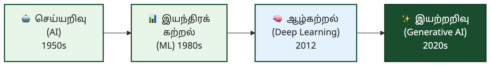
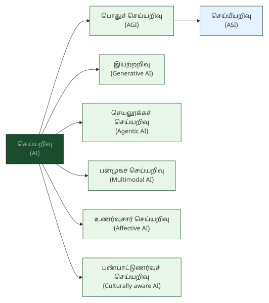
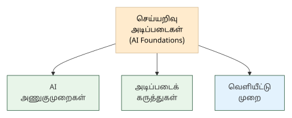
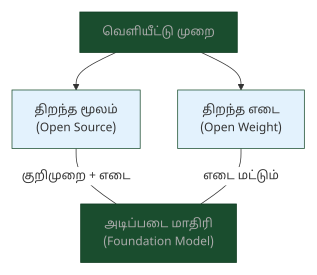
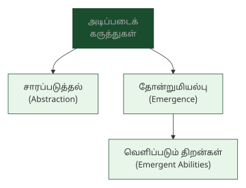
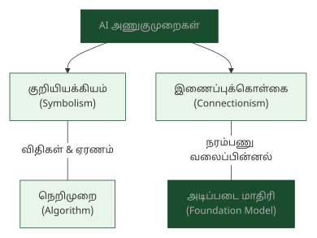

# 1. செய்யறிவு அடிப்படைகள் — AI Foundations

> **🎯 கற்றல் நோக்கங்கள்**
> - செய்யறிவு (AI), பொதுச் செய்யறிவு (AGI), செய்மீயறிவு (ASI) ஆகிய நிலைகளின் வேறுபாடுகளை அறிதல்
> - இயற்றறிவு (Generative AI), செயலூக்கச் செய்யறிவு (Agentic AI) உள்ளிட்ட நவீன AI வகைகளின் கலைச்சொற்களைப் புரிந்துகொள்ளுதல்
> - நெறிமுறை (Algorithm), வகைப்பாடு (Classification), பொறுப்பான செய்யறிவு (Responsible AI) போன்ற அடிப்படைக் கருத்துகளின் தமிழ்ச்சொற்களை அறிதல்

## "இயந்திரமும் அறிவும்" — செய்யறிவுப் பயணத்தின் தொடக்கம்
<!-- IMAGE: A tree of knowledge with roots labeled as algorithms branching into AI types, human brain and circuit board merging, deep green (#1a4d2e) accent, flat vector style with Tamil cultural motifs -->

<!-- END IMAGE -->
1950-ல் ஆலன் டூரிங் (Alan Turing) "இயந்திரங்களால் சிந்திக்க முடியுமா?" என்ற கேள்வியை எழுப்பினார். அந்தக் கேள்வி கணினியியலின் போக்கையே மாற்றியது. தொடக்கத்தில் ஆராய்ச்சியாளர்கள் குறியீட்டு அணுகுமுறையில் (Symbolism) விதிகளையும் ஏரணத்தையும் கொண்டு கணினிகளுக்கு அறிவைப் புகட்ட முயன்றனர். பின்னர் மூளையின் நரம்பணு அமைப்பை ஒத்த இணைப்புக்கொள்கை (Connectionism) வளர்ந்தது. இன்று இவ்விரண்டு அணுகுமுறைகளின் கலவையிலிருந்து பெருமொழி மாதிரிகள் (LLMs) தோன்றியிருக்கின்றன.

தமிழ் மொழியில் "Artificial Intelligence" என்பதற்கு "செய்யறிவு" என்ற கலைச்சொல் உருவாக்கப்பட்டுள்ளது. செய் (made/artificial) + அறிவு (intelligence) என்ற வேர்ச்சொற்களின் இணைப்பு இது. "செயற்கை நுண்ணறிவு" என்ற பரவலான சொல்லைவிட, சொல்லாய்வு குழுவின் "செய்யறிவு" ஒருமையாகவும் தமிழ் இலக்கண மரபுக்கு ஏற்றதாகவும் உள்ளது.

இந்த அத்தியாயத்தில் செய்யறிவின் அடிப்படை நிலைகள், நவீன வகைகள், திறந்தநிலை வெளியீடுகள், அடிப்படைக் கருத்துகள் ஆகியவற்றுக்கான 18 கலைச்சொற்கள் தொகுக்கப்பட்டுள்ளன.

### செய்யறிவு நிலைகள் — Levels of AI

செய்யறிவின் (AI) வளர்ச்சியை மூன்று நிலைகளாகப் பிரிக்கலாம். இன்று நடைமுறையில் இருப்பது குறுகிய செய்யறிவு மட்டுமே. பொதுச் செய்யறிவும் (AGI) செய்மீயறிவும் (ASI) இன்னும் ஆராய்ச்சி நிலையில் உள்ளன.

**Artificial Intelligence (AI) — செய்யறிவு** (செயற்கை நுண்ணறிவு) [^1]
செய் (artificial/made) + அறிவு (intelligence). மனித அறிவைப் போலச் செயல்படும் திறன் கொண்ட கணினி அமைப்புகள்.

**Artificial General Intelligence (AGI) — பொதுச் செய்யறிவு**
பொது (general) + செய்யறிவு (AI). மனிதனைப் போல எந்தத் துறையிலும் பொதுவாகச் சிந்திக்கவும், கற்கவும், சிக்கல் தீர்க்கவும் வல்ல AI நிலை.

**Artificial Super Intelligence (ASI) — செய்மீயறிவு** (செய்வியனறிவு)
செய் (artificial) + மீ (super/over) + அறிவு (intelligence). "மீ" முன்னொட்டு "மீக்கணிப்பொறி" (super computer) போல் பயன்படுத்தப்படுகிறது. ஒட்டுமொத்த மனித அறிவையும் தாண்டிய திறமைகளைக் கொண்ட கற்பனை AI நிலை.

### நவீன AI வகைகள் — Modern AI Types

செய்யறிவுத் துறை 2023-க்குப் பிறகு வேகமாக விரிவடைந்துள்ளது. உரை, படம், ஒலி உருவாக்கும் இயற்றறிவு (Generative AI), தானே முடிவெடுத்துச் செயல்படும் செயலூக்கச் செய்யறிவு (Agentic AI), பல வகை உள்ளீடுகளைக் கையாளும் பன்முகச் செய்யறிவு (Multimodal AI) ஆகியவை இன்றைய முதன்மை வகைகள்.

**Generative AI — இயற்றறிவு** (ஈனும் செய்யறிவு) [^1]
இயற்று (create/compose) + அறிவு (intelligence). புதிய உரை, படம், ஒலி அல்லது நிரல் குறிமுறைகளைத் தாமாகவே உருவாக்கும் திறன் கொண்ட AI மாதிரி.

**Agentic AI — செயலூக்கச் செய்யறிவு** (முகவர் சார் செய்யறிவு)
செயல் (action) + ஊக்கம் (drive/initiative) + செய்யறிவு. தானே முடிவெடுத்துக் கருவிகளைப் பயன்படுத்தி இலக்கு நோக்கித் தொடர்ச்சியாகச் செயல்படும் AI மாதிரி.

**Multimodal AI — பன்முகச் செய்யறிவு** (பன்முக மாதிரி)
பன் (multi) + முகம் (mode/facet) + செய்யறிவு (AI). உரை, படம், ஒலி, காணொளி போன்ற பல வகை உள்ளீடுகளைக் கையாளும் திறன் கொண்ட AI மாதிரி.

**Affective AI — உணர்வுசார் செய்யறிவு** (உணர்வியல் செய்யறிவு)
உணர்வு (emotion) + சார் (related to) + செய்யறிவு. மனித உணர்வுகளை அறிந்துகொள்ளும், புரிந்துகொள்ளும், தகுந்த வகையில் பதிலளிக்கும் திறன் கொண்ட AI மாதிரிகள்.

**Affective Computing — உணர்வுசார் கணினியியல்**
மனித உணர்வுகளை அறிய, பகுப்பாய்வு செய்ய, இணைக்க உதவும் கணினியியல் துறை.

**Culturally-aware AI — பண்பாட்டுணர்வுச் செய்யறிவு** (பண்பாட்டுச் சார்பு செய்யறிவு)
பண்பாடு (culture) + உணர்வு (awareness) + செய்யறிவு. ஒரு குறிப்பிட்ட பண்பாட்டின் மரபுகள், மொழி, மதிப்புகள் மற்றும் சூழமைவை உணர்ந்து செயல்படும் AI மாதிரி.

> [!NOTE]
> **அறிவீர்களா?** தமிழ், சீனம், அரபு போன்ற மொழிகளுக்கான AI மாதிரிகள் மேற்கத்திய கலாச்சாரச் சாய்வுடன் (cultural bias) பயிற்றுவிக்கப்படுகின்றன. பண்பாட்டுணர்வுச் செய்யறிவு (Culturally-aware AI) இந்தச் சாய்வைக் களைய முயல்கிறது. தமிழ்ச் சூழலில் இது குறிப்பாக இன்றியமையாதது. திருக்குறளின் அறக்கருத்துகளை AI புரிந்துகொள்ள, மொழி மட்டுமன்றி பண்பாட்டு அறிவும் தேவை.

### திறந்தநிலை — Openness

AI மாதிரிகளின் வெளியீட்டு முறை தொழில்துறையின் போக்கை நிர்ணயிக்கிறது. சில மாதிரிகள் முழுமையாகத் திறந்த மூலமாக (Open Source) வெளியிடப்படுகின்றன, சில எடைகளை (Weights) மட்டும் பகிர்கின்றன.

**Open Source AI — திறந்த மூலச் செய்யறிவு**
திறந்த (open) + மூலம் (source) + செய்யறிவு (AI). மாதிரியின் மூலக் குறிமுறை, எடைகள், பயிற்சித் தரவு விவரங்கள் அனைத்தும் பொதுவில் கிடைத்து, யாரும் மாற்றவும் விநியோகிக்கவும் அனுமதிக்கும் AI வெளியீடு; திறந்த எடை (Open Weight) மாதிரிகளிலிருந்து வேறுபட்டது.

**Open Weight — திறந்த எடை**
திறந்த (open) + எடை (weight). மாதிரியின் பயிற்சி பெற்ற எடைகள் பொதுவில் வெளியிடப்பட்டு, பயன்படுத்தவும் நுண்திருத்தம் செய்யவும் அனுமதிக்கும் AI வெளியீடு; ஆனால் பயிற்சிக் குறிமுறை அல்லது தரவு பொதுவில் இல்லாமல் இருக்கலாம் (உ-ம்: Llama, Gemma, Mistral).

> [!TIP]
> **திறந்த மூலம் (Open Source) vs திறந்த எடை (Open Weight):** திறந்த மூலச் செய்யறிவு மாதிரியின் குறிமுறையும் எடைகளும் பொதுவில் கிடைக்கும். திறந்த எடை மாதிரியில் எடைகள் மட்டும் வெளியிடப்படும், குறிமுறை வெளியிடப்படாது. Meta-வின் Llama திறந்த எடை மாதிரிக்கு ஒரு எடுத்துக்காட்டு.

### அடித்தள மாதிரிகள் — Foundation Models

அடிப்படை மாதிரிகள் (Foundation Models) பல்வேறு பணிகளுக்கு அடித்தளமாக அமைகின்றன. இவை பெரும் தரவுகளில் முன்பயிற்சி (Pretraining) பெற்று, பின்னர் நுண்திருத்தம் (Fine-tuning) மூலம் குறிப்பிட்ட பணிகளுக்குத் தழுவிக்கப்படுகின்றன.

**Foundation Model — அடிப்படை மாதிரி** (அடித்தள மாதிரி)
பல்வேறு வேலைகளுக்கு அடித்தளமாக அமையும் பெரும் முன்பயிற்சி பெற்ற AI மாதிரி (எ.கா: GPT, Claude, Gemini).

### அடிப்படைக் கருத்துகள் — Core Concepts

நெறிமுறை (Algorithm), சாரப்படுத்தல் (Abstraction), தோன்றுமியல்பு (Emergence) ஆகிய அடிப்படைக் கருத்துகள் AI-ன் கட்டுமானத்தில் இன்றியமையாதவை.

**Algorithm — நெறிமுறை** (படிமுறை)
நெறி (method/rule) + முறை (procedure). ஒரு வேலையைச் செய்ய அல்லது சிக்கலைத் தீர்க்கத் தேவையான துல்லியமான படிநிலை வரிசை; AI-யில் சரிவிறக்கம் (Gradient Descent), A* தேடல் போன்றவை நெறிமுறைகளுக்கு எடுத்துக்காட்டுகள்.

**Abstraction — சாரப்படுத்தல்** (பண்புச் சுருக்கம்)
சாரம் (essence) + படுத்தல் (to render). விவரங்களை மறைத்துப் பொதுக் கருத்தை அல்லது இடைமுகத்தை மட்டும் வெளிக்காட்டுதல்; கணினியியலின் அடிப்படைக் கருத்துகளில் ஒன்று.

**Emergence — தோன்றுமியல்பு**
தோன்றும் (arising) + இயல்பு (nature). சிறிய கூறுகளின் சேர்க்கையால், அவை தனித்தனியாகக் கொண்டிராத புதிய பண்புகள் தற்செயலாக வெளிப்படும் நிகழ்வு; வெளிப்படும் திறன்களின் அடிப்படைக் கருத்து.

**Emergent Abilities — வெளிப்படும் திறன்கள்** (தோன்றும் திறன்கள்)
AI மாதிரியின் அளவு பெருகும்போது, சிறிய மாதிரிகளில் இல்லாத புதிய திறன்கள் (உ-ம்: Instruction-following) தற்செயலாக வெளிப்படும் நிகழ்வு.

### அணுகுமுறைகள் — Approaches

செய்யறிவின் அடிப்படையில் இரு முதன்மை அணுகுமுறைகள் இருக்கின்றன: குறியீடுகளையும் விதிகளையும் அடிப்படையாகக் கொண்ட குறியியக்கியம் (Symbolism), நரம்பணு வலைப்பின்னலை ஒத்த இணைப்புக்கொள்கை (Connectionism).

**Connectionism — குறியியக்கியம்** (இணைப்புக்கொள்கை) [^1]
குறி (sign/symbol) + இயக்கியம் (-ism / theory). மூளையின் நரம்பணு வலைப்பின்னலைப் போலக் கணினி அமைப்புகளையும் ஒன்றோடொன்று இணைத்துச் செயல்பட வைக்கும் அணுகுமுறை.

**Symbolism — குறியியக்கியம்** (குறியீட்டு அணுகுமுறை) [^1]
குறி (sign/symbol) + இயக்கியம் (-ism / theory). விதிகளையும் ஏரணத்தையும் பயன்படுத்தித் தரவுகளைக் குறியீடுகள் மூலம் மனித அறிவாகக் கணினிக்குப் புகட்டும் முற்காலச் செய்யறிவு அணுகுமுறை.

---

### பொறுப்புணர்வும் ஆளுகையும் — Responsible AI & Governance

செய்யறிவின் திறன் வளரும்போது அதன் பொறுப்பான பயன்பாடு குறித்த கேள்விகளும் எழுகின்றன. பொறுப்பான செய்யறிவு (Responsible AI) மற்றும் செய்யறிவு ஆளுகை (AI Governance) பற்றிய விரிவான கலைச்சொற்கள் [அத்தியாயம் 10-ல் காண்க](10-safety-ethics-evaluation.md).

### 📰 AI வரலாற்றில் ஒரு துளி

**டார்ட்மவுத் மாநாடு: 'AI' என்ற சொல் பிறந்த இடம்!**

1956-ஆம் ஆண்டு கோடைகாலத்தில், அமெரிக்காவின் டார்ட்மவுத் கல்லூரியில் ஜான் மெக்கார்த்தி (John McCarthy) மற்றும் மார்வின் மின்ஸ்கி (Marvin Minsky) ஆகியோர் ஒரு மாநாட்டை ஏற்பாடு செய்தனர். 

இந்த மாநாட்டில்தான் "செயற்கை நுண்ணறிவு" (Artificial Intelligence) என்ற சொல் முறையாகப் பயன்படுத்தப்பட்டது. இதில் வியப்பு என்னவென்றால், இயந்திரங்களுக்கு மொழி, பார்வை, மற்றும் மனித மூளையின் செயல்பாடுகளை "ஒரே ஒரு கோடைகால உழைப்பில்" முழுமையாகக் கற்பித்துவிட முடியும் என்று அந்த அறிவியலாளர்கள் நம்பினார்கள்! அது பல பத்தாண்டுகள் எடுக்கும் நீண்ட பயணம் என்பது அவர்களுக்கு அப்போது தெரிந்திருக்கவில்லை.

## 📋 அத்தியாயச் சுருக்கம்

> **💡 முதன்மைக் கருத்துகள்**
> - இந்த அத்தியாயத்தில் செய்யறிவு (AI) நிலைகள் முதல் ஆளுகை வரையிலான 18 கலைச்சொற்கள் தொகுக்கப்பட்டுள்ளன.
> - செய்யறிவு (AI) என்ற தமிழ்ச் சொல் "செய் + அறிவு" என்ற வேர்களிலிருந்து உருவானது. "செயற்கை நுண்ணறிவு" என்பதன் எளிமையான வடிவம்
> - இயற்றறிவு (Generative AI), செயலூக்கச் செய்யறிவு (Agentic AI) ஆகியவை 2024-25-ன் முதன்மை AI போக்குகள்

**அடிக்கடி குழப்பமடையும் சொற்கள்:**
- செய்யறிவு (AI) vs இயற்றறிவு (Generative AI): அனைத்து இயற்றறிவும் செய்யறிவு, ஆனால் அனைத்து செய்யறிவும் இயற்றறிவு அல்ல
- திறந்த மூலம் (Open Source) vs திறந்த எடை (Open Weight): மூலக் குறிமுறை வெளியீடு vs எடைகள் மட்டும்
- இணைப்புக்கொள்கை (Connectionism) vs குறியியக்கியம் (Symbolism): நரம்பணு வலைப்பின்னல் அணுகுமுறை vs விதிசார் அணுகுமுறை
- பொறுப்பான செய்யறிவு (Responsible AI) vs செய்யறிவு ஆளுகை (AI Governance): நடைமுறைக் கொள்கைகள் vs சட்ட/அமைப்புக் கட்டமைப்பு

> [!TIP]
> **குறுக்கு இணைப்பு:** நரவலை (Neural Network) கட்டமைப்புகள் பற்றி [அத்தியாயம் 3-ல் காண்க](03-neural-networks.md). இயந்திரக் கற்றல் (Machine Learning) முறைகள் [அத்தியாயம் 2-ல் விரிவாக விளக்கப்பட்டுள்ளன](02-machine-learning.md). அடிப்படை மாதிரிகளின் (Foundation Models) முதன்மைக் கட்டமைப்பான மாற்றுநர் (Transformer) பற்றி [அத்தியாயம் 5-ல் காண்க](05-transformers-language-models.md).

## 💭 உங்கள் சிந்தனைக்கு

1. நீங்கள் ஒரு தமிழ் மருத்துவ AI உதவியாளரை உருவாக்க விரும்புகிறீர்கள். இந்த AI நோயாளியின் அறிகுறிகளைப் புரிந்துகொள்ள வேண்டும், மருத்துவப் பரிந்துரைகளை உருவாக்க வேண்டும், நோயாளியின் கவலைகளையும் உணர வேண்டும். இதற்கு இயற்றறிவு (Generative AI), உணர்வுசார் செய்யறிவு (Affective AI), பண்பாட்டுணர்வுச் செய்யறிவு (Culturally-aware AI) ஆகியவற்றில் எவை தேவை? ஏன்?

2. ஒரு நிறுவனம் தமிழ் மொழிக்கான AI மாதிரியை உருவாக்க விரும்புகிறது. திறந்த மூலச் செய்யறிவு (Open Source AI) மாதிரியை அடிப்படையாக எடுத்துக்கொள்வது நல்லதா, திறந்த எடை (Open Weight) மாதிரியை எடுப்பது நல்லதா? அடிப்படை மாதிரி (Foundation Model) ஒன்றை நுண்திருத்தம் (Fine-tuning) செய்வதன் நன்மை என்ன?

3. பெருமொழி மாதிரிகளில் (LLMs) வெளிப்படும் திறன்கள் (Emergent Abilities) காணப்படுகின்றன. 10 பில்லியன் அளபுருக்கள் கொண்ட மாதிரியில் இல்லாத திறன் 100 பில்லியன் அளபுருக்கள் கொண்ட மாதிரியில் தற்செயலாகத் தோன்றுகிறது. இது தோன்றுமியல்பின் (Emergence) ஒரு வெளிப்பாடா? இத்தகைய திறன்களை முன்கூட்டிக் கணிக்க இயலுமா?

## 🧠 அறிவுச் சோதனை

1. **பொருத்துக:** கீழ்க்கண்ட ஆங்கிலச் சொற்களுக்கு சரியான தமிழ்ச் சொல்லைப் பொருத்துக:

    | ஆங்கிலம் | தமிழ் |
    |:---------|:------|
    | Artificial Intelligence | அ) இயற்றறிவு |
    | Generative AI | ஆ) அடிப்படை மாதிரி |
    | Foundation Model | இ) செய்யறிவு |

2. **கோடிட்ட இடத்தை நிரப்புக:** "________ என்பது மனிதனைப் போல எந்தத் துறையிலும் பொதுவாகச் சிந்திக்கவும், கற்கவும், சிக்கல் தீர்க்கவும் வல்ல AI நிலை." (AGI)

3. **சரியா / தவறா:** "இயற்றறிவு (Generative AI) என்பது செய்யறிவின் (AI) மறுபெயர்."

4. **பல தேர்வு:** கீழ்க்கண்டவற்றில் "செயலூக்கச் செய்யறிவு" (Agentic AI) என்பதன் சரியான விளக்கம் எது?

    - அ) உரை, படம், ஒலி உருவாக்கும் AI
    - ஆ) தானே முடிவெடுத்துக் கருவிகளைப் பயன்படுத்தி இலக்கு நோக்கிச் செயல்படும் AI
    - இ) மனித உணர்வுகளை அறியும் AI

5. **சரியா / தவறா:** "திறந்த மூலம் (Open Source) என்றால் மாதிரியின் எடைகள் மட்டும் வெளியிடப்படும்."

<strong>விடைகளைக் காண சொடுக்குக</strong>

1. Artificial Intelligence → இ) செய்யறிவு, Generative AI → அ) இயற்றறிவு, Foundation Model → ஆ) அடிப்படை மாதிரி
2. பொதுச் செய்யறிவு (AGI)
3. **தவறு.** இயற்றறிவு (Generative AI) செய்யறிவின் ஒரு வகை மட்டுமே. செய்யறிவு என்பது பரந்த துறை; இயற்றறிவு புதிய உள்ளடக்கத்தை உருவாக்கும் திறன் கொண்ட ஒரு பிரிவு.
4. **ஆ)** தானே முடிவெடுத்துக் கருவிகளைப் பயன்படுத்தி இலக்கு நோக்கிச் செயல்படும் AI.
5. **தவறு.** திறந்த மூலம் (Open Source) என்றால் மூலக் குறிமுறையும் எடைகளும் பொதுவில் கிடைக்கும். எடைகள் மட்டும் வெளியிடுவது திறந்த எடை (Open Weight).

