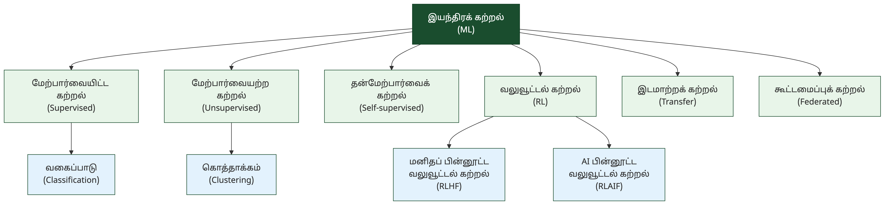
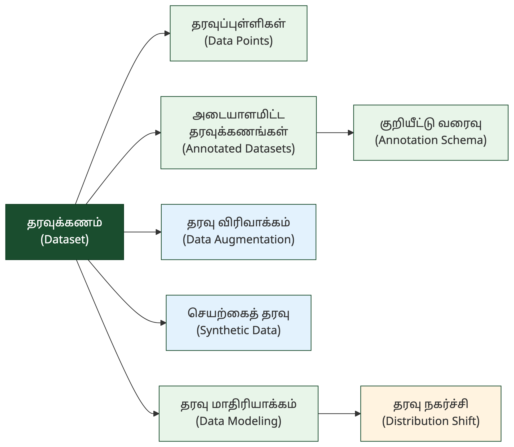

# 2. இயந்திரக் கற்றல் — Machine Learning

<!-- IMAGE: Data flowing through a funnel, transforming into patterns — scatter plot becoming organized clusters, deep green (#1a4d2e) accent, flat vector style with Tamil cultural motifs -->

<!-- END IMAGE -->

> **🎯 கற்றல் நோக்கங்கள்**
>
> - மேற்பார்வையிட்ட கற்றல் (Supervised), மேற்பார்வையற்ற கற்றல் (Unsupervised) உள்ளிட்ட கற்றல் முறைகளின் வேறுபாடுகளை அறிதல்
> - தரவுக்கணம் (Dataset), தரவு விரிவாக்கம் (Data Augmentation) போன்ற தரவுச் சொற்களைப் புரிந்துகொள்ளுதல்
> - மிகைப்பொருத்தம் (Overfitting), பண்பெடுப்பு (Feature Extraction) ஆகிய மாதிரி நடத்தைச் சொற்களை அறிதல்

## "தரவிலிருந்து கற்கும் கலை"

ஒரு குழந்தை தமிழ் எழுத்துகளைக் கற்கிறது. "அ" என்ற எழுத்தை நூற்றுக்கணக்கான முறை பார்க்கிறது: கரும்பலகையில், நோட்புக்கில், புத்தகத்தில். ஒவ்வொரு முறையும் எழுத்தின் வடிவம் சற்றே வேறுபடலாம், ஆனால் குழந்தை படிப்படியாக "அ" என்ற எழுத்தின் சாரத்தைப் புரிந்துகொள்கிறது. இது மேற்பார்வையிட்ட கற்றல் (Supervised Learning): எடுத்துக்காட்டுகளையும் அவற்றின் பெயர்களையும் கொடுத்துக் கற்பித்தல்.

இயந்திரக் கற்றல் (Machine Learning) இதே அடிப்படையில் இயங்குகிறது. வெளிப்படையான விதிகளை எழுதாமல், தரவிலிருந்தே வடிவங்களைக் கண்டறிந்து கணிப்புகளை வழங்குவது இதன் சிறப்பு. சில முறைகள் அடையாளமிட்ட தரவுகளிலிருந்து கற்கின்றன, சில அடையாளமற்ற தரவிலிருந்தே வடிவங்களைக் கண்டறிகின்றன, சில வெகுமதி மூலம் கற்கின்றன.

இந்த அத்தியாயத்தில் கற்றல் முறைகள், வகைப்பாடு, தரவு மேலாண்மை, மாதிரி நடத்தை ஆகியவற்றுக்கான 29 கலைச்சொற்கள் தொகுக்கப்பட்டுள்ளன.

---

### கற்றல் முறைகள் — Learning Paradigms

இயந்திரக் கற்றலில் பல்வேறு கற்றல் முறைகள் உள்ளன. ஒவ்வொன்றும் தரவை வெவ்வேறு வழிகளில் பயன்படுத்துகிறது. அடையாளமிட்ட தரவு தேவையா, வெகுமதி முறையா, தன்னிலையிலேயே கற்கும் முறையா என்பதைப் பொறுத்து இவை வேறுபடுகின்றன.

**Machine Learning (ML) — இயந்திரக் கற்றல்**
இயந்திரம் (machine) + கற்றல் (learning). வெளிப்படையான நிரலாக்கம் இல்லாமல், தரவிலிருந்து தானாகவே கற்று வடிவங்களைக் கண்டறிந்து கணிப்புகளை வழங்கும் கணினியியல் துறை.

**Supervised Learning — மேற்பார்வையிட்ட கற்றல்**
மேற்பார்வை (supervision) + கற்றல் (learning). அடையாளமிடப்பட்ட (உள்ளீடு-வெளியீடு இணை) தரவுகளைப் பயன்படுத்தி AI மாதிரியைப் பயிற்றுவிக்கும் முறை (உ-ம்: வகைப்பாடு).

**Unsupervised Learning — மேற்பார்வையற்ற கற்றல்**
மேற்பார்வை (supervision) + அற்ற (without) + கற்றல் (learning). அடையாளமிடப்படாத தரவுகளிலிருந்தே வடிவங்கள், கொத்துகள் மற்றும் அமைப்புகளைத் தானாகவே கண்டறியும் இயந்திரக் கற்றல் முறை.

**Semi-supervised Learning — அரைமேற்பார்வைக் கற்றல்**
அரை (half/semi) + மேற்பார்வை (supervision) + கற்றல் (learning). சிறிது அடையாளமிட்ட தரவும் பெரும்பான்மை அடையாளமிடாத தரவும் கலந்த கற்றல் முறை.

**Self-supervised Learning — தன்மேற்பார்வைக் கற்றல்**
தன் (self) + மேற்பார்வை (supervision) + கற்றல் (learning). அடையாளமிடாத தரவிலிருந்து தானே மேற்பார்வைக் குறிப்புகளை உருவாக்கிக் கற்கும் முறை (BERT, GPT).

**Reinforcement Learning (RL) — வலுவூட்டல் கற்றல்**
வலு (strength) + ஊட்டல் (feeding) + கற்றல் (learning). ஒரு செயல்முகவர் சூழலோடு தொடர்புகொண்டு, செயல்களுக்கான வெகுமதிகள் அல்லது தண்டனைகள் மூலம் தாமாகவே கற்றுக்கொள்ளும் இயந்திரக் கற்றல் முறை.

**Reinforcement Learning from Human Feedback (RLHF) — மனிதப் பின்னூட்ட வலுவூட்டல் கற்றல்** (மனித வெகுமதி வலுவூட்டல் கற்றல்)
மனித விருப்பங்களுக்கு ஏற்ப AI-இன் வெளியீடுகளைச் சீரமைக்கும் சிறப்புப் பயிற்சி முறை.

**RL from AI Feedback (RLAIF) — செய்யறிவு பின்னூட்ட வலுவூட்டல் கற்றல்**
RLHF-ன் மாற்று முறை; மனிதர்களின் பின்னூட்டத்திற்குப் பதிலாக மற்றொரு AI மாதிரியின் கருத்துகளைப் பயன்படுத்தி வலுவூட்டல் கற்றலை மேற்கொள்ளும் முறை (Anthropic Constitutional AI-ல் பயன்படுகிறது).

**Transfer Learning — இடமாற்றக் கற்றல்** (பரவல் கற்றல்)
இடமாற்றம் (transfer) + கற்றல் (learning). ஒரு பணிக்காகப் பயிற்றுவிக்கப்பட்ட மாதிரியின் அறிவை, மற்றொரு தொடர்புடைய பணிக்குப் பயன்படுத்தும் முறை; அடிப்படை மாதிரிகளின் அடித்தளம்.

**Federated Learning — கூட்டமைப்புக் கற்றல்** (ஒன்றியக் கற்றல்)
தரவை மையத்திற்கு அனுப்பாமல், கருவிகளிலேயே பயிற்றுவித்துப் பயிற்சி முடிவுகளை மட்டும் ஒன்றிணைக்கும் பாதுகாப்பான கற்றல் முறை.

**Multi-task Learning — பன்முகப் பணி கற்றல்** (பல்பணிக் கற்றல்)
பன்முகம் (multi-faceted) + பணி (task) + கற்றல் (learning). ஒரே மாதிரி பல்வேறு தொடர்புடைய பணிகளை ஒரே நேரத்தில் கற்றுக்கொள்ளும் முறை; பணிகளுக்கு இடையேயான பொதுமைகள் கற்றலை மேம்படுத்துகின்றன.

**Contrastive Learning — எதிர்வைப்புக் கற்றல்** (ஒப்பீட்டுக் கற்றல்)
எதிர்வைப்பு (contrast) + கற்றல் (learning). ஒத்த இணைகளை நெருக்கி, மாறுபட்டவற்றை விலக்கிக் கற்கும் முறை (CLIP).

**In-context Learning — சூழலுள் கற்றல்**
சூழல் (context) + உள் (within) + கற்றல் (learning). எடுத்துக்காட்டுகளைத் தூண்டுவினாவிலேயே கொடுத்து, நுண்திருத்தமின்றி மாதிரி கற்கும் முறை.

> [!TIP]
> **RLHF vs RLAIF:** RLHF-ல் மனிதர்கள் AI-இன் வெளியீடுகளை மதிப்பிடுகின்றனர். RLAIF-ல் இந்த வேலையை மற்றொரு AI மாதிரி செய்கிறது. RLAIF செலவைக் குறைக்கிறது, ஆனால் AI மதிப்பீட்டின் தரம் மனிதர்களுக்கு இணையாக இருக்குமா என்பது விவாதத்திற்குரிய கேள்வி.

---

### வகைப்பாடு & கொத்தாக்கம் — Classification & Clustering

இயந்திரக் கற்றலின் இரு முதன்மை வெளியீட்டு வகைகள்: தரவை முன்னரே வரையறுக்கப்பட்ட குழுக்களில் சேர்க்கும் வகைப்பாடு (Classification), தரவிலிருந்தே குழுக்களைக் கண்டறியும் கொத்தாக்கம் (Clustering). இவற்றோடு இயல்புக்கு மாறான தரவைக் கண்டறியும் இயல்புவிலகல் கண்டறிதலும் (Anomaly Detection) இணைந்துள்ளது.

**Classification — வகைப்பாடு**
தரவை முன்கூட்டியே தீர்மானிக்கப்பட்ட வகைகளில் ஒன்றில் சேர்த்தல்.

**Clustering — கொத்தாக்கம்**
கொத்து (cluster) + ஆக்கம் (process). ஒத்த பண்புகளைக் கொண்ட தரவுகளைக் குழுக்களாகப் பிரித்தல்.

**Anomaly Detection — இயல்புவிலகல் கண்டறிதல்** (வழுக்கண்டறிதல்)
இயல்பு (norm) + விலகல் (deviation) + கண்டறிதல் (detection). இயல்பான தரவு வடிவத்திலிருந்து விலகிய தரவுப் புள்ளிகளை அடையாளம் காணும் முறை.

---

### தரவு & மாதிரியாக்கம் — Data & Modeling

இயந்திரக் கற்றலின் அடிப்படை எரிபொருள் தரவு. மாதிரியின் தரம் பயிற்சித் தரவின் தரத்தை நேரடியாகச் சார்ந்துள்ளது. தரவுக்கணம் (Dataset) எவ்வாறு உருவாக்கப்படுகிறது, அடையாளமிடப்படுகிறது, விரிவாக்கப்படுகிறது என்பதை இந்தப் பிரிவின் கலைச்சொற்கள் விளக்குகின்றன.

**Dataset — தரவுக்கணம்**
தரவு (data) + கணம் (set). இயந்திரக் கற்றலுக்குப் பயன்படும் தரவுத் தொகுப்பு.

**Data Points — தரவுப்புள்ளிகள்**
தரவு (data) + புள்ளி (point). ஒரு தரவுக்கணத்தில் உள்ள தனிப்பட்ட அளவீடுகள் அல்லது அவதானிப்புகள்; AI மாதிரிகள் இவற்றிலிருந்து கற்றுக்கொள்கின்றன.

**Annotated Datasets — அடையாளமிட்ட தரவுக்கணங்கள்** (குறியிட்ட தரவுக்கணங்கள்) [^1]
இயந்திரக் கற்றலுக்குப் பயன்படும் வகையில், மனிதர்களாலோ நிரல்களாலோ விளக்கங்கள் அல்லது அடையாளங்கள் இணைக்கப்பட்ட தரவுகளின் தொகுப்பு.

**Annotation Schema — தரவுக் குறியீட்டு வரைவு** (குறியீட்டுத் திட்டம்)
தரவுக் கணத்தில் ஒவ்வொரு தரவுப் பகுதிக்கும் எத்தகைய பெயரிடல் அல்லது குறியீடு பயன்படுத்தப்பட வேண்டும் என்பதை வரையறுக்கும் கட்டமைப்பு.

**Data Augmentation — தரவு விரிவாக்கம்**
ஏற்கனவே உள்ள பயிற்சித் தரவுகளிலிருந்து புதிய, மாறுபட்ட எடுத்துக்காட்டுகளைச் செயற்கையாக உருவாக்கிப் பயிற்சித் தரவின் அளவைப் பெருக்கும் நுட்பம்.

**Synthetic Data — செயற்கைத் தரவு** (புனைவுத் தரவு)
செயற்கை (artificial) + தரவு (data). கணினி அல்லது AI மூலம் செயற்கையாக உருவாக்கப்படும் பயிற்சித் தரவு.

**Data Modeling — தரவு மாதிரியாக்கம்**
உண்மை உலகச் சிக்கலையோ செயல்முறையையோ கணினி புரிந்துகொள்ளக்கூடிய தரவுக் கட்டமைப்பாக மாற்றும் முறை.

**Distribution Shift — தரவு நகர்ச்சி** (விநியோக மாற்றம்)
பயிற்சித் தரவும் பயன்பாட்டுத் தரவும் வேறுபடும் நிலை; மாதிரியின் செயல்திறன் நடைமுறைச் சூழலில் வீழ்ச்சியடையக் காரணம்.

> [!NOTE]
> **அறிவீர்களா?** தமிழ் மொழிக்கான AI மாதிரிகளைப் பயிற்றுவிக்கப் போதுமான அடையாளமிட்ட தரவுக்கணங்கள் (Annotated Datasets) கிடைப்பது அரிது. இது "குறைவள மொழி" (low-resource language) அறைகூவல் எனப்படுகிறது. தரவு விரிவாக்கம் (Data Augmentation), செயற்கைத் தரவு (Synthetic Data) ஆகிய நுட்பங்கள் இந்த அறைகூவலைச் சமாளிக்க உதவுகின்றன.

---

### மாதிரி நடத்தை — Model Behavior

மாதிரி பயிற்சி பெற்ற பிறகு, அது எவ்வாறு செயல்படுகிறது என்பதை மதிப்பிட வேண்டும். மிகைப்பொருத்தம் (Overfitting), சாய்வு-மாறுபாட்டு ஈடு (Bias-Variance Tradeoff) ஆகியவை மாதிரியின் கற்றல் தரத்தைப் புரிந்துகொள்ள உதவும் கருத்துகள்.

**Overfitting — மிகைப்பொருத்தம்**
மிகை (over) + பொருத்தம் (fitting). மாதிரி தான் படித்த பயிற்சித் தரவை மட்டும் அப்படியே மனப்பாடம் செய்துவிட்டு, புதிய தரவுகளுக்குத் தவறான பதில்களைத் தரும் நிலை.

**Underfitting — குறைப்பொருத்தம்**
குறை (under) + பொருத்தம் (fitting). ஒரு மாதிரி மிகவும் எளிமையாக இருந்து, தரவின் அடிப்படை அமைப்பைக் கற்றுக்கொள்ள இயலாமல் பயிற்சித் தரவிலும் சோதனைத் தரவிலும் மோசமாகச் செயல்படும் நிலை.

**Bias-Variance Tradeoff — சாய்வு-மாறுபாட்டு ஈடு**
சாய்வு (bias) + மாறுபாடு (variance) + ஈடு (tradeoff). மாதிரியின் சாய்வையும் மாறுபாட்டையும் சமன்படுத்தும் பயிற்சி நெறிமுறை. மிகச் சாய்வாக இருந்தால் வழுச் சேர்க்கும், மிக மாறுபாடாக இருந்தால் மிகைப்பொருத்தம் ஏற்படும்.

**Validation Set — சரிபார்ப்புத் தொகுதி**
சரிபார்ப்பு (validation) + தொகுதி (set). பயிற்சியின் போது மாதிரியின் செயல்திறனை மதிப்பிடப் பயன்படுத்தப்படும் தனிப்பட்ட தரவு (பயிற்சி, சரிபார்ப்பு, சோதனை என தரவு மூன்றாகப் பிரிக்கப்படும்).

**Ground Truth — அடிப்படை உண்மை** (மெய்த்தரவு)
மாதிரியின் கணிப்பை ஒப்பிட்டு மதிப்பிடப் பயன்படும் சரியான விடை / அடையாளம்.

**Feature Extraction — பண்பெடுப்பு**
பண்பு (feature) + எடுப்பு (extraction). மூலத் தரவிலிருந்து பயனுள்ள பண்புகளை மட்டும் பிரித்தெடுக்கும் செயல்; இயந்திரக் கற்றலின் ஒரு முதன்மைப் படி.

---

### 📰 AI வரலாற்றில் ஒரு துளி (A Drop in AI History)

{ style="width: 250px; float: right; margin-left: 20px; border-radius: 8px;" }

**இயந்திரத்திடம் தோற்ற உலக செஸ் சாம்பியன்!**

1997-ஆம் ஆண்டு மே மாதம், IBM நிறுவனம் உருவாக்கிய 'டீப் ப்ளூ' (Deep Blue) என்ற சூப்பர் கம்ப்யூட்டருக்கும், அன்றைய உலகச் செஸ் சாம்பியனான கேரி காஸ்பரோவுக்கும் இடையே வரலாற்றுச் சிறப்புமிக்க செஸ் போட்டி நடந்தது. 

ஆறு ஆட்டங்கள் கொண்ட அந்தப் போட்டியில், மனித மூளையை வீழ்த்தி டீப் ப்ளூ வெற்றி பெற்றது! இது இயந்திரக் கற்றல் மற்றும் செயற்கை நுண்ணறிவு வரலாற்றில் ஒரு மாபெரும் திருப்புமுனையாக அமைந்தது. "கணினி சிந்திக்குமா?" என்ற மனிதகுலத்தின் நீண்டகாலக் கேள்விக்கு அந்த வெற்றி முதல் ஆழமான பதிலை அளித்தது.

---

## 📋 அத்தியாயச் சுருக்கம்

> **💡 முதன்மைக் கருத்துகள்**
>
> - இந்த அத்தியாயத்தில் 29 கலைச்சொற்கள்: கற்றல் முறைகள் முதல் மாதிரி நடத்தை வரை
> - இயந்திரக் கற்றல் (ML) என்பது தரவிலிருந்து தானாகவே வடிவங்களைக் கண்டறியும் கணினியியல் துறை. செய்யறிவின் (AI) மிக முதன்மையான துணைத்துறை
> - தமிழ் போன்ற குறைவள மொழிகளுக்குத் தரவு விரிவாக்கம் (Data Augmentation), செயற்கைத் தரவு (Synthetic Data) போன்ற நுட்பங்கள் இன்றியமையாதவை

**அடிக்கடி குழப்பமடையும் சொற்கள்:**
- மேற்பார்வையிட்ட கற்றல் (Supervised) vs மேற்பார்வையற்ற கற்றல் (Unsupervised): அடையாளமிட்ட தரவு vs அடையாளமிடாத தரவு
- வகைப்பாடு (Classification) vs கொத்தாக்கம் (Clustering): முன்வரையறுக்கப்பட்ட வகைகளில் சேர்த்தல் vs தரவிலிருந்தே குழுக்களைக் கண்டறிதல்
- தரவு விரிவாக்கம் (Data Augmentation) vs செயற்கைத் தரவு (Synthetic Data): ஏற்கனவே உள்ள தரவை மாற்றியமைத்தல் vs முழுமையாகப் புதிய தரவை உருவாக்குதல்

> [!TIP]
> **குறுக்கு இணைப்பு:** செய்யறிவு (AI) அடிப்படை வகைகள் பற்றி அத்தியாயம் 1-ல் காண்க. நரவலை (Neural Network) கட்டமைப்புகள் அத்தியாயம் 3-ல் விரிவாக விளக்கப்பட்டுள்ளன. பயிற்சி & உகப்பாக்கம் (Training & Optimization) பற்றி அத்தியாயம் 4-ல் காண்க.

---

## 💭 உங்கள் சிந்தனைக்கு

1. நீங்கள் தமிழ் இணையத்தில் உள்ள போலிச் செய்திகளைக் கண்டறியும் AI அமைப்பை உருவாக்க விரும்புகிறீர்கள். இதற்கு மேற்பார்வையிட்ட கற்றல் (Supervised Learning) முறையில் வகைப்பாடு (Classification) பொருத்தமா, அல்லது மேற்பார்வையற்ற கற்றல் (Unsupervised Learning) முறையில் இயல்புவிலகல் கண்டறிதல் (Anomaly Detection) பொருத்தமா? இரண்டு அணுகுமுறைகளின் நன்மை, தீமைகளை ஒப்பிடுக.

2. ஒரு தமிழ் மொழி AI மாதிரிக்குப் பயிற்சித் தரவு மிகக் குறைவு. இடமாற்றக் கற்றல் (Transfer Learning) மூலம் ஆங்கில மாதிரியின் அறிவைப் பயன்படுத்தலாம், அல்லது தரவு விரிவாக்கம் (Data Augmentation) மூலம் உள்ள தரவை விரிவாக்கலாம். எந்த முறை தமிழுக்குப் பொருத்தமானது? ஏன்?

3. கூட்டமைப்புக் கற்றல் (Federated Learning) முறையில் நோயாளிகளின் மருத்துவத் தரவு ஒவ்வொரு மருத்துவமனையிலும் அங்கேயே இருக்கும், தரவு வெளியே அனுப்பப்படாது. தமிழ்நாட்டில் பல மருத்துவமனைகள் இணைந்து ஒரு நோய் கணிப்பு மாதிரியைப் பயிற்றுவிக்க இந்த முறை ஏன் பொருத்தமானது?

---

## 🧠 அறிவுச் சோதனை — Knowledge Check

1. **பொருத்துக:** கீழ்க்கண்ட ஆங்கிலச் சொற்களுக்கு சரியான தமிழ்ச் சொல்லைப் பொருத்துக:

   | ஆங்கிலம் | தமிழ் |
   |:---------|:------|
   | Supervised Learning | அ) கொத்தாக்கம் |
   | Clustering | ஆ) மிகைப்பொருத்தம் |
   | Overfitting | இ) மேற்பார்வையிட்ட கற்றல் |

2. **கோடிட்ட இடத்தை நிரப்புக:** "________ என்பது தரவை மையத்திற்கு அனுப்பாமல், கருவிகளிலேயே பயிற்றுவித்துப் பயிற்சி முடிவுகளை மட்டும் ஒன்றிணைக்கும் கற்றல் முறை."

3. **சரியா / தவறா:** "மேற்பார்வையற்ற கற்றலுக்கு (Unsupervised Learning) அடையாளமிட்ட தரவு தேவை."

4. **பல தேர்வு:** கீழ்க்கண்டவற்றில் "இடமாற்றக் கற்றல்" (Transfer Learning) என்பதன் சரியான விளக்கம் எது?
   - அ) தரவை ஒரு கருவியிலிருந்து மற்றொன்றுக்கு மாற்றுதல்
   - ஆ) ஒரு பணிக்காகப் பயிற்றுவிக்கப்பட்ட மாதிரியின் அறிவை மற்றொரு பணிக்குப் பயன்படுத்துதல்
   - இ) தரவுக் கணத்தை இரண்டு பகுதிகளாகப் பிரிக்கும் முறை

5. **சரியா / தவறா:** "மிகைப்பொருத்தம் (Overfitting) என்பது மாதிரி புதிய தரவுகளுக்குச் சிறப்பாகச் செயல்படும் நிலை."

<strong>விடைகளைக் காண சொடுக்குக</strong>

1. Supervised Learning → இ) மேற்பார்வையிட்ட கற்றல், Clustering → அ) கொத்தாக்கம், Overfitting → ஆ) மிகைப்பொருத்தம்
2. கூட்டமைப்புக் கற்றல் (Federated Learning)
3. **தவறு.** மேற்பார்வையற்ற கற்றல் அடையாளமிடப்படாத தரவிலிருந்தே வடிவங்களைக் கண்டறியும்; அடையாளமிட்ட தரவு தேவையில்லை.
4. **ஆ)** ஒரு பணிக்காகப் பயிற்றுவிக்கப்பட்ட மாதிரியின் அறிவை மற்றொரு பணிக்குப் பயன்படுத்துதல்.
5. **தவறு.** மிகைப்பொருத்தம் (Overfitting) என்பது மாதிரி பயிற்சித் தரவை மனப்பாடம் செய்துவிட்டு, புதிய தரவுகளுக்குத் தவறான பதில்களைத் தரும் நிலை.

