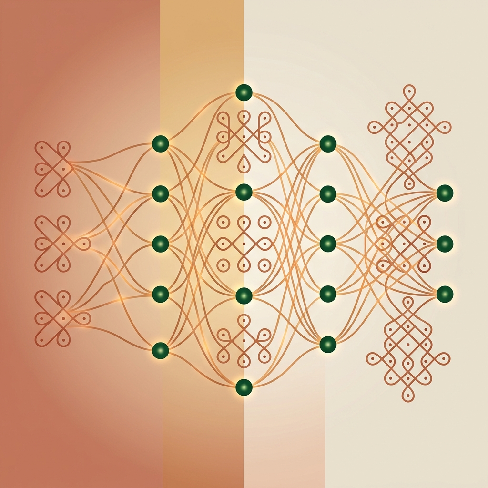
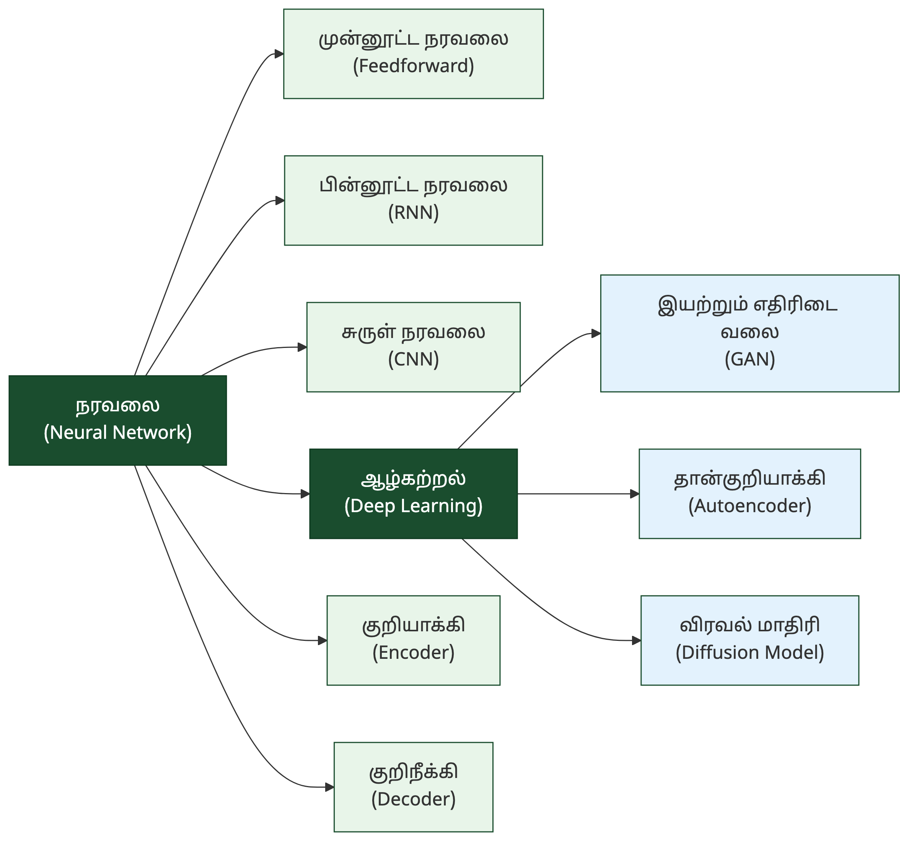

# 3. நரவலை & ஆழ்கற்றல் — Neural Networks & Deep Learning

<!-- IMAGE: Interconnected nodes glowing in layers, inspired by kolam dot-grid patterns, deep green (#1a4d2e) accent, flat vector style with Tamil cultural motifs -->

<!-- END IMAGE -->

> **🎯 கற்றல் நோக்கங்கள்**
> - நரவலை (Neural Network), செய்நரவலை (ANN), ஆழ்கற்றல் (Deep Learning) ஆகிய அடிப்படைக் கருத்துகளின் வேறுபாடுகளை அறிதல்
> - சுருள் நரவலை (CNN), பின்னூட்ட நரவலை (RNN), இயற்றும் எதிரிடை வலை (GAN) போன்ற கட்டமைப்புகளின் கலைச்சொற்களைப் புரிந்துகொள்ளுதல்
> - அடுக்கு (Layer), தூண்டல் சார்பு (Activation Function), குறியாக்கி (Encoder) ஆகிய உள்கூறுகளின் தமிழ்ச்சொற்களை அறிதல்

## "கோலமும் நரவலையும்"

தமிழ்நாட்டின் வீட்டு வாசலில் வரையப்படும் கோலத்தின் புள்ளி வடிவம் (pulli kolam) நரவலையின் கட்டமைப்போடு ஒரு கவிதையான ஒற்றுமையைக் கொண்டுள்ளது. கோலத்தில் ஒவ்வொரு புள்ளியும் அடுத்த புள்ளியோடு இணைக்கப்படுகிறது, சிக்கலான வடிவங்கள் எளிய இணைப்புகளிலிருந்து தோன்றுகின்றன. அதேபோல் நரவலையிலும் (Neural Network) எளிய நரம்பணுக்கள் அடுக்கடுக்காக இணைக்கப்பட்டு, சிக்கலான வடிவங்களைக் கண்டறியும் திறன் பெறுகின்றன.

1943-ல் வாரன் மெக்கலாக் (Warren McCulloch) மற்றும் வால்ட்டர் பிட்ஸ் (Walter Pitts) என்ற இரு ஆராய்ச்சியாளர்கள் மூளையின் நரம்பணுக்களைக் கணிதமாக வடிவமைத்தனர். அந்த தொடக்கக் கருத்து பல பத்தாண்டுகளில் வளர்ந்து, இன்று படம் உருவாக்கம் (Diffusion Models), மொழி மாதிரிகள் (LLMs) வரை பயன்படும் ஆழ்கற்றல் (Deep Learning) தொழில்நுட்பமாக மாறியுள்ளது.

இந்த அத்தியாயத்தில் நரவலை அடிப்படைகள், கட்டமைப்புகள், அடுக்குகள், செயல்பாட்டுக் கூறுகள் ஆகியவற்றுக்கான 20 கலைச்சொற்கள் தொகுக்கப்பட்டுள்ளன.

### நரவலை அடிப்படைகள் — Neural Network Fundamentals

நரவலை (Neural Network) என்பது மனித மூளையின் நரம்பணு அமைப்பிலிருந்து உத்வேகம் பெற்ற கணினிக் கட்டமைப்பு. எளிய நரவலை சில அடுக்குகளைக் கொண்டிருக்கும். ஆழ்கற்றல் (Deep Learning) என்பது பல அடுக்குகள் கொண்ட நரவலைகளைப் பயன்படுத்தும் மேம்பட்ட வகை.

**Neural Networks — நரவலை** (நரம்பணு வலைப்பின்னல்) [^1]
நரம்பு (nerve) + வலை (network). மனித மூளையின் கட்டமைப்பைப் பின்பற்றித் தரவுகளில் உள்ள சிக்கலான வடிவங்களைக் கற்றுக்கொள்ளும் கணினி அமைப்பு.

**Artificial Neural Network (ANN) — செய்நரவலை** [^1]
செய் (artificial) + நரம்பு (nerve) + வலை (network). மனித மூளையின் நரம்பணு அமைப்பைப் பின்பற்றி வடிவமைக்கப்பட்ட கணினிக் கட்டமைப்பு.

**Deep Learning — ஆழ்கற்றல்** (ஆழ்திறன் கற்றல்)
ஆழ் (deep) + கற்றல் (learning). பல அடுக்கு நரவலைகளைப் பயன்படுத்திப் பெருமளவு தரவுகளிலிருந்து சிக்கலான அமைப்புகளைக் கற்றுக்கொள்ளும் முறை.

### நரவலை கட்டமைப்புகள் — Network Architectures

நரவலைகள் பல கட்டமைப்புகளில் வடிவமைக்கப்படுகின்றன. தகவல் ஒரே திசையில் பயணிக்கும் முன்னூட்ட நரவலை (Feedforward) எளிய வகை. பின்னூட்ட நரவலை (RNN) மொழி போன்ற தொடர்ச்சியான தரவுகளைக் கையாள வல்லது. சுருள் நரவலை (CNN) படங்களில் வடிவங்களைக் கண்டறிகிறது. இயற்றும் எதிரிடை வலை (GAN), விரவல் மாதிரி (Diffusion Model) ஆகியவை புதிய உள்ளடக்கத்தை உருவாக்குகின்றன.

**Feedforward Neural Networks — முன்னூட்ட நரவலை** [^1]
முன் (forward) + ஊட்டம் (feed) + நரவலை. தகவல்கள் உள்ளீட்டு அடுக்கிலிருந்து வெளியீட்டு அடுக்குக்கு ஒரே திசையில் (முன்னோக்கி) மட்டுமே சுழற்சியின்றிப் பயணிக்கும் நரவலை.

**Recurrent Neural Network (RNN) — பின்னூட்ட நரவலை** (மீள்சுற்று நரவலை) [^1]
பின்னூட்டம் (recurrent/feedback) + நரவலை. முந்தைய வெளியீட்டைத் தற்போதைய உள்ளீட்டின் ஒரு பகுதியாகப் பயன்படுத்தித் தொடர்ச்சியான தரவுகளைக் (மொழி, நேரம்) கையாளும் நரவலை.

**Convolutional Neural Network (CNN) — சுருள் நரவலை** (முறுக்கு நரவலை)
சுருள் (convolution) + நரவலை (neural network). படங்களையும் வடிவப் பகுப்பாய்வையும் சிறப்பாகக் கையாளும் ஆழ்கற்றல் கட்டமைப்பு; படத்தின் சிறு பகுதிகளில் வடிவங்களைக் கண்டறிய சுருள் வடிவ வடிப்பான்களைப் பயன்படுத்துகிறது.

**Generative Adversarial Network (GAN) — இயற்றும் எதிரிடை வலை** (எதிர்வலைப் பின்னல்)
இயற்றும் (generative) + எதிரிடை (adversarial) + வலை (network). இரண்டு போட்டியிடும் நரவலைகள் (இயற்றி, கண்டறிவி) மூலம் புதிய தரவுகளை உருவாக்கும் கட்டமைப்பு.

**Backpropagation Neural Networks — பின்பிழைப்பாய்ச்ச நரவலை** [^1]
பின்பிழைப்பாய்ச்ச முறையைப் பயன்படுத்திப் பயிற்றுவிக்கப்படும் நரவலைக் கட்டமைப்பு.

**Autoencoder — தான்குறியாக்கி** (தான்சுருக்கி)
தான் (self) + குறியாக்கி (encoder). உள்ளீட்டைச் சுருக்கி மீண்டும் மீட்டமைக்கும் நரவலை. பண்பெடுப்பு (Feature Extraction), இரைச்சல் நீக்கம் ஆகியவற்றில் பயன்படுகிறது.

**Diffusion Model — விரவல் மாதிரி** (பரவல் மாதிரி)
விரவல் (diffusion) + மாதிரி (model). இரைச்சலைச் சேர்த்துப் பின் அதை நீக்குவதன் மூலம் தரவுகளிலிருந்து புதிய படங்களையோ ஒலிகளையோ உருவாக்கும் இயற்றறிவு மாதிரி.

> [!NOTE]
> **அறிவீர்களா?** கோலத்தின் புள்ளிகளை (pulli) நரம்பணுக்களாகவும், இணைப்புக் கோடுகளை எடைகளாகவும் (Weights) கருதினால், கோலத்தின் வடிவம் ஒரு நரவலையின் கட்டமைப்பை ஒத்திருக்கும். கோலத்தில் ஒரு புள்ளியை மாற்றினால் முழு வடிவமும் மாறுவது போல, நரவலையில் ஒரு எடையை மாற்றினால் வெளியீடு மாறும்.

### அடுக்குகள் & மாதிரி வகைகள் — Layers & Model Types

நரவலை அடுக்குகளால் (Layers) ஆனது. உள்ளீட்டு அடுக்கு தரவை ஏற்கிறது, மறை அடுக்குகள் கற்றலை நிகழ்த்துகின்றன, வெளியீட்டு அடுக்கு முடிவைத் தருகிறது. அடுக்குகள் எவ்வாறு இணைக்கப்படுகின்றன என்பதைப் பொறுத்து அடர்த்தி மாதிரி (Dense Model), சிதறல் மாதிரி (Sparse Model) எனப் பிரிக்கலாம்.

**Layer — அடுக்கு**
நரவலையின் ஒரு செயல்பாட்டு நிலை; உள்ளீட்டு அடுக்கு, மறை அடுக்குகள் மற்றும் வெளியீட்டு அடுக்கு எனப் பல நிலைகளைக் கொண்டது.

**Dense Layer — அடர்த்தி அடுக்கு** (முழு இணைப்பு அடுக்கு)
ஒரு நரவலையில் முந்தைய அடுக்கின் அனைத்து நரம்பணுக்களுடனும் முழுமையாக இணைக்கப்பட்ட அடுக்கு.

**Dense Model — அடர்த்தி மாதிரி**
நரவலையில் உள்ள அனைத்து நரம்பணுக்களும் ஒன்றுக்கொன்று முழுமையாக இணைக்கப்பட்டு, அனைத்து எடைகளும் செயல்படும் நிலையில் உள்ள மாதிரி (சிதறல் மாதிரிக்கு எதிர்மாறானது).

**Sparse Model — சிதறல் மாதிரி** (அரிது மாதிரி)
சிதறல் (sparse) + மாதிரி (model). பல எடைகள் (Weights) பூஜ்யத்திற்கு அருகில் சிதறிக் காணப்படும் மாதிரி; இதனால் குறைந்த கணக்கீட்டுத் திறனிலேயே செயல்பட முடிகிறது.

> [!TIP]
> **அடர்த்தி மாதிரி (Dense) vs சிதறல் மாதிரி (Sparse):** அடர்த்தி மாதிரியில் அனைத்து நரம்பணுக்களும் செயல்படும், கணக்கீடு மிகுதி. சிதறல் மாதிரியில் தேவையான நரம்பணுக்கள் மட்டும் செயல்படும், வேகமும் சிக்கனமும் கூடும். Mixture of Experts (MoE) கட்டமைப்பு சிதறல் மாதிரியின் ஒரு முதன்மைப் பயன்பாடு.

### செயல்பாட்டுக் கூறுகள் — Functional Components

நரவலையின் உள்ளே ஒவ்வொரு நரம்பணுவும் ஒரு தூண்டல் சார்பின் (Activation Function) வழியாகச் செயல்படுகிறது. இந்தச் சார்பு நரம்பணுவின் வெளியீட்டை மாற்றி அடுத்த அடுக்குக்கு அனுப்புகிறது. மிகைப்பொருத்தத்தைக் (Overfitting) குறைக்கத் துளைவிடல் (Dropout) பயன்படுகிறது. குறியாக்கி (Encoder) தரவைச் சுருக்குகிறது, குறிநீக்கி (Decoder) மீட்டமைக்கிறது.

**Activation Function — தூண்டல் சார்பு** (இயக்கச் சார்பு)
நரம்புவலையில் ஒரு கணுவுக்குக் கிடைக்கும் மதிப்பை மாற்றி அடுத்த அடுக்கு பயன்படுத்தும் சார்பு (உ-ம்: ReLU, Sigmoid).

**Softmax — மென்-மீப்பெரு சார்பு**
மென் (soft) + மீப்பெரு (maximum) + சார்பு (function). எண்களின் திசையனை நிகழ்தகவு விநியோகமாக மாற்றும் சார்பு; வெளியீடுகளின் கூட்டுத்தொகை 1 ஆக இருக்கும், ஒரு வெற்றியாளரை மட்டும் தேர்ந்தெடுக்காமல் மென்மையான மாற்றத்தை அளிக்கும்.

**Hardmax — கடின-மீப்பெரு சார்பு**
கடின (hard) + மீப்பெரு (maximum) + சார்பு (function). மீப்பெரு மதிப்பை 1 ஆகவும் ஏனைய மதிப்புகளை 0 ஆகவும் கட்டாயமாக மாற்றும் இருமைத் தேர்வுச் சார்பு; நிகழ்தகவுக்கு இடமளிக்காது.

**Argmax — சார்பின்-உச்சநிலை**
சார்பின் (arguments) + உச்சநிலை (maximum). மீப்பெரு மதிப்பையே தராமல், அந்த மீப்பெரு மதிப்பு எந்தச் சுட்டெண்ணில் (index) உள்ளது என்பதைக் கண்டறிந்து தரும் சார்பு.

**Sigmoid — சிக்மாய்டு சார்பு** (வளைகோட்டுச் சார்பு)
எந்த உண்மையான எண்ணையும் 0-க்கும் 1-க்கும் இடையிலான நிகழ்தகவு வீச்சுக்கு மாற்றும் தூண்டல் சார்பு; 'S' வடிவ வளைகோட்டை உருவாக்கும்.

**Tanh — டான்ஹெச் சார்பு** (அதிபரவளையத் தொடுகோடு சார்பு)
சிக்மாய்டு (Sigmoid) சார்பை ஒத்தது; உள்ளீட்டு மதிப்புகளை -1-க்கும் 1-க்கும் இடையில் பூச்சிய-மையமாக (zero-centered) மாற்றும் தூண்டல் சார்பு.

**ReLU — நேரியல் திருத்த அலகு** (சரிசெய்த நேரியல் அலகு)
நேரிய (linear) + திருத்த (rectified) + அலகு (unit). நேர்மதிப்புகளை அப்படியே கடத்தி, எதிர்மதிப்புகளை 0 ஆக மாற்றும் தூண்டல் சார்பு; ஆழ்கற்றலில் மிகப் பரவலாகப் பயன்படுகிறது.

**Dropout — துளைவிடல்** (நரம்புவிடுபடல்)
பயிற்சியில் சில நரம்புகளைத் தற்காலிகமாக முடக்கி மிகைப்பொருத்தத்தைக் குறைக்கும் சீரமைப்பு நுட்பம்.

**Encoder — குறியாக்கி**
குறி (code) + ஆக்கி (maker). மனித உள்ளீட்டைக் கணினி புரிந்துகொள்ளும் உள்ளார்ந்த எண் தரவாக (Vector / Embedding) மாற்றும் பகுதி.

**Decoder — குறிநீக்கி** (மீள்வடிவாக்கி)
குறி (code) + நீக்கி (remover). குறியாக்கப்பட்ட தரவிலிருந்து மனிதர்கள் அல்லது கணினி புரிந்துகொள்ளும் வெளியீட்டை உருவாக்கும் பகுதி.

> [!NOTE]
> **அறிவீர்களா?** குறியாக்கி-குறிநீக்கி (Encoder-Decoder) கட்டமைப்பு மொழிபெயர்ப்பில் சிறப்பாகப் பயன்படுகிறது. தமிழ் வாக்கியத்தைக் குறியாக்கி சுருக்கமான எண் வடிவமாக மாற்றும், குறிநீக்கி அதை ஆங்கில வாக்கியமாக மீட்டமைக்கும். மாற்றுநர் (Transformer) கட்டமைப்பும் இதே அடிப்படையில் இயங்குகிறது (அத்தியாயம் 5 காண்க).

### 📰 AI வரலாற்றில் ஒரு துளி

**செய்யறிவுக் குளிர்காலமும் (AI Winter) நரவலையின் மீட்சியும்!**

1980 மற்றும் 1990-களில், நரவலைகள் (Neural Networks) பயனற்றவை என அறிவியலாளர்களால் கருதப்பட்டன. முதலீடுகள் நிறுத்தப்பட்ட இந்தக் காலக்கட்டம் "செய்யறிவுக் குளிர்காலம்" (AI Winter) என அழைக்கப்படுகிறது.

ஆனால், ஜெஃப்ரி ஹிண்டன் (Geoffrey Hinton), யான் லெகுன் (Yann LeCun), யோசுவா பெங்கியோ (Yoshua Bengio) ஆகிய மூன்று அறிவியலாளர்கள் மட்டும் தளராமல் நரவலை ஆய்வைத் தொடர்ந்தனர். இன்று ஆழ்கற்றல் உலகை ஆள்வதற்குக் காரணமான இந்த மூவரும் "ஆழ்கற்றலின் முன்னோடித் தந்தையர்" (Godfathers of Deep Learning) என்று அழைக்கப்படுகின்றனர். 2018-ல் இவர்களுக்குக் கணிப்பொறியியலின் உயரிய விருதான 'டியூரிங் விருது' வழங்கப்பட்டது.

## 📋 அத்தியாயச் சுருக்கம்

> **💡 முதன்மைக் கருத்துகள்**
> - இந்த அத்தியாயத்தில் 20 கலைச்சொற்கள்: நரவலை அடிப்படைகள் முதல் குறியாக்கி/குறிநீக்கி வரை
> - நரவலை (Neural Network) என்பது "நரம்பு + வலை" என்ற வேர்களிலிருந்து உருவானது. மனித மூளையின் கட்டமைப்பைப் பின்பற்றிய கணினி அமைப்பு
> - ஒவ்வொரு கட்டமைப்பும் ஒரு குறிப்பிட்ட பணிக்குச் சிறப்பானது: CNN படங்களுக்கு, RNN தொடர்ச்சியான தரவுகளுக்கு, GAN புதிய உள்ளடக்க உருவாக்கத்திற்கு

**அடிக்கடி குழப்பமடையும் சொற்கள்:**
- நரவலை (Neural Network) vs ஆழ்கற்றல் (Deep Learning): நரவலை என்பது கட்டமைப்பு, ஆழ்கற்றல் என்பது பல அடுக்கு நரவலைகளைப் பயன்படுத்தும் கற்றல் முறை
- அடர்த்தி மாதிரி (Dense) vs சிதறல் மாதிரி (Sparse): அனைத்து எடைகளும் செயல்படுதல் vs தேர்ந்தெடுக்கப்பட்ட எடைகள் மட்டும் செயல்படுதல்
- குறியாக்கி (Encoder) vs குறிநீக்கி (Decoder): தரவைச் சுருக்குதல் vs சுருக்கத்திலிருந்து மீட்டமைத்தல்

> [!TIP]
> **குறுக்கு இணைப்பு:** இயந்திரக் கற்றல் (Machine Learning) முறைகள் பற்றி அத்தியாயம் 2-ல் காண்க. பயிற்சி & உகப்பாக்கம் (Training & Optimization), பின்பிழைப்பாய்ச்சம் (Backpropagation) ஆகியவை அத்தியாயம் 4-ல் விரிவாக விளக்கப்பட்டுள்ளன. மாற்றுநர் (Transformer) கட்டமைப்பு, குறியாக்கி-குறிநீக்கி வடிவமைப்பின் மேம்பாடு, அத்தியாயம் 5-ல் காண்க.

## 💭 உங்கள் சிந்தனைக்கு

1. தமிழ்க் கையெழுத்துக்களை அடையாளம் காணும் AI அமைப்பை உருவாக்க விரும்புகிறீர்கள். இதற்கு சுருள் நரவலை (CNN) பொருத்தமா, பின்னூட்ட நரவலை (RNN) பொருத்தமா? தமிழ் எழுத்துகளின் வளைவான வடிவங்களைக் கண்டறிய எந்தக் கட்டமைப்பு ஏன் சிறந்தது?

2. ஒரு இயற்றும் எதிரிடை வலை (GAN) மூலம் பழந்தமிழ்ச் சுவடிகளின் சேதமடைந்த பகுதிகளை மீட்டமைக்க முடியுமா? இயற்றி (Generator) என்ன செய்யும், கண்டறிவி (Discriminator) என்ன செய்யும் என்பதை விளக்குக.

3. ஒரு தமிழ் மொழிபெயர்ப்பு மாதிரியில் குறியாக்கி (Encoder) தமிழ் வாக்கியத்தைச் சுருக்குகிறது, குறிநீக்கி (Decoder) ஆங்கில வாக்கியத்தை உருவாக்குகிறது. ஆழ்கற்றல் (Deep Learning) மாதிரியில் அடுக்குகளின் எண்ணிக்கையை பெருக்குவது மொழிபெயர்ப்புத் தரத்தை எப்போதும் மேம்படுத்துமா? மிகைப்பொருத்தம் (Overfitting) ஏற்படும் ஆபத்து உள்ளதா?

## 🧠 அறிவுச் சோதனை

1. **பொருத்துக:** கீழ்க்கண்ட ஆங்கிலச் சொற்களுக்கு சரியான தமிழ்ச் சொல்லைப் பொருத்துக:

    | ஆங்கிலம் | தமிழ் |
    |:---------|:------|
    | Convolutional Neural Network | அ) பின்னூட்ட நரவலை |
    | Recurrent Neural Network | ஆ) தான்குறியாக்கி |
    | Autoencoder | இ) சுருள் நரவலை |

2. **கோடிட்ட இடத்தை நிரப்புக:** "________ என்பது பல அடுக்கு நரவலைகளைப் பயன்படுத்திப் பெருமளவு தரவுகளிலிருந்து சிக்கலான அமைப்புகளைக் கற்றுக்கொள்ளும் முறை."

3. **சரியா / தவறா:** "முன்னூட்ட நரவலையில் (Feedforward) தகவல்கள் முன்னோக்கியும் பின்னோக்கியும் பயணிக்கும்."

4. **பல தேர்வு:** கீழ்க்கண்டவற்றில் "துளைவிடல்" (Dropout) என்பதன் சரியான விளக்கம் எது?

    - அ) நரவலையில் புதிய அடுக்குகளைச் சேர்க்கும் முறை
    - ஆ) பயிற்சியில் சில நரம்புகளைத் தற்காலிகமாக முடக்கி மிகைப்பொருத்தத்தைக் குறைக்கும் நுட்பம்
    - இ) நரவலையின் வெளியீட்டை நிகழ்தகவு விநியோகமாக மாற்றும் செயல்பாடு

5. **சரியா / தவறா:** "குறியாக்கி (Encoder) குறியாக்கப்பட்ட தரவிலிருந்து மனிதர்கள் புரிந்துகொள்ளும் வெளியீட்டை உருவாக்கும்."

<strong>விடைகளைக் காண சொடுக்குக</strong>

1. Convolutional Neural Network → இ) சுருள் நரவலை, Recurrent Neural Network → அ) பின்னூட்ட நரவலை, Autoencoder → ஆ) தான்குறியாக்கி
2. ஆழ்கற்றல் (Deep Learning)
3. **தவறு.** முன்னூட்ட நரவலையில் தகவல்கள் உள்ளீட்டிலிருந்து வெளியீட்டுக்கு ஒரே திசையில் (முன்னோக்கி) மட்டுமே பயணிக்கும், சுழற்சி இல்லை.
4. **ஆ)** பயிற்சியில் சில நரம்புகளைத் தற்காலிகமாக முடக்கி மிகைப்பொருத்தத்தைக் குறைக்கும் நுட்பம்.
5. **தவறு.** குறியாக்கி (Encoder) உள்ளீட்டைச் சுருக்கமான எண் வடிவமாக மாற்றும். குறிநீக்கி (Decoder) தான் சுருக்கத்திலிருந்து வெளியீட்டை உருவாக்கும்.

