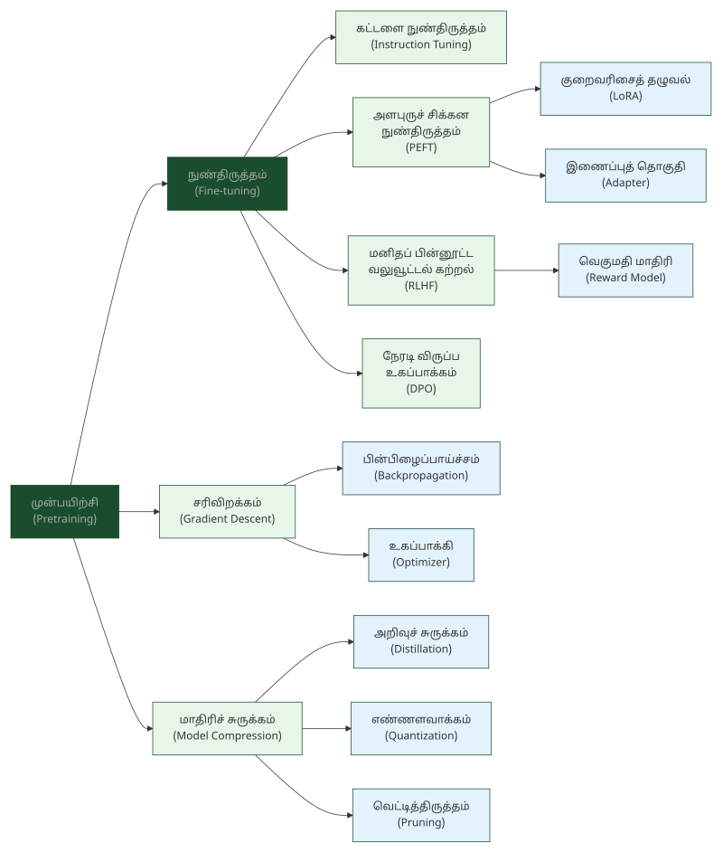

# 4. பயிற்சி & உகப்பாக்கம் — Training & Optimization

> **🎯 கற்றல் நோக்கங்கள்**
> - முன்பயிற்சி (Pretraining), நுண்திருத்தம் (Fine-tuning), கட்டளை நுண்திருத்தம் (Instruction Tuning) ஆகிய பயிற்சி முறைகளின் வேறுபாடுகளை அறிதல்
> - சரிவிறக்கம் (Gradient Descent), பின்பிழைப்பாய்ச்சம் (Backpropagation) போன்ற உகப்பாக்க நுட்பங்களின் கலைச்சொற்களைப் புரிந்துகொள்ளுதல்
> - எண்ணளவாக்கம் (Quantization), அறிவுச் சுருக்கம் (Distillation), LoRA போன்ற நவீன சிக்கன நுட்பங்களின் தமிழ்ச்சொற்களை அறிதல்

## "குயவனின் சக்கரம்"

<!-- IMAGE: A potter's wheel shaping a form — iterative refinement metaphor, deep green (#1a4d2e) accent, flat vector style with Tamil cultural motifs -->

<!-- END IMAGE -->

ஒரு குயவன் களிமண்ணைச் சக்கரத்தில் வைத்து, சுழற்சிக்குச் சுழற்சி மெதுவாகச் செப்பனிட்டுப் பானையை வடிவமைக்கிறான். முதல் சுழற்சியில் கரடுமுரடான வடிவம், அடுத்த சுழற்சியில் சற்றுச் சீரான வடிவம், பல சுழற்சிகளுக்குப் பிறகு நேர்த்தியான பானை. இது AI மாதிரியின் பயிற்சிச் செயல்முறையை அழகாகப் பிரதிபலிக்கிறது.

AI மாதிரியின் பயிற்சியிலும் இதே மறுசெய்கை (iterative) அணுகுமுறை பின்பற்றப்படுகிறது. ஒவ்வொரு சுழற்சியிலும் (Epoch) மாதிரி தரவைப் பார்க்கிறது, பிழையைக் கணக்கிடுகிறது (Loss Function), சரிவிறக்கம் (Gradient Descent) மூலம் எடைகளைச் சரிசெய்கிறது. பல சுழற்சிகளுக்குப் பிறகு மாதிரி துல்லியமாகக் கணிக்கத் தொடங்குகிறது. ஆனால் மிகுதியாகச் செப்பனிட்டால் மிகைப்பொருத்தம் (Overfitting) ஏற்படும், குயவன் பானையை மிகுதியாக அழுத்தினால் உடைவது போல.

இந்த அத்தியாயத்தில் பயிற்சி முறைகள், அளபுருக்கள், உகப்பாக்கம், நுண்திருத்த நுட்பங்கள், மாதிரிச் சுருக்கம் ஆகியவற்றுக்கான 28 கலைச்சொற்கள் தொகுக்கப்பட்டுள்ளன.

### பயிற்சி முறைகள் — Training Methods

AI மாதிரியின் பயிற்சி பல படிநிலைகளில் நடைபெறுகிறது. முதலில் பெரிய பொதுத் தரவுகளில் முன்பயிற்சி (Pretraining) அளிக்கப்படுகிறது. பின்னர் குறிப்பிட்ட துறைக்கு நுண்திருத்தம் (Fine-tuning) செய்யப்படுகிறது. கட்டளை நுண்திருத்தம் (Instruction Tuning) மாதிரியைப் பயனர் கட்டளைகளுக்கு ஏற்பச் செயல்பட வைக்கிறது.

**Pretraining — முன்பயிற்சி**
முன் (pre) + பயிற்சி (training). ஒரு மாதிரியைக் குறிப்பிட்ட பணிக்கு நுண்திருத்தம் செய்யும் முன், பெரிய பொதுத் தரவுகளில் அடிப்படை மொழியறிவைப் பயிற்றுவித்தல்.

**Fine-tuning — நுண்திருத்தம்** (சிறப்புப் பயிற்சி / செப்பனிடல்)
நுண் (fine/subtle) + திருத்தம் (tuning). ஏற்கனவே பொதுவான தரவுகளில் கற்ற ஒரு பெரிய AI மாதிரிக்கு, குறிப்பிட்ட ஒரு துறை சார்ந்த தரவுகளை மட்டும் கொடுத்து மேலும் துல்லியமாக மாற்றுவதற்கான பயிற்சி.

**Instruction Tuning — கட்டளை நுண்திருத்தம்**
கட்டளை (instruction) + நுண்திருத்தம் (fine-tuning). பயனர் கட்டளைகளை AI மாதிரி துல்லியமாகப் பின்பற்ற உதவும் சிறப்பு நுண்திருத்தப் பயிற்சி.

**Synthetic Data — செயற்கைத் தரவு** (புனைவுத் தரவு)
செயற்கை (artificial) + தரவு (data). கணினி அல்லது AI மூலம் செயற்கையாக உருவாக்கப்படும் பயிற்சித் தரவு; உண்மைத் தரவு போதுமானதாக இல்லாதபோது அல்லது தனியுரிமைக் கவலைகள் இருக்கும்போது பயன்படுகிறது (உ-ம்: மருத்துவத் தரவு, அரிய மொழித் தரவு).

### அளபுருக்கள் — Parameters

மாதிரியின் கற்றல் திறன் அதன் அளபுருக்களில் (Parameters) சேமிக்கப்படுகிறது. பெருமொழி மாதிரிகளில் பில்லியன் கணக்கான அளபுருக்கள் இருக்கலாம். மேலளபுருக்கள் (Hyperparameters) பயிற்சிக்கு முன்பே வடிவமைப்பாளரால் அமைக்கப்படும் கட்டுப்பாட்டு மதிப்புகள்.

**Hyperparameter — மேலளபுரு** (கட்டுப்பாட்டு அளபுரு)
மேல் (over/hyper) + அளபுரு (parameter). மாதிரி தானாகக் கற்றுக்கொள்ளாமல், பயிற்சிக்கு முன்பே வடிவமைப்பாளரால் முன்கூட்டியே அமைக்கப்படும் அளபுரு (உ-ம்: Learning Rate, Batch Size).

**Overparameterization — அளபுரு மிகைப்பு**
அளபுரு (parameter) + மிகைப்பு (excess). பயிற்சிக்குத் தேவையானதை விட மிகுந்த அளபுருக்களைக் கொண்ட நிலை; தற்கால ஆழ்கற்றலில் இது பொதுவானது.

> [!TIP]
> **அளபுரு (Parameter) vs மேலளபுரு (Hyperparameter):** அளபுரு என்பது மாதிரி தானாகக் கற்றுக்கொள்ளும் மதிப்பு (எ.கா: எடைகள்). மேலளபுரு என்பது பயிற்சிக்கு முன்பே மனிதர்களால் அமைக்கப்படும் கட்டுப்பாட்டு மதிப்பு (எ.கா: கற்றல் வீதம்). கற்றல் வீதம் மிகுதியாக இருந்தால் மாதிரி சரியாகக் கற்காது, மிகக் குறைவாக இருந்தால் கற்றல் மிக மெதுவாகும்.

### பயிற்சி அமைப்புகள் — Training Setup

கற்றல் வீதம் (Learning Rate), தொகுதி அளவு (Batch Size), சுழற்சிகளின் எண்ணிக்கை (Epochs) போன்ற அமைப்புகள் பயிற்சியின் வேகத்தையும் தரத்தையும் நிர்ணயிக்கின்றன.

**Batch Size — தொகுதி அளவு**
ஒரு பயிற்சிச் சுழற்சியில் ஒரே நேரத்தில் பயன்படுத்தும் எடுத்துக்காட்டுகளின் எண்ணிக்கை.

**Epoch — சுழற்சி** (முழுச் சுழற்சி)
ஒரு AI மாதிரியை முழுப் பயிற்சித் தரவைப் பயன்படுத்தி ஒருமுறை பயிற்றுவித்தல்; பெரும்பாலான பயிற்சிகளில் பல சுழற்சிகள் தேவைப்படும்.

**Learning Rate — கற்றல் வீதம்**
கற்றல் (learning) + வீதம் (rate). எடைகள் எவ்வளவு வேகமாகப் புதுப்பிக்கப்படுகின்றன என்பதைக் கட்டுப்படுத்தும் மேலளபுரு; மிகுதியாக இருந்தால் மாதிரி சரியாகக் கற்காது, மிகக் குறைவாக இருந்தால் கற்றல் மிக மெதுவாகும்.

**Learning Objective — கற்றல் நோக்கம்**
கற்றல் (learning) + நோக்கம் (objective). இயந்திரக் கற்றலின்போது ஒரு மாதிரி அடைய வேண்டிய இலக்கு அல்லது குறைக்க வேண்டிய பிழை அளவு (உ-ம்: CLM அடுத்த சொல்லைக் கணிக்கும், MLM மறைக்கப்பட்ட சொல்லைக் கணிக்கும்).

### உகப்பாக்கம் & சரிவிறக்கம் — Optimization & Gradient Methods

பயிற்சியின் இதயம் உகப்பாக்கச் செயல்முறை. இழப்புச் சார்பு (Loss Function) மாதிரியின் பிழையை அளவிடுகிறது. சரிவு (Gradient) பிழையைக் குறைக்கும் திசையைச் சுட்டிக்காட்டுகிறது. சரிவிறக்கம் (Gradient Descent) அந்தத் திசையில் அளபுருக்களை நகர்த்துகிறது. பின்பிழைப்பாய்ச்சம் (Backpropagation) நரவலையின் ஒவ்வொரு அடுக்கிற்கும் சரிவைக் கணக்கிடுகிறது. சீரமைப்பு (Regularization) மிகைப்பொருத்தத்தைத் தடுக்கிறது.

**Loss Function — இழப்புச் சார்பு** (பிழை அளவீடு)
இழப்பு (loss) + சார்பு (function). AI மாதிரியின் கணிப்புகளுக்கும் உண்மை மதிப்புகளுக்கும் இடையே உள்ள வேறுபாட்டை அளவிடும் கணிதச் சார்பு; பயிற்சியின் போது இதைக் குறைப்பதே முதன்மை நோக்கமாகும்.

**Cross-Entropy — வகைப்புப் பிழை அளவு** (குறுக்கு-எண்ட்ரோபி)
வகைப்பு (classification) + பிழை (error) + அளவு (measure). கணிக்கப்பட்ட விநியோகத்துக்கும் உண்மை விநியோகத்துக்கும் இடையிலான வேறுபாட்டை அளவிடும் இழப்புச் சார்பு; வகைப்பாட்டு மற்றும் மொழி மாதிரிப் பயிற்சியில் அதிகம் பயன்படுத்தப்படும் இழப்புச் சார்பு.

**Gradient — சரிவு** (படிமச் சாய்வு)
இழப்புச் சார்பின் (Loss Function) மாற்ற வேகம்; எந்தத் திசையில் அளபுருக்களை நகர்த்தினால் பிழை குறையும் என்பதைச் சுட்டிக்காட்டுகிறது. (கணித நூல்களில் "சரிவு" என்பதே நிறுவப்பட்ட சொல்.)

**Gradient Descent — சரிவிறக்கம்** (படிம இறக்கம்)
சரிவு (gradient) + இறக்கம் (descent). ஒரு AI மாதிரியின் இழப்பைக் குறைக்க அதன் அளபுருக்களைப் படிப்படியாகச் சரிசெய்யும் உகப்பாக்க நெறிமுறை; ஆழ்கற்றலின் அடித்தளம்.

**Backpropagation (of error) — பின்பிழைப்பாய்ச்சம்** (பின்னோக்கிய பிழைப்பாய்ச்சம்) [^1]
பின் (back) + பிழை (error) + பாய்ச்சம் (propagation). நரவலையில் பிழைகளைக் கணக்கிட்டு, எடைகளைச் சரிசெய்யப் பின்னோக்கிச் செல்லும் கணித முறை.

**Optimizer — உகப்பாக்கி**
உகப்பு (optimum) + ஆக்கி (maker). பயிற்சியின்போது இழப்புச் சார்பைக் குறைக்க எடைகளைப் புதுப்பிக்கும் நெறிமுறை (Adam, SGD, AdamW); கற்றல் வீதத்துடன் (Learning Rate) இணைந்து மாதிரியின் ஒருங்கிணைவு வேகத்தையும் தரத்தையும் தீர்மானிக்கிறது.

**Regularization — சீரமைப்பு** (ஒழுங்குமுறைப்படுத்தல்)
மிகைப்பொருத்தத்தைக் குறைக்கப் பயிற்சியில் கட்டுப்பாடுகள் விதிக்கும் நுட்பங்கள் (Dropout, Weight Decay).

**Weight Decay — எடைத் தளர்வு**
எடை (weight) + தளர்வு (decay). மிகைப்பொருத்தத்தைக் குறைக்கப் பயிற்சியின் போது எடைகளை மெதுவாகச் சிறிதாக்கும் சீரமைப்பு முறை.

> [!NOTE]
> **அறிவீர்களா?** சரிவிறக்கம் (Gradient Descent) ஒரு மலையிலிருந்து கண்மூடித்தனமாக இறங்குவதற்கு ஒப்பிடலாம். ஒவ்வொரு அடியிலும் மிகச் செங்குத்தான திசையில் (சரிவு) இறங்குகிறோம். கற்றல் வீதம் (Learning Rate) நமது அடியின் அளவு. அடி மிகப் பெரிதாக இருந்தால் பள்ளத்தைத் தாண்டிவிடுவோம், மிகச் சிறிதாக இருந்தால் மலையிலேயே நிற்போம்.

### நுண்திருத்த நுட்பங்கள் — Fine-tuning Techniques

பெருமொழி மாதிரிகளின் அளபுருக்கள் பில்லியன் கணக்கில் உள்ளன. முழு மாதிரியையும் நுண்திருத்தம் செய்வது மிகச் செலவானது. அளபுருச் சிக்கன நுண்திருத்தம் (PEFT) இந்தச் சிக்கலுக்குத் தீர்வு: சிறிய எண்ணிக்கையிலான கூடுதல் அளபுருக்களை மட்டும் சேர்த்துப் பயிற்றுவிக்கிறது. RLHF, DPO ஆகியவை மனித விருப்பங்களுக்கு ஏற்ப மாதிரியைச் சீரமைக்கின்றன.

**Parameter-Efficient Fine-Tuning (PEFT) — அளபுருச் சிக்கன நுண்திருத்தம்** (எடை-சிக்கன நுண்திருத்தம்)
அளபுரு (parameter) + சிக்கனம் (efficient) + நுண்திருத்தம் (fine-tuning). முழு மாதிரியின் அளபுருக்களையும் மாற்றாமல், சிறிய எண்ணிக்கையிலான அளபுருக்களை மட்டும் சேர்த்து அல்லது மாற்றி நுண்திருத்தம் செய்யும் முறை.

**Low-Rank Adaptation (LoRA) — குறைவரிசைத் தழுவல்** (குறை-சரிசெய்தல் சேர்க்கை)
குறை (low) + வரிசை (rank) + தழுவல் (adaptation). முழு மாதிரியையும் மாற்றாமல், குறைந்த அளவிலான கூடுதல் எடைகளை (Low-Rank Matrices) மட்டும் இணைத்துப் பயிற்றுவிக்கும் எடை-சிக்கன நுண்திருத்த (PEFT) முறை.

**Adapter — இணைப்புத் தொகுதி** (ஏற்பி)
இணைப்பு (adapter) + தொகுதி (module). PEFT முறையில் ஏற்கனவே உள்ள அடுக்குகளுக்கு இடையே சிறிய அளவு கூடுதல் எடைகளை மட்டும் சேர்த்து நுண்திருத்தம் செய்யும் கூறு; மூல மாதிரியின் எடைகளை மாற்றாமல் புதிய பணிக்குத் தழுவ உதவுகிறது.

**Direct Preference Optimization (DPO) — நேரடி விருப்ப உகப்பாக்கம்**
நேரடி (direct) + விருப்பம் (preference) + உகப்பாக்கம் (optimization). தனி ஒரு வெகுமதி மாதிரி இல்லாமல், மனித விருப்பத் தரவுகளிலிருந்து நேரடியாக மாதிரியைச் செப்பனிடும் எளிய முறை.

**Reward Model — வெகுமதி மாதிரி** (பாராட்டு மாதிரி)
வெகுமதி (reward) + மாதிரி (model). AI தரும் பதில்களில் எது சிறந்தது என்று மனிதனைப் போலவே மதிப்பிட்டுப் புள்ளிகள் வழங்கும் துணைக் கணினி மாதிரி (RLHF-இல் பயன்படுகிறது).

> [!TIP]
> **RLHF vs DPO:** RLHF (அத்தியாயம் 2 காண்க) தனி வெகுமதி மாதிரியைப் பயிற்றுவித்து, அதன் மூலம் மாதிரியைச் சீரமைக்கிறது. DPO நேரடியாக மனித விருப்பத் தரவுகளிலிருந்தே மாதிரியைச் செப்பனிடுகிறது, தனி வெகுமதி மாதிரி தேவையில்லை. DPO எளிமையானது, குறைந்த கணக்கீட்டுச் செலவில் இயங்கும்.

### மாதிரிச் சுருக்கம் — Model Compression

பெருமொழி மாதிரிகள் பில்லியன் கணக்கான அளபுருக்களைக் கொண்டவை, மிகப் பெரிய நினைவகமும் கணக்கீட்டுத் திறனும் தேவைப்படுகின்றன. மாதிரிச் சுருக்க (Model Compression) நுட்பங்கள் இந்த மாதிரிகளைச் சிறியதாகவும் வேகமாகவும் மாற்றுகின்றன: அறிவுச் சுருக்கம் (Distillation) பெரிய மாதிரியின் அறிவைச் சிறிய மாதிரிக்குப் பரிமாற்றுகிறது, எண்ணளவாக்கம் (Quantization) எடைகளின் துல்லியத்தைக் குறைக்கிறது, வெட்டித்திருத்தம் (Pruning) தேவையற்ற எடைகளை நீக்குகிறது.

**Distillation — அறிவுச் சுருக்கம்** (சாரம் பிரித்தெடுத்தல்)
அறிவு (knowledge) + சுருக்கம் (distillation). பெரிய "ஆசிரிய" மாதிரியிலிருந்து அதன் அறிவைச் சிறிய "மாணவ" மாதிரிக்குப் பரிமாற்றும் மாதிரிச் சுருக்க நுட்பம் (உ-ம்: DistilBERT, TinyLlama).

**Model Compression — மாதிரிச் சுருக்கம்**
மாதிரி (model) + சுருக்கம் (compression). மாதிரியைச் சிறியதாகவும் வேகமாகவும் மாற்றுவதற்கான நுட்பங்கள் (உ-ம்: Quantization, Pruning, Distillation); விளிம்புநிலைச் சாதனங்களிலும் கைபேசிகளிலும் AI-யை இயக்குவதற்கு இன்றியமையாதது.

**Quantization — எண்ணளவாக்கம்** (துல்லியச் சுருக்கம்)
எண் (number) + அளவு (size) + ஆக்கம் (process). மாதிரியின் எடைகளை உயர் துல்லியத்திலிருந்து (32-bit) குறைந்த துல்லியத்திற்கு (8/4-bit) சுருக்கி, நினைவகமும் வேகமும் மேம்படுத்தும் நுட்பம்.

**Pruning — வெட்டித்திருத்தம்** (கிளை நீக்கம்)
வெட்டு (prune) + திருத்தம் (refinement). மாதிரிச் சுருக்க நுட்பம்; தேவையற்ற அல்லது குறைந்த முதன்மை கொண்ட எடைகளை நீக்கி, மாதிரியின் அளவையும் கணக்கீட்டுச் சுமையையும் குறைக்கும் முறை.

**Catastrophic Forgetting — பேரழிவு மறதி**
பேரழிவு (catastrophic) + மறதி (forgetting). புதிய தரவில் நுண்திருத்தம் செய்யும்போது மாதிரி பழைய அறிவை இழக்கும் நிலை.

> [!NOTE]
> **அறிவீர்களா?** "அறிவுச் சுருக்கம்" (Distillation) என்ற கலைச்சொல் வாலை வடிநீர் (distillation) உருவகத்தை அடிப்படையாகக் கொண்டது. பெரிய பாத்திரத்தில் உள்ள திரவத்தின் சாரத்தை (essence) சிறிய பாத்திரத்தில் பிடிப்பது போல, 70 பில்லியன் அளபுருக்கள் கொண்ட மாதிரியின் அறிவை 7 பில்லியன் அளபுருக்கள் கொண்ட சிறிய மாதிரிக்குப் பரிமாற்றலாம்.

### 📰 AI வரலாற்றில் ஒரு துளி

**ஒரு AI-க்குப் பயிற்சி அளிக்க எவ்வளவு செலவாகும்?**

GPT-4 போன்ற மிகப் பெரிய மொழி மாதிரிகளுக்குப் பயிற்சி (Training) அளிப்பது எளிதான செயலல்ல. இதற்கு ஆயிரக்கணக்கான அதிநவீன GPU-க்கள் பல மாதங்கள் தொடர்ந்து இயங்க வேண்டும்.

இந்த ஒரு மாதிரிக்குப் பயிற்சி அளிக்க 100 மில்லியன் டாலர்களுக்கும் (சுமார் 830 கோடி ரூபாய்) மேல் செலவானதாகக் கூறப்படுகிறது! மேலும், இந்தப் பயிற்சிக்கு ஆகும் மின்சாரம், ஒரு சிறிய நகரம் முழுவதும் பயன்படுத்தும் மின்சாரத்திற்குச் சமம். AI மாதிரிகளின் அளவு பெரிதாகப் பெரிதாக, அவற்றின் கணக்கீட்டுச் செலவும் ஆற்றல் தேவையும் கற்பனைக்கு எட்டாத வகையில் அதிகரித்து வருகின்றன.

## 📋 அத்தியாயச் சுருக்கம்

> **💡 முதன்மைக் கருத்துகள்**
> - இந்த அத்தியாயத்தில் பயிற்சி முறைகள் முதல் மாதிரிச் சுருக்கம் வரையிலான 28 கலைச்சொற்கள் தொகுக்கப்பட்டுள்ளன.
> - AI மாதிரியின் பயிற்சி ஒரு மறுசெய்கை (iterative) செயல்முறை: தரவைப் பார்த்தல், பிழையைக் கணக்கிடுதல் (Loss), சரிவிறக்கம் (Gradient Descent) மூலம் எடைகளைச் சரிசெய்தல்
> - PEFT, LoRA போன்ற சிக்கன நுட்பங்கள் குறைந்த வளங்களில் பெருமொழி மாதிரிகளை நுண்திருத்தம் செய்ய உதவுகின்றன

**அடிக்கடி குழப்பமடையும் சொற்கள்:**
- முன்பயிற்சி (Pretraining) vs நுண்திருத்தம் (Fine-tuning): பொதுத் தரவில் அடிப்படைக் கற்றல் vs குறிப்பிட்ட துறையில் செப்பனிடல்
- அளபுரு (Parameter) vs மேலளபுரு (Hyperparameter): மாதிரி தானாகக் கற்பது vs மனிதர் முன்கூட்டியே அமைப்பது
- எண்ணளவாக்கம் (Quantization) vs வெட்டித்திருத்தம் (Pruning): எடைகளின் துல்லியத்தைக் குறைத்தல் vs தேவையற்ற எடைகளை நீக்குதல்

> [!TIP]
> **குறுக்கு இணைப்பு:** நரவலை (Neural Network) கட்டமைப்புகள் பற்றி [அத்தியாயம் 3-ல் காண்க](03-neural-networks.md). வலுவூட்டல் கற்றல் (Reinforcement Learning), RLHF ஆகியவை [அத்தியாயம் 2-ல் விரிவாக விளக்கப்பட்டுள்ளன](02-machine-learning.md). மாற்றுநர் (Transformer) மாதிரிகளின் பயிற்சி பற்றி [அத்தியாயம் 5-ல் காண்க](05-transformers-language-models.md).

## 💭 உங்கள் சிந்தனைக்கு

1. நீங்கள் தமிழ் மொழிக்கான ஒரு சிறிய மொழி மாதிரியை (SLM) உருவாக்க விரும்புகிறீர்கள். உங்களிடம் வரையறுக்கப்பட்ட GPU வளங்கள் மட்டுமே உள்ளன. முழு நுண்திருத்தம் (Full Fine-tuning) செய்வதற்குப் பதிலாக LoRA பயன்படுத்துவது ஏன் சிறந்தது? அளபுருச் சிக்கன நுண்திருத்தத்தின் (PEFT) நன்மைகள் என்ன?

2. ஒரு பெருமொழி மாதிரியை தமிழ் மருத்துவத் தரவுகளில் நுண்திருத்தம் (Fine-tuning) செய்கிறீர்கள். ஆனால் நுண்திருத்தத்திற்குப் பிறகு மாதிரி ஆங்கிலத்தில் பதிலளிக்கும் திறனை இழக்கிறது. இது பேரழிவு மறதியா (Catastrophic Forgetting)? இதைத் தடுக்க என்ன செய்யலாம்?

3. ஒரு 70 பில்லியன் அளபுரு மாதிரியை கைபேசியில் இயக்க வேண்டும். எண்ணளவாக்கம் (Quantization), வெட்டித்திருத்தம் (Pruning), அறிவுச் சுருக்கம் (Distillation) ஆகிய மூன்று நுட்பங்களில் எவற்றைப் பயன்படுத்துவீர்கள்? ஒவ்வொன்றின் நன்மை, தீமைகளை ஒப்பிடுக.

## 🧠 அறிவுச் சோதனை

1. **பொருத்துக:** கீழ்க்கண்ட ஆங்கிலச் சொற்களுக்கு சரியான தமிழ்ச் சொல்லைப் பொருத்துக:

    | ஆங்கிலம் | தமிழ் |
    |:---------|:------|
    | Gradient Descent | அ) நுண்திருத்தம் |
    | Fine-tuning | ஆ) எண்ணளவாக்கம் |
    | Quantization | இ) சரிவிறக்கம் |

2. **கோடிட்ட இடத்தை நிரப்புக:** "________ என்பது பெரிய 'ஆசிரிய' மாதிரியிலிருந்து அதன் அறிவைச் சிறிய 'மாணவ' மாதிரிக்குப் பரிமாற்றும் நுட்பம்."

3. **சரியா / தவறா:** "மேலளபுரு (Hyperparameter) என்பது மாதிரி பயிற்சியின் போது தானாகவே கற்றுக்கொள்ளும் மதிப்பு."

4. **பல தேர்வு:** கீழ்க்கண்டவற்றில் "பின்பிழைப்பாய்ச்சம்" (Backpropagation) என்பதன் சரியான விளக்கம் எது?

    - அ) தரவை உள்ளீட்டிலிருந்து வெளியீட்டுக்கு அனுப்பும் முறை
    - ஆ) நரவலையில் பிழைகளைக் கணக்கிட்டு, எடைகளைச் சரிசெய்யப் பின்னோக்கிச் செல்லும் கணித முறை
    - இ) மாதிரியின் எடைகளை உயர் துல்லியத்திலிருந்து குறைந்த துல்லியத்திற்கு மாற்றும் நுட்பம்

5. **சரியா / தவறா:** "LoRA முழு மாதிரியின் அனைத்து அளபுருக்களையும் மாற்றி நுண்திருத்தம் செய்கிறது."

<strong>விடைகளைக் காண சொடுக்குக</strong>

1. Gradient Descent → இ) சரிவிறக்கம், Fine-tuning → அ) நுண்திருத்தம், Quantization → ஆ) எண்ணளவாக்கம்
2. அறிவுச் சுருக்கம் (Distillation)
3. **தவறு.** மேலளபுரு (Hyperparameter) பயிற்சிக்கு முன்பே வடிவமைப்பாளரால் முன்கூட்டியே அமைக்கப்படும் மதிப்பு. மாதிரி தானாகக் கற்றுக்கொள்வது அளபுரு (Parameter).
4. **ஆ)** நரவலையில் பிழைகளைக் கணக்கிட்டு, எடைகளைச் சரிசெய்யப் பின்னோக்கிச் செல்லும் கணித முறை.
5. **தவறு.** LoRA முழு மாதிரியை மாற்றாமல், குறைந்த அளவிலான கூடுதல் எடைகளை (Low-Rank Matrices) மட்டும் இணைத்துப் பயிற்றுவிக்கும் சிக்கன நுண்திருத்த முறை.

