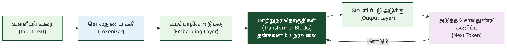
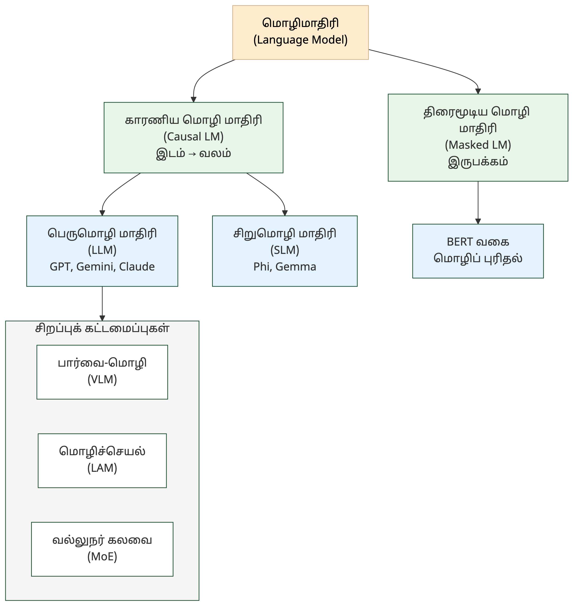
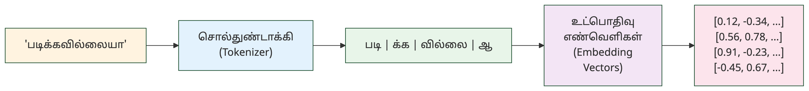

# 5. மாற்றுநர் & மொழிமாதிரிகள் — Transformers & Language Models

> **🎯 கற்றல் நோக்கங்கள்**
> - மாற்றுநர் (Transformer) கட்டமைப்பின் அடிப்படைக் கலைச்சொற்களைப் புரிந்துகொள்ளுதல்
> - பெருமொழி மாதிரி (LLM), சிறுமொழி மாதிரி (SLM) உள்ளிட்ட மொழிமாதிரி வகைகளை வேறுபடுத்தி அறிதல்
> - சொல்துண்டாக்கம் (Tokenization), முடிவுருவாக்கம் (Inference) ஆகிய செயல்முறைகளின் கலைச்சொற்களை அறிதல்

## "கவனம் மட்டுமே போதும்" — மாற்றுநர் பிறந்த கதை

<!-- IMAGE: Neural network layers transforming text into meaning — Tamil script flowing through attention heads, transformer blocks glowing, deep green (#1a4d2e) accent, flat vector style with Tamil cultural motifs -->

<!-- END IMAGE -->

2017-ல் கூகுள் நிறுவனத்தின் எட்டு ஆராய்ச்சியாளர்கள் "Attention Is All You Need" என்ற ஆராய்ச்சிக் கட்டுரையை வெளியிட்டனர். அது வரை, மொழி மாதிரிகள் சொற்களை ஒன்றன் பின் ஒன்றாக வரிசையில் படிக்கின்றன. "நான் நேற்று கடைக்கு சென்றேன்" என்ற வாக்கியத்தில் "சென்றேன்" என்ற சொல்லைப் புரிந்துகொள்ள, முதலில் "நான்", பிறகு "நேற்று", பிறகு "கடைக்கு" என்று வரிசையாகச் செயலாக்க வேண்டும். இது மிகவும் மெதுவானது.

மாற்றுநர் (Transformer) கட்டமைப்பு இதை முற்றிலும் மாற்றியது. அனைத்துச் சொற்களையும் ஒரே நேரத்தில் படிக்கும், ஒவ்வொரு சொல்லும் மற்ற எல்லாச் சொற்களுடனும் எவ்வாறு தொடர்புபடுகிறது என்பதைக் கணக்கிடும். இந்த வழிமுறையை அவர்கள் "கவனம்" (Attention) என்று பெயரிட்டனர். அந்த ஒற்றைக் கட்டுரை இன்று டிரில்லியன் டாலர் தொழில்துறையின் அடித்தளமாக மாறியிருக்கிறது. GPT, BERT, Gemini, Claude அனைத்தும் இதன் வழித்தோன்றல்களே.

இந்த அத்தியாயத்தில் மாற்றுநரின் உள் கூறுகள், மொழிமாதிரி வகைகள், சொல்துண்டாக்கம் (Tokenization), முடிவுருவாக்கம் (Inference) ஆகியவற்றுக்கான 36 கலைச்சொற்கள் தொகுக்கப்பட்டுள்ளன.

### மாற்றுநர் கட்டமைப்பு — Transformer Architecture

மாற்றுநர் (Transformer) என்பது இன்றைய அனைத்து AI மொழிமாதிரிகளின் அடிப்படைக் கட்டமைப்பு. கீழ்க்கண்ட ஐந்து கலைச்சொற்கள் இந்தக் கட்டமைப்பின் உள் கூறுகளை விவரிக்கின்றன.

**Transformer — மாற்றுநர்** (மாற்றி)
தன்கவன (Self-Attention) வழிமுறையைப் பயன்படுத்தித் தொடர்ச்சியான தரவுகளை (குறிப்பாக மொழியை) இணையாகச் செயலாக்கும் ஆழ்கற்றல் நரவலைக் கட்டமைப்பு (உ-ம்: GPT, BERT).

**Attention — கவனம்** (கவனிப்பு)
உள்ளீட்டின் எந்தப் பகுதி மீது மாதிரி முதன்மையாகக் கவனம் செலுத்த வேண்டும் என்பதைத் தீர்மானிக்கும் நரவலை வழிமுறை.

**Self-Attention — தன்கவனம்** (தன்கவனிப்பு)
தன் (self) + கவனம் (attention). உள்ளீட்டின் ஒவ்வொரு பகுதியும், அதே உள்ளீட்டின் மற்ற பகுதிகளுடன் எவ்வாறு தொடர்புபடுகிறது என்பதைக் கணக்கிடும் வழிமுறை; மாற்றுநரின் (Transformer) அடிப்படை.

**Multi-Head Attention — பல்தலைக் கவனம்**
பல் (multi) + தலை (head) + கவனம் (attention). ஒரே உள்ளீட்டைப் பல கவனத் தலைகள் இணையாக ஆராய்ந்து பொருள் கொள்ளும் மாற்றுநர் (Transformer) நுட்பம்.

**Positional Encoding — நிலைக் குறியீடு** (இடக் குறியாக்கம்)
நிலை (position) + குறியீடு (encoding). மாற்றுநரில் (Transformer) சொல்துண்டுகளின் வரிசை நிலையை எண்களாகச் சேர்க்கும் முறை.

### மொழிமாதிரி வகைகள் — Language Model Types

மாற்றுநர் கட்டமைப்பின் மீது பல வகையான மொழிமாதிரிகள் கட்டப்பட்டுள்ளன. சில இடமிருந்து வலமாகக் கணிக்கும் (GPT), சில இருபக்கமும் படிக்கும் (BERT), சில மிகப் பெரியவை (LLM), சில சிறியவை (SLM). கீழ்க்கண்ட கலைச்சொற்கள் இந்த வகைப்பாட்டை விளக்குகின்றன.

**Language Model (LM) — மொழிமாதிரி** (மொழியொப்பாக்கம்) [^1]
சொற்களின் தொடர்ச்சியைக் கணித்து, மனித மொழியைப் புரிந்துகொள்ளவும் உருவாக்கவும் வடிவமைக்கப்பட்ட AI கட்டமைப்பு.

**Large Language Model (LLM) — பெருமொழி மாதிரி** (மாமொழி மாதிரி) [^1]
பெரு (large) + மொழி (language) + மாதிரி (model). பில்லியன் கணக்கான அளபுருக்களையும் பரந்த தரவுகளையும் கொண்டு பயிற்றுவிக்கப்பட்ட மிகப் பெரிய மொழி மாதிரி.

**LLM Landscape — பெருமொழி சூழலமைப்பு** (LLM சூழல் வரைபடம்)
பெருமொழி மாதிரி (LLM) + சூழலமைப்பு (landscape). தற்போது கிடைக்கும் பல்வேறு பெருமொழி மாதிரிகளின் (GPT, Claude, Gemini, Llama, Mistral) திறன்கள், விலை, உரிமம் மற்றும் பயன்பாட்டு வேறுபாடுகளை ஒப்பிடும் மேலோட்டப் படம்.

**Small Language Model (SLM) — சிறுமொழி மாதிரி** (குறுமொழி மாதிரி) [^1]
சிறு (small) + மொழி (language) + மாதிரி (model). பெருமொழி மாதிரிகளைப் போலன்றி, குறைவான அளபுருக்களைக் கொண்டு ஒரு குறிப்பிட்ட பணிக்காகச் சிறப்பாகச் செயல்பட வடிவமைக்கப்பட்ட மாதிரி.

**Causal Language Model — காரணிய மொழி மாதிரி**
இடமிருந்து வலமாக அடுத்த சொல்லைக் கணிக்கும் மாதிரி (GPT); MLM-க்கு எதிர்மாறானது.

**Masked Language Model (MLM) — திரைமூடிய மொழி மாதிரி** (முகமூடிய மொழி மாதிரி) [^1]
திரை (mask) + மூடிய (covered) + மொழி மாதிரி. வாக்கியத்தில் மறைக்கப்பட்ட சொற்களைச் சூழலிலிருந்து கணிக்கப் பயிற்றுவிக்கப்படும் மாதிரி (BERT).

**Computational Language Model — கணியமொழியொப்பாக்கம்** (கணிய மொழி மாதிரி) [^1]
கணியம் (computational) + மொழி (language) + ஒப்பாக்கம் (modeling). மொழியின் கட்டமைப்பைக் கணக்கீட்டு முறையில் வடிவமைத்துச் செயல்படும் மாதிரி.

**Autoregressive Model — தன்னிழைவு மாதிரி** (முன்னிலையடிப்படை மாதிரி)
தன் (self) + இழைவு (regression/relation) + மாதிரி (model). முந்தைய சொற்களை வைத்து அடுத்த சொல்லைக் கணிக்கும் மாதிரி (GPT போன்ற LLM-கள் இதன் அடிப்படையில் இயங்குகின்றன).

> [!TIP]
> **காரணிய மொழி மாதிரி (Causal LM) vs திரைமூடிய மொழி மாதிரி (MLM):** GPT மாதிரிகள் காரணிய அணுகுமுறையில்: இடமிருந்து வலமாக அடுத்த சொல்லைக் கணிக்கின்றன. BERT மாதிரிகள் திரைமூடிய அணுகுமுறையில்: வாக்கியத்தின் நடுவில் மறைக்கப்பட்ட சொல்லை இருபக்கச் சூழலிலிருந்தும் கணிக்கின்றன.

### சிறப்புக் கட்டமைப்புகள் — Specialized Architectures

அடிப்படை மாற்றுநருக்கு அப்பால், செயல்திறனை மேம்படுத்தவும் புதிய திறன்களைச் சேர்க்கவும் சிறப்புக் கட்டமைப்புகள் உருவாக்கப்பட்டுள்ளன. படங்களைப் புரிந்துகொள்ளும் மாதிரிகள், மென்பொருளை இயக்கும் மாதிரிகள், வளங்களை மிச்சப்படுத்தும் கலவை நுட்பங்கள் இவற்றில் அடங்கும்.

**Mixture of Experts (MoE) Model — வல்லுநர் கலவை மாதிரி** [^1]
வல்லுநர் (expert) + கலவை (mixture) + மாதிரி (model). பல சிறப்புச் சிறிய நரவலைகளைக் கொண்ட மாதிரி; ஒவ்வொரு உள்ளீட்டுக்கும் பொருத்தமான சில நரவலைகள் மட்டுமே செயல்படும்.

**Mixture of Depths (MoD) — ஆழக்கலவை**
ஆழம் (depth) + கலவை (mixture). வல்லுநர் கலவைக்கு (MoE) இணையான நுட்பம்; ஒவ்வொரு சொல்துண்டுக்கும் எவ்வளவு கணக்கீட்டு ஆழம் தேவை என்பதைத் தீர்மானித்து வளங்களை மிச்சப்படுத்தும் கட்டமைப்பு.

**MoE Routing — வல்லுநர் வழிப்படுத்தல்**
வல்லுநர் கலவை (MoE) மாதிரியில், ஒவ்வொரு உள்ளீட்டுக்கும் (சொல்துண்டு) எந்த வல்லுநர் நரவலை செயல்பட வேண்டும் என்பதைத் தீர்மானிக்கும் வழிமுறை.

**Vision-Language Model (VLM) — பார்வை-மொழி மாதிரி** [^1]
பார்வை (vision) + மொழி (language) + மாதிரி (model). படங்களையும் உரையையும் ஒரே நேரத்தில் புரிந்துகொண்டு செயல்படும் திறன் கொண்ட பன்முக மாதிரி.

**Language Action Model (LAM) — மொழிச்செயல் மாதிரி** [^1]
மொழி (language) + செயல் (action) + மாதிரி (model). மொழியைப் புரிந்துகொண்டு, மென்பொருள்களில் நேரடியாகச் செயல்களை நிறைவேற்றும் திறன் கொண்ட AI மாதிரி.

**Latent Concept Model (LCM) — உள்ளுறைக் கருத்துரு மாதிரி** [^1]
உள்ளுறை (latent/hidden) + கருத்துரு (concept) + மாதிரி (model). தரவுகளில் வெளிப்படையாகத் தெரியாத, ஆனால் உள்ளீடுகளுக்குப் பின்னால் மறைந்திருக்கும் அடிப்படைக் கருத்துகளைக் கண்டறியும் மாதிரி.

### சொல்துண்டாக்கம் & சூழல் — Tokenization & Context

AI மாதிரி உரையை நேரடியாகப் படிப்பதில்லை. முதலில் உரையைச் சிறிய துண்டுகளாகப் பிரிக்கும், பிறகு அவற்றை எண்களாக மாற்றும். தமிழ் போன்ற ஒட்டுநிலை மொழிகளுக்கு இந்தச் செயல்முறை குறிப்பிடத்தக்க அறைகூவல். இந்தப் பிரிவின் கலைச்சொற்கள் அந்தச் செயல்முறையையும் அதன் வரம்புகளையும் விளக்குகின்றன.

**Token — சொல்துண்டு** (சொல் அலகு) [^1]
சொல் (word) + துண்டு (piece). AI மாதிரி வாசிக்கும் அல்லது உருவாக்கும் மொழியின் மிகச்சிறிய அலகு (ஒரு சொல் அல்லது சொல்லின் பகுதி).

**Token Limit — சொல்துண்டு வரம்பு** (உள்ளீட்டு வரம்பு)
ஒரு மொழி மாதிரி ஒரே நேரத்தில் வாசிக்கக்கூடிய அல்லது உருவாக்கக்கூடிய உச்சச் சொல்துண்டுகளின் எண்ணிக்கை.

**Tokenization — சொல்துண்டாக்கம்** (உரைப் பகுப்பு)
உரையைச் சொல்துண்டுகளாகப் பிரிக்கும் பொதுவான செயல்முறை (சொல், எழுத்து, அல்லது துணைச்சொல் அளவில்).

**Tokenizer — சொல்துண்டாக்கி**
சொல்துண்டு (token) + ஆக்கி (maker). உரையைச் சொல்துண்டுகளாகப் பிரிக்கும் கருவி (BPE, SentencePiece).

**Context Window — சூழல் சாளரம்** (உள்ளீட்டு வரம்பு / சூழல் நீளம்)
ஒரு AI மாதிரி ஒரே நேரத்தில் படித்து நினைவில் கொள்ளக்கூடிய ஒட்டுமொத்த சொல்துண்டுகளின் (Tokens) உச்ச அளவு.

**Long Context — நீண்ட சூழல்** (நீண்ட உள்ளீட்டு வரம்பு)
மிக நீளமான உள்ளீட்டை (லட்சக்கணக்கான சொல்துண்டுகள்) ஒரே நேரத்தில் கையாளும் மாதிரித் திறன்.

> [!NOTE]
> **அறிவீர்களா?** தமிழ் ஒட்டுநிலை மொழி (agglutinative language) என்பதால், சொல்துண்டாக்கம் (Tokenization) ஆங்கிலத்தைவிடச் அறைகூவலானது. "படிக்கவில்லையா" என்ற ஒற்றைச் சொல்லில் படி + க்க + வில்லை + ஆ என்ற நான்கு உருபுகள் ஒட்டிக்கொண்டிருக்கும். ஆங்கிலத்தில் இது "Didn't (you) read?" என்ற மூன்று தனிச்சொற்கள். 128K சொல்துண்டு சூழல் சாளரம் (Context Window) என்றால் 128,000² = 16.4 பில்லியன் கவனக் கணக்கீடுகள் தேவை!

### முடிவுருவாக்கம் & செயல்திறன் — Inference & Performance

மாதிரியைப் பயிற்றுவிப்பது ஒரு கட்டம், அதைப் பயன்படுத்துவது இன்னொரு கட்டம். பயனர் ஒரு கேள்வி கேட்கும்போது நிகழும் செயல்முறை, அதன் வேகம், நினைவகப் பயன்பாடு, அறிவு வரம்பு ஆகியவை இந்தப் பிரிவின் கலைச்சொற்களால் விவரிக்கப்படுகின்றன.

**Inference — முடிவுருவாக்கம்** (அனுமானம்)
முடிவு (conclusion) + உருவாக்கம் (creation). AI மாதிரியைப் பயிற்றுவித்த பிறகு, அதைப் பயன்படுத்திப் புதிய உள்ளீட்டிற்குக் கணிப்பு அல்லது பதில் வழங்கும் செயல்முறை (பயிற்சிக்கு எதிர்மாறானது).

**Inference Scaling — முடிவுருவாக்க நீட்சி** (சோதனை நேர நீட்சி)
முடிவுருவாக்கத்தின் போது கூடுதல் கணிப்பு வளங்களைப் பயன்படுத்திப் பதிலின் தரத்தை மேம்படுத்தும் முறை; o1, R1 போன்ற ஏரண மாதிரிகளின் அடிப்படை.

**Test-Time Compute — சோதனைநேரக் கணிப்பு**
சோதனை (test) + நேரம் (time) + கணிப்பு (compute). AI மாதிரி பயிற்சி முடிந்து முடிவுருவாக்கம் (inference) நிலையில் ஒவ்வொரு பதிலுக்கும் பயன்படுத்தப்படும் கணக்கீட்டு வளங்கள்; ஏரண மாதிரிகளில் இதைப் பெருக்குவதால் பதிலின் தரம் மேம்படுகிறது.

**KV Cache — விசை-மதிப்புத் தேக்ககம்** (வி-ம தேக்ககம்)
விசை (key) + மதிப்பு (value) + தேக்ககம் (cache). மாற்றுநர் (Transformer) மாதிரிகளில், முந்தைய சொல்துண்டுகளின் விசை மற்றும் மதிப்பு தரவுகளை நினைவகத்தில் சேமித்து வைத்து, உரை உருவாக்கத்தை வேகப்படுத்தும் நுட்பம்.

**Speculative Decoding — ஊகக் குறிநீக்கம்** (முன்மதிப்பீட்டு விடையாக்கம்)
ஊகம் (speculation) + குறிநீக்கம் (decoding). சிறிய மாதிரி ஊகிக்க, பெரிய மாதிரி சரிபார்க்க: இரட்டை மாதிரி வேகமூட்டும் நுட்பம்.

**Knowledge Cutoff — அறிவு வரம்பு** (அறிவெல்லை)
அறிவு (knowledge) + வரம்பு (cutoff). AI மாதிரி பயிற்றுவிக்கப்பட்ட தரவின் கடைசித் தேதி; அதற்குப் பிறகான நிகழ்வுகள் மாதிரிக்குத் தெரியாது.

**Latency — செயல்தாமதம்** (பின்னடைவு)
செயல் (action) + தாமதம் (delay). பயனர் கோரிக்கைக்கும் AI மாதிரி அளிக்கும் பதிலுக்கும் இடையிலான நேர இடைவெளி; உண்மை நேர AI பயன்பாடுகளில் இது மிகக் குறைவாக இருக்க வேண்டும்.

### குறிப்பிடத்தக்க மாதிரிகள் — Notable Models & Products

**ChatGPT — சாட்ஜிபிடி** (சேட்ஜிபிடி)
ஓபன்ஏஐ (OpenAI) நிறுவனம் உருவாக்கிய, இயல்பான மொழியில் உரையாடும் பெருமொழி மாதிரி (LLM).

**DeepSeek — ஆழ்தேடி** (ஆழ்தேடல்)
ஆழ் (deep) + தேடி (seeker). சீனாவில் தோன்றிய திறந்த மூல AI நிறுவனம்; ஆழ்ந்த தேடல் / ஆய்வு என்ற கருத்தை அடிப்படையாகக் கொண்டது.

**Stable Diffusion — நிலைத்த விரவல்** (சீரான விரவல்)
நிலைத்த (stable) + விரவல் (diffusion). குறைந்த கணக்கீட்டுத் திறனில் இயங்கக்கூடிய, உரையிலிருந்து படங்களை உருவாக்கும் ஒரு திறந்த மூல விரவல் மாதிரி.

### 📰 AI வரலாற்றில் ஒரு துளி

**"கவனம் மட்டுமே தேவை" (Attention Is All You Need)**

2017-ஆம் ஆண்டு கூகுள் (Google) நிறுவனத்தைச் சேர்ந்த 8 ஆய்வாளர்கள் இணைந்து ஒரு ஆய்வுக் கட்டுரையை வெளியிட்டனர். அதற்கு அவர்கள் வைத்த தலைப்பு "Attention Is All You Need" (கவனம் மட்டுமே தேவை).

அதில் அவர்கள் 'மாற்றுநர்' (Transformer) என்ற புதிய கட்டமைப்பை அறிமுகப்படுத்தினார்கள். இதுவே இன்றுள்ள GPT, Claude, Gemini போன்ற அனைத்து மொழி மாதிரிகளுக்கும் அடிப்படை! விந்தை என்னவென்றால், அந்த ஆய்வுக் கட்டுரையை எழுதிய 8 பேரும் சில ஆண்டுகளில் கூகுளை விட்டு வெளியேறினர். அவர்களில் பலர் இன்று பல பில்லியன் டாலர் மதிப்புள்ள சொந்த AI நிறுவனங்களைத் (Cohere, Character.AI, Essential AI, Sakana AI) தொடங்கியுள்ளனர்.

## 📋 அத்தியாயச் சுருக்கம்

> **💡 முதன்மைக் கருத்துகள்**
> - இந்த அத்தியாயத்தில் மாற்றுநர் (Transformer) கட்டமைப்பு முதல் குறிப்பிடத்தக்க மாதிரிகள் வரையிலான 36 கலைச்சொற்கள் தொகுக்கப்பட்டுள்ளன.
> - மாற்றுநர் (Transformer) என்பது தன்கவனம் (Self-Attention) வழிமுறையை அடிப்படையாகக் கொண்ட ஆழ்கற்றல் கட்டமைப்பு. இன்றைய அனைத்து பெருமொழி மாதிரிகளின் (LLM) அடித்தளம்
> - சொல்துண்டாக்கம் (Tokenization) மொழிமாதிரிகளின் முதல் படி. தமிழ் போன்ற ஒட்டுநிலை மொழிகளுக்கு இது குறிப்பிடத்தக்க அறைகூவல்

**அடிக்கடி குழப்பமடையும் சொற்கள்:**
- பெருமொழி மாதிரி (LLM) vs சிறுமொழி மாதிரி (SLM): அளபுருக்களின் (Parameters) எண்ணிக்கையில் வேறுபடுகின்றன, இரண்டும் மாற்றுநர் (Transformer) அடிப்படையானவை
- காரணிய மொழி மாதிரி (Causal LM) vs திரைமூடிய மொழி மாதிரி (MLM): GPT வகை vs BERT வகை; ஒன்று அடுத்த சொல்லைக் கணிக்கும், மற்றொன்று மறைக்கப்பட்ட சொல்லைக் கணிக்கும்
- முடிவுருவாக்கம் (Inference) vs பயிற்சி (Training): பயிற்சி கற்றல் நிலை, முடிவுருவாக்கம் பயன்பாட்டு நிலை

> [!TIP]
> **குறுக்கு இணைப்பு:** நரவலை (Neural Network) கட்டமைப்புகள் பற்றி [அத்தியாயம் 3-ல் காண்க](03-neural-networks.md). பயிற்சி & உகப்பாக்கம் (Training & Optimization) பற்றி [அத்தியாயம் 4-ல் விரிவாக விளக்கப்பட்டுள்ளது](04-training-optimization.md). தூண்டுவினா (Prompting) நுட்பங்கள் [அத்தியாயம் 8-ல் உள்ளன](08-prompting-interaction.md).

## 💭 உங்கள் சிந்தனைக்கு

1. நீங்கள் ஒரு பழந்தமிழ் இலக்கிய நூலை AI மூலம் சுருக்க விரும்புகிறீர்கள். "படிக்கவில்லையா" போன்ற ஒட்டுநிலைச் சொற்கள் நிறைந்த உரையை AI எவ்வாறு சொல்துண்டாக்கம் (Tokenization) செய்யும்? ஆங்கில உரையைவிட மிகுந்த சொல்துண்டுகள் (Tokens) தேவைப்படுமா? அப்படியென்றால், சூழல் சாளரம் (Context Window) எவ்வாறு பாதிக்கப்படும்?

2. GPT போன்ற காரணிய மொழி மாதிரி (Causal LM) தமிழில் கட்டுரை எழுத உதவும், BERT போன்ற திரைமூடிய மொழி மாதிரி (MLM) தமிழ் உரையில் பிழைகளைக் கண்டறிய உதவும். நீங்கள் ஒரு தமிழ் எழுத்துப் பிழை திருத்தி (spell checker) உருவாக்க விரும்பினால், எந்த வகை மாதிரி பொருத்தமானது? ஏன்?

3. வல்லுநர் கலவை மாதிரி (MoE) ஒவ்வொரு உள்ளீட்டுக்கும் ஒரு சில வல்லுநர்களை மட்டுமே இயக்குகிறது. இது கணக்கீட்டு வளங்களை மிச்சப்படுத்துகிறது. ஆனால் தமிழ், ஆங்கிலம், இந்தி மூன்றையும் புரிந்துகொள்ள வேண்டிய பன்மொழி மாதிரிக்கு இந்தக் கட்டமைப்பு ஏன் சிறப்பாகப் பொருந்தும்?

## 🧠 அறிவுச் சோதனை

1. **பொருத்துக:** கீழ்க்கண்ட ஆங்கிலச் சொற்களுக்கு சரியான தமிழ்ச் சொல்லைப் பொருத்துக:

    | ஆங்கிலம் | தமிழ் |
    |:---------|:------|
    | Transformer | அ) சொல்துண்டாக்கம் |
    | Tokenization | ஆ) முடிவுருவாக்கம் |
    | Inference | இ) மாற்றுநர் |

2. **கோடிட்ட இடத்தை நிரப்புக:** "________ என்பது AI மாதிரி ஒரே நேரத்தில் படித்து நினைவில் கொள்ளக்கூடிய உச்சச் சொல்துண்டுகளின் (Tokens) அளவு." (Context Window)

3. **சரியா / தவறா:** "பெருமொழி மாதிரி (LLM) என்பது சிறுமொழி மாதிரியின் (SLM) மறுபெயர்."

4. **பல தேர்வு:** கீழ்க்கண்டவற்றில் "தன்கவனம்" (Self-Attention) என்பதன் சரியான விளக்கம் எது?

    - அ) மாதிரி வெளி உள்ளீடுகளிலிருந்து கற்கும் முறை
    - ஆ) உள்ளீட்டின் ஒவ்வொரு பகுதியும் அதே உள்ளீட்டின் மற்ற பகுதிகளுடன் எவ்வாறு தொடர்புபடுகிறது என்பதைக் கணக்கிடும் வழிமுறை
    - இ) மாதிரி தன்னைத்தானே பயிற்றுவிக்கும் முறை

5. **சரியா / தவறா:** "சொல்துண்டாக்கம் (Tokenization) என்பது ஒரு சொல்லை அதன் எழுத்துகளாகப் பிரிப்பது மட்டுமே."

<strong>விடைகளைக் காண சொடுக்குக</strong>

1. Transformer → இ) மாற்றுநர், Tokenization → அ) சொல்துண்டாக்கம், Inference → ஆ) முடிவுருவாக்கம்
2. சூழல் சாளரம் (Context Window)
3. **தவறு.** பெருமொழி மாதிரியில் (LLM) பில்லியன் கணக்கான அளபுருக்கள் (Parameters) இருக்கும், சிறுமொழி மாதிரியில் (SLM) குறைவான அளபுருக்கள் இருக்கும்; இரண்டும் வெவ்வேறு வகைகள்.
4. **ஆ)** உள்ளீட்டின் ஒவ்வொரு பகுதியும் அதே உள்ளீட்டின் மற்ற பகுதிகளுடன் எவ்வாறு தொடர்புபடுகிறது என்பதைக் கணக்கிடும் வழிமுறை.
5. **தவறு.** சொல்துண்டாக்கம் (Tokenization) சொல், எழுத்து, அல்லது துணைச்சொல் (subword) அளவில் பிரிக்கலாம்; எழுத்து அளவு மட்டுமல்ல.

