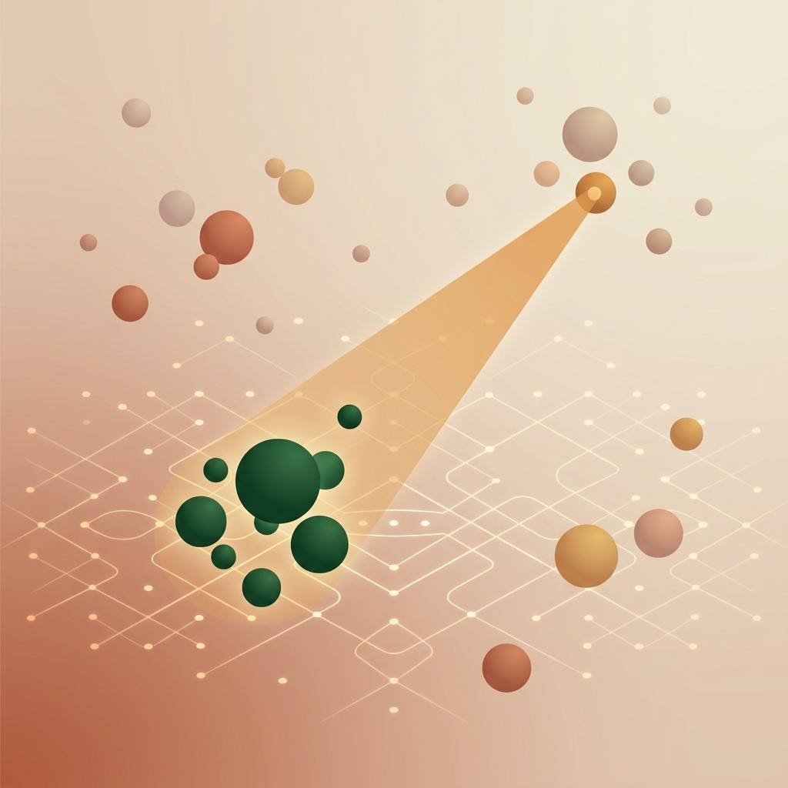
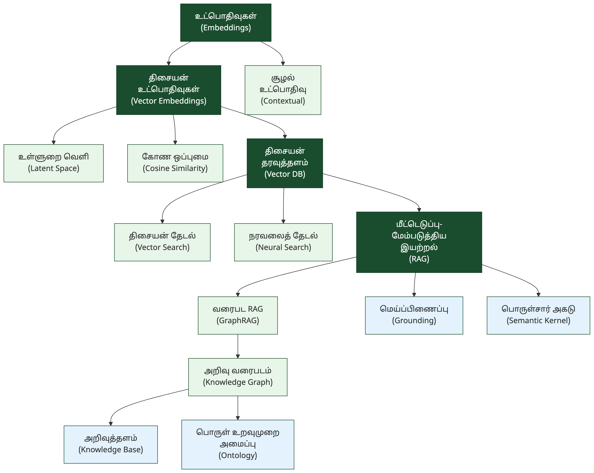

# 7. உட்பொதிவுகள் & தேடல் — Embeddings & Search

<!-- IMAGE: Words transforming into floating number vectors in a multidimensional space — Tamil words like "மொழி", "பொருள்" becoming glowing coordinate points, search queries connecting to nearest neighbors, deep green (#1a4d2e) accent, flat vector style with Tamil cultural motifs -->

<!-- END IMAGE -->

> **🎯 கற்றல் நோக்கங்கள்**
>
> - உட்பொதிவுகள் (Embeddings), திசையன் (Vector), உள்ளுறை வெளி (Latent Space) ஆகிய கருத்துகளின் கலைச்சொற்களை அறிதல்
> - திசையன் தேடல் (Vector Search), நரவலைத் தேடல் (Neural Search) போன்ற பொருள்சார் தேடல் நுட்பங்களைப் புரிந்துகொள்ளுதல்
> - மீட்டெடுப்பு-மேம்படுத்திய இயற்றல் (RAG), அறிவு வரைபடம் (Knowledge Graph) ஆகிய அறிவுக் கட்டமைப்புகளின் கலைச்சொற்களை வேறுபடுத்தி அறிதல்

## சொற்களுக்கு முகவரி கொடுத்தால்?

"வங்கி" என்ற சொல்லைப் படிக்கும்போது, அது ஆற்றின் கரையா அல்லது நிதி நிறுவனமா? மனிதர்கள் சூழலிலிருந்து இதை உடனடியாகப் புரிந்துகொள்வார்கள். ஆனால் கணினிக்கு ஒரு சொல் வெறும் எழுத்துகளின் தொகுப்பு மட்டுமே. அந்தச் சொல்லுக்குப் "பொருள்" என்ற பரிமாணத்தைக் கொடுக்க, அதை எண்களின் தொகுதியாக மாற்ற வேண்டும். இதுதான் உட்பொதிவுகளின் (Embeddings) அடிப்படைக் கருத்து.

ஒவ்வொரு சொல்லுக்கும் ஒரு புள்ளி முகவரி கொடுப்பது போல, 768 அல்லது 1536 பரிமாணங்கள் கொண்ட எண்வெளியில் ஒரு இடத்தை நிர்ணயிக்கிறது AI. "அரசன்" என்ற சொல்லுக்கும் "மன்னன்" என்ற சொல்லுக்கும் அருகருகே முகவரிகள் அமையும், ஏனெனில் அவற்றின் பொருள் நெருக்கமானது. இந்த எண்வெளியில் தேடுவது பாரம்பரிய வார்த்தைத் தேடலைவிட மிகவும் திறமையானது.

இந்த அத்தியாயத்தில் உட்பொதிவுகள், திசையன் தேடல், மீட்டெடுப்பு-மேம்படுத்திய இயற்றல் (RAG), அறிவுக் கட்டமைப்புகள் ஆகியவற்றுக்கான 16 கலைச்சொற்கள் தொகுக்கப்பட்டுள்ளன.

---

### உட்பொதிவுகள் & திசையன்கள் — Embeddings & Vectors

சொற்களையும் வாக்கியங்களையும் எண்களாக மாற்றுவது AI-யின் முதல் படி. இந்தப் பிரிவின் கலைச்சொற்கள் அந்த மாற்றத்தின் கணித அடிப்படையை விளக்குகின்றன. உட்பொதிவுகள் எவ்வாறு உருவாக்கப்படுகின்றன, அவை எந்த வெளியில் வாழ்கின்றன, அவற்றின் ஒப்புமை எவ்வாறு அளவிடப்படுகிறது ஆகியவை இங்கு அடங்கும்.

**Embeddings — உட்பொதிவுகள்** (உள்ளடக்குகள்)
உள் (inner) + பொதி (contain). சொற்கள் அல்லது தரவுகளை AI மாதிரி புரிந்துகொள்ளும் வகையில் எண்களாக (Vectors) மாற்றியமைக்கும் முறை.

**Contextual Embedding — சூழல் உட்பொதிவு**
சூழல் (context) + உட்பொதிவு (embedding). வாக்கியச் சூழலைப் பொறுத்து மாறும் சொல் திசையன்; நிலையான உட்பொதிவுகளுக்கு (Word2Vec) மாறாக BERT, GPT பயன்படுத்துவது.

**Vector Embeddings — திசையன் உட்பொதிவுகள்** (எண்வழி உட்பொதிவுகள்)
திசையன் (vector) + உட்பொதிவுகள் (embeddings). சொற்கள், வாக்கியங்கள் அல்லது படங்களை AI புரிந்துகொள்ளும் வகையில், அவற்றின் பொருளைப் பிரதிபலிக்கும் எண்களாக மாற்றப்பட்ட வடிவங்கள்.

**Latent Space — உள்ளுறை வெளி** (மறை வெளி)
உள்ளுறை (latent) + வெளி (space). மாதிரி தரவின் அடிப்படைப் பண்புகளைச் சுருக்கிச் சேமிக்கும் எண் வெளி.

**Latent Variable — உள்ளுறை மாறி** (மறை மாறி)
உள்ளுறை (latent/hidden) + மாறி (variable). தரவில் நேரடியாகத் தெரியாமல், மற்ற மாறிகள் வழியாக மட்டுமே ஊகிக்கக்கூடிய மறைந்த மாறி.

**Cosine Similarity — கோண ஒப்புமை** (கொசைன் ஒப்புமை)
இரு திசையன்களுக்கு இடையிலான கோணத்தை வைத்து ஒப்புமையை அளவிடும் கணிதம்; RAG / தேடலின் அடிப்படை.

> [!NOTE]
> **அறிவீர்களா?** Word2Vec போன்ற முந்தைய உட்பொதிவு முறைகளில், "வங்கி" என்ற சொல்லுக்கு ஒரே திசையன் மட்டுமே இருக்கும். சூழல் உட்பொதிவு (Contextual Embedding) இதை மாற்றியது: "ஆற்றின் வங்கியில் அமர்ந்தான்" என்ற வாக்கியத்திலும், "வங்கியில் பணம் எடுத்தான்" என்ற வாக்கியத்திலும் "வங்கி" வெவ்வேறு திசையன்களைப் பெறும்.

---

### தேடல் & தரவுத்தளம் — Search & Database

உட்பொதிவுகளை உருவாக்கிய பிறகு, அவற்றைச் சேமித்துத் தேட வேண்டும். பாரம்பரியத் தேடல் குறிப்பிட்ட வார்த்தைகளை மட்டுமே தேடும். திசையன் தேடல் கேள்வியின் பொருளைப் புரிந்துகொண்டு நெருக்கமான கருத்துகளைக் கண்டறியும். இந்தப் பிரிவு அந்தத் தேடல் தொழில்நுட்பங்களின் கலைச்சொற்களை விளக்குகிறது.

**Vector Database — திசையன் தரவுத்தளம்** (திசையன் தரவு மையம்)
திசையன் (vector) + தரவுத்தளம் (database). உட்பொதிவுகளை (Embeddings) சேமித்து ஒப்புமைத் தேடல் செய்யும் தரவுத்தளம்; RAG-ன் அடிப்படை.

**Vector Search — திசையன் தேடல்** (பொருள்சார் தேடல்)
திசையன் (vector) + தேடல் (search). முதன்மை வார்த்தைகளை மட்டும் தேடாமல், பயனர் கேட்கும் கேள்வியின் ஆழமான பொருளைப் புரிந்துகொண்டு அதற்கு நெருக்கமான கருத்துகளைத் தேடிக் கண்டுபிடிக்கும் முறை.

**Neural Search — நரவலைத் தேடல்** (பொருள்சார் தேடல்)
நரவலை (neural network) + தேடல் (search). பாரம்பரியத் தேடல் போலக் குறிப்பிட்ட வார்த்தைகளை மட்டும் தேடாமல், நரவலைகளைப் பயன்படுத்திப் பயனர் கேட்கும் கேள்வியின் ஆழமான பொருளைப் புரிந்துகொண்டு தேடும் நுட்பம்.

> [!TIP]
> **திசையன் தேடல் (Vector Search) vs நரவலைத் தேடல் (Neural Search):** இரண்டும் பொருள்சார் தேடலைச் செய்கின்றன. திசையன் தேடல் முன்கூட்டியே கணக்கிடப்பட்ட உட்பொதிவுகளைப் பயன்படுத்தும். நரவலைத் தேடல் கேள்வி நேரத்தில் நரவலையை இயக்கி உட்பொதிவுகளை உருவாக்கும்.

---

### மீட்டெடுப்பு & அறிவுக் கட்டமைப்பு — Retrieval & Knowledge

AI மாதிரி பயிற்சியின்போது கற்ற அறிவு மட்டுமே போதாது. வெளிப்புறத் தரவுத்தளங்கள், அறிவு வரைபடங்கள், நிறுவன ஆவணங்கள் ஆகியவற்றிலிருந்து தகவல்களை மீட்டெடுத்து, பதிலை மேம்படுத்தும் கட்டமைப்புகள் இன்று AI-யின் மிக இன்றியமையாத பகுதியாக இருக்கின்றன. இந்தப் பிரிவு அந்தக் கட்டமைப்புகளின் கலைச்சொற்களைத் தொகுக்கிறது.

**Retrieval-Augmented Generation (RAG) — மீட்டெடுப்பு-மேம்படுத்திய இயற்றல்** (மீட்டெடுப்புசார் உரை உருவாக்கம்)
மீட்டெடுப்பு (retrieval) + மேம்படுத்திய (augmented) + இயற்றல் (generation). வெளிப்புறத் தரவுத்தளங்களிலிருந்து தகவல்களை மீட்டெடுத்துத் துல்லியமான பதிலை உருவாக்கும் கட்டமைப்பு.

**GraphRAG — வரைபட RAG** (வரைபட மீட்டெடுப்பு)
அறிவு வரைபடத்தையும் RAG-ஐயும் ஒருங்கிணைத்து, தொடர்புகளின் அடிப்படையில் ஆழமான விடைகளை வழங்கும் கட்டமைப்பு.

**Knowledge Base — அறிவுத்தளம்**
அறிவு (knowledge) + தளம் (base). ஒரு குறிப்பிட்ட துறை சார்ந்த தகவல்கள், தரவுகள் மற்றும் விதிகளைச் சேமித்து வைத்து விடையளிக்க உதவும் மையக் கட்டமைப்பு.

**Knowledge Graph — அறிவு வரைபடம்** (அறிவுத் தொடர்பமைப்பு)
உண்மை உலகப் பொருள்கள், நிகழ்வுகள் அல்லது கருத்துகளுக்கு இடையிலான உறவுகளை வலைப்பின்னல் போன்று இணைத்துச் சேமிக்கும் கட்டமைப்பு.

**Ontology — பொருள் உறவுமுறை அமைப்பு**
பொருள் (entity) + உறவுமுறை (relationship) + அமைப்பு (system). உண்மை உலகக் கருத்துகள் மற்றும் பொருள்களுக்கு இடையே உள்ள உறவுகளைக் கணினி புரிந்துகொள்ளும் வகையில் வடிவமைக்கப்படும் முறையான வரைபடம்.

**Semantic Kernel — பொருள்சார் அகடு** (கருத்தியல் கருவம்)
பொருள் (meaning) + சார் (related) + அகடு (core/kernel). பாரம்பரிய நிரலாக்க மொழிகளுடன் (C#, Python) பெருமொழி மாதிரிகளை எளிதாக இணைக்க மைக்ரோசாப்ட் உருவாக்கிய திறந்த மூலக் கட்டமைப்பு.

**Grounding — மெய்ப்பிணைப்பு** (ஆதாரமூட்டல்)
மெய் (truth) + பிணைப்பு (anchoring). AI பதிலை வெளிப்புற ஆதாரங்களுடன் (ஆவணங்கள், தரவுத்தளங்கள்) இணைக்கும் செயல்; மதிமயக்கத்தைக் குறைக்க உதவுகிறது.

> [!NOTE]
> **அறிவீர்களா?** RAG கட்டமைப்பு 2020-ல் மெட்டா (Meta) ஆராய்ச்சியாளர்களால் அறிமுகப்படுத்தப்பட்டது. இன்று பெரும்பாலான AI நிறுவனப் பயன்பாடுகள் RAG அடிப்படையில் இயங்குகின்றன. ஒரு தமிழ் நூலகத்தின் ஆவணங்களை திசையன் தரவுத்தளத்தில் (Vector Database) சேமித்து, பயனர் கேள்விக்கு RAG மூலம் பதிலளிக்கும் அமைப்பை உருவாக்கலாம்.

---

### 📰 AI வரலாற்றில் ஒரு துளி

{ style="width: 250px; float: right; margin-left: 20px; border-radius: 8px;" }

**சொற்களுக்குள் ஒளிந்திருக்கும் கணிதம்!**

சொற்களுக்குக் கணிதம் தெரியுமா? உட்பொதிவுகள் (Embeddings) தொழில்நுட்பம் மூலம் மனித மொழியைக் கணினியால் எண்களாக (Vectors) மாற்ற முடிகிறது.

2013-ல் Word2Vec என்ற நுட்பத்தை ஆய்வாளர்கள் சோதித்தபோது ஓர் அரிய விந்தை நடந்தது. அவர்கள் "அரசன்" (King) என்ற சொல்லின் எண்களிலிருந்து "ஆண்" (Man) என்பதைக் கழித்துவிட்டு "பெண்" (Woman) என்பதைக் கூட்டினார்கள். விடை என்ன தெரியுமா? "அரசி" (Queen)!

அதாவது, `அரசன் - ஆண் + பெண் = அரசி` என்ற உறவை ஒரு கணினி எந்த அகராதியின் உதவியும் இல்லாமல் எண்கள் மூலமாகவே சரியாகக் கண்டறிந்தது!

---

## 📋 அத்தியாயச் சுருக்கம்

> **💡 முதன்மைக் கருத்துகள்**
>
> - இந்த அத்தியாயத்தில் 16 கலைச்சொற்கள்: உட்பொதிவுகளின் (Embeddings) அடிப்படை முதல் அறிவுக் கட்டமைப்புகள் வரை
> - உட்பொதிவுகள் (Embeddings) சொற்களின் பொருளை எண்களாக மாற்றுகின்றன. சூழல் உட்பொதிவு (Contextual Embedding) வாக்கியச் சூழலைப் பொறுத்து வெவ்வேறு திசையன்களை உருவாக்கும்
> - திசையன் தேடல் (Vector Search) பாரம்பரிய வார்த்தைத் தேடலைவிடத் திறமையானது, ஏனெனில் கேள்வியின் பொருளைப் புரிந்துகொண்டு தேடுகிறது
> - மீட்டெடுப்பு-மேம்படுத்திய இயற்றல் (RAG) வெளிப்புறத் தரவுகளை இணைத்து AI பதிலின் துல்லியத்தை மேம்படுத்துகிறது

**அடிக்கடி குழப்பமடையும் சொற்கள்:**
- உட்பொதிவுகள் (Embeddings) vs திசையன் உட்பொதிவுகள் (Vector Embeddings): உட்பொதிவுகள் பொதுவான கருத்து, திசையன் உட்பொதிவுகள் எண் வடிவத்தில் உள்ள குறிப்பிட்ட பிரதிநிதித்துவம்
- அறிவுத்தளம் (Knowledge Base) vs அறிவு வரைபடம் (Knowledge Graph): அறிவுத்தளம் தகவல்களின் தொகுப்பு, அறிவு வரைபடம் பொருள்களுக்கிடையிலான உறவுகளை வலைப்பின்னலாகச் சேமிக்கும்
- RAG vs GraphRAG: RAG உரைத் துண்டுகளை மீட்டெடுக்கும், GraphRAG அறிவு வரைபடத்தின் தொடர்புகளையும் பயன்படுத்தும்

> [!TIP]
> **குறுக்கு இணைப்பு:** சொல்துண்டாக்கம் (Tokenization) பற்றி அத்தியாயம் 5-ல் காண்க. இயன்மொழியாள்கைப் (NLP) பணிகள் அத்தியாயம் 6-ல் விளக்கப்பட்டுள்ளன. தூண்டுவினா (Prompting) நுட்பங்கள் அத்தியாயம் 8-ல் உள்ளன.

---

## 💭 உங்கள் சிந்தனைக்கு

1. ஒரு தமிழ்ப் பல்கலைக்கழக நூலகம் தனது 50,000 ஆராய்ச்சிக் கட்டுரைகளை AI மூலம் தேடக்கூடிய அமைப்பை உருவாக்க விரும்புகிறது. இந்தப் பணிக்கு திசையன் தரவுத்தளம் (Vector Database) எவ்வாறு பயன்படும்? கோண ஒப்புமை (Cosine Similarity) இதில் என்ன பங்கு வகிக்கும்?

2. ஒரு தமிழ் அரசுத்துறை AI உதவியாளர் கட்டமைக்கப்படுகிறது. இந்த உதவியாளர் அரசாணைகள், சட்டங்கள், விதிமுறைகள் ஆகியவற்றிலிருந்து பதிலளிக்க வேண்டும். மீட்டெடுப்பு-மேம்படுத்திய இயற்றல் (RAG) கட்டமைப்பில் மெய்ப்பிணைப்பு (Grounding) ஏன் இன்றியமையாதது?

3. தமிழ் விக்கிப்பீடியா தரவுகளிலிருந்து ஒரு அறிவு வரைபடம் (Knowledge Graph) கட்டமைக்கப்படுகிறது. "திருவள்ளுவர்" என்ற பொருளுக்கும் "திருக்குறள்" என்ற பொருளுக்கும் இடையிலான தொடர்பை பொருள் உறவுமுறை அமைப்பு (Ontology) எவ்வாறு வரையறுக்கும்? GraphRAG இந்தத் தொடர்புகளை எவ்வாறு பயன்படுத்தும்?

---

## 🧠 அறிவுச் சோதனை

1. **பொருத்துக:** கீழ்க்கண்ட ஆங்கிலச் சொற்களுக்கு சரியான தமிழ்ச் சொல்லைப் பொருத்துக:

   | ஆங்கிலம் | தமிழ் |
   |:---------|:------|
   | Embeddings | அ) திசையன் தரவுத்தளம் |
   | Vector Database | ஆ) கோண ஒப்புமை |
   | Cosine Similarity | இ) உட்பொதிவுகள் |

2. **கோடிட்ட இடத்தை நிரப்புக:** "________ என்பது வெளிப்புறத் தரவுத்தளங்களிலிருந்து தகவல்களை மீட்டெடுத்துத் துல்லியமான பதிலை உருவாக்கும் கட்டமைப்பு." (RAG)

3. **சரியா / தவறா:** "சூழல் உட்பொதிவு (Contextual Embedding) ஒரு சொல்லுக்கு எப்போதும் ஒரே திசையனை வழங்கும்."

4. **பல தேர்வு:** கீழ்க்கண்டவற்றில் "மெய்ப்பிணைப்பு" (Grounding) என்பதன் சரியான விளக்கம் எது?
   - அ) AI மாதிரியைப் புதிய தரவுகளுடன் மீண்டும் பயிற்றுவிப்பது
   - ஆ) AI பதிலை வெளிப்புற ஆதாரங்களுடன் இணைத்து மதிமயக்கத்தைக் குறைப்பது
   - இ) உட்பொதிவுகளை திசையன் தரவுத்தளத்தில் சேமிப்பது

5. **சரியா / தவறா:** "அறிவுத்தளம் (Knowledge Base) என்பதும் அறிவு வரைபடம் (Knowledge Graph) என்பதும் ஒரே கருத்தைக் குறிக்கும்."

<strong>விடைகளைக் காண சொடுக்குக</strong>

1. Embeddings → இ) உட்பொதிவுகள், Vector Database → அ) திசையன் தரவுத்தளம், Cosine Similarity → ஆ) கோண ஒப்புமை
2. மீட்டெடுப்பு-மேம்படுத்திய இயற்றல் (RAG)
3. **தவறு.** சூழல் உட்பொதிவு வாக்கியச் சூழலைப் பொறுத்து வெவ்வேறு திசையன்களை வழங்கும். Word2Vec போன்ற நிலையான உட்பொதிவுகள் ஒரே திசையனை வழங்கும்.
4. **ஆ)** AI பதிலை வெளிப்புற ஆதாரங்களுடன் இணைத்து மதிமயக்கத்தைக் குறைப்பது.
5. **தவறு.** அறிவுத்தளம் தகவல்களின் தொகுப்பு, அறிவு வரைபடம் பொருள்களுக்கிடையிலான உறவுகளை வலைப்பின்னலாகச் சேமிக்கும் கட்டமைப்பு.

