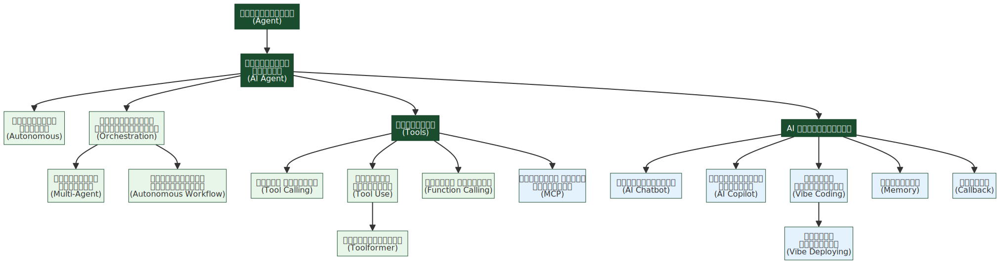
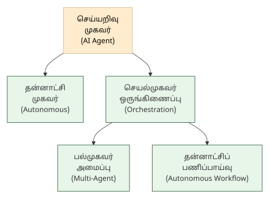
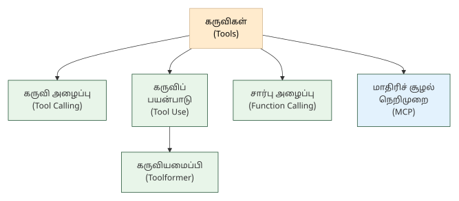
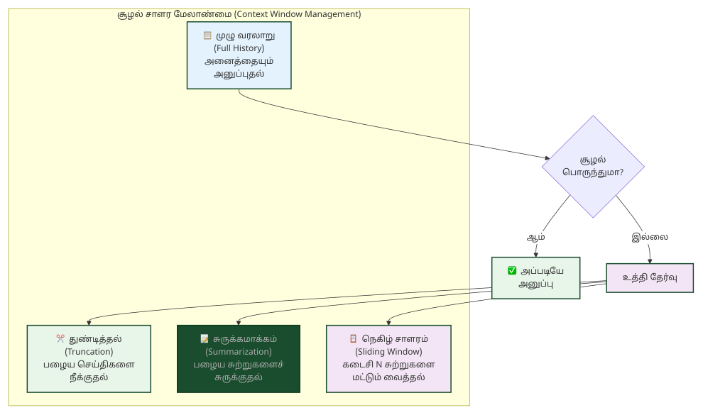
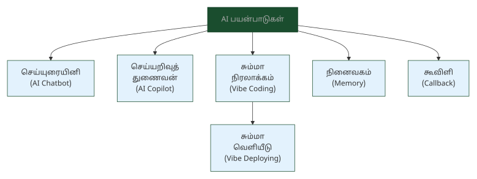
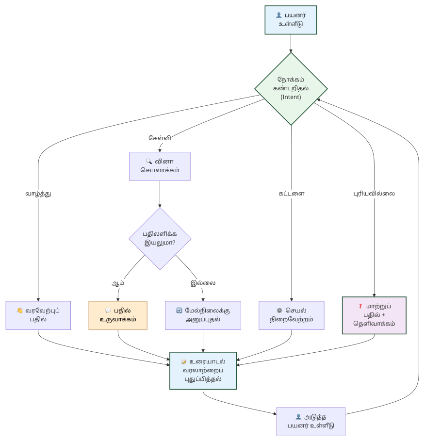

# 9. செய்யறிவு முகவர்கள் & கருவிகள் — AI Agents & Tools

> **🎯 கற்றல் நோக்கங்கள்**
> - செயல்முகவர் (Agent), செய்யறிவு முகவர் (AI Agent), தன்னாட்சி முகவர் (Autonomous Agent) ஆகிய முகவர் வகைகளின் கலைச்சொற்களை அறிதல்
> - கருவி அழைப்பு (Tool Calling), சார்பு அழைப்பு (Function Calling), மாதிரிச் சூழல் நெறிமுறை (MCP) ஆகிய கருவி இணைப்பு நுட்பங்களைப் புரிந்துகொள்ளுதல்
> - செய்யுரையினி (AI Chatbot), செய்யறிவுத் துணைவன் (AI Copilot), சும்மா நிரலாக்கம் (Vibe Coding) போன்ற AI பயன்பாட்டு வகைகளை வேறுபடுத்தி அறிதல்

## கருவிகளைப் பயன்படுத்தும் AI

<!-- IMAGE: Multiple AI agents collaborating — one agent orchestrating others, tools (search, calculator, database) connected via protocol lines, autonomous workflow loops, deep green (#1a4d2e) accent, flat vector style with Tamil cultural motifs -->

<!-- END IMAGE -->

ஒரு காலத்தில் AI-யிடம் கேள்வி கேட்டால் மொழி வழியாக மட்டுமே பதிலளிக்கும். "இன்றைய சென்னை வெப்பநிலை என்ன?" என்று கேட்டால், பயிற்சித் தரவில் உள்ள பழைய தகவலைக் கூறும். இன்று AI முகவர்கள் (Agents) வானிலை API-யை அழைத்து நேரடித் தரவைப் பெறுகின்றன, கால்குலேட்டரைப் பயன்படுத்திக் கணக்குகளைச் செய்கின்றன, தரவுத்தளங்களைத் தேடுகின்றன.

இந்த மாற்றம் AI-யை வெறும் மொழி மாதிரியிலிருந்து செயல் ஆற்றும் முகவராக மாற்றியது. செயல்முகவர் ஒருங்கிணைப்பு (Agent Orchestration) மூலம் பல முகவர்கள் இணைந்து சிக்கலான பணிகளை நிறைவேற்றுகின்றன. மாதிரிச் சூழல் நெறிமுறை (MCP) வெளிப்புறக் கருவிகளுடன் தரப்படுத்தப்பட்ட இணைப்பை வழங்குகிறது.

இந்த அத்தியாயத்தில் செயல்முகவர்கள், கருவி இணைப்பு, AI பயன்பாட்டு வகைகள் ஆகியவற்றுக்கான 17 கலைச்சொற்கள் தொகுக்கப்பட்டுள்ளன.

### செயல்முகவர்கள் — Agents

AI முகவர்கள் மொழித் திறனை மட்டும் கொண்டிருப்பதில்லை; சூழலைப் புரிந்து, திட்டமிட்டு, கருவிகளைப் பயன்படுத்தி, முடிவெடுக்கும் திறன் கொண்டவை. ஒற்றை முகவர் முதல் பல்முகவர் அமைப்புகள் வரை, இந்தப் பிரிவு முகவர்களின் அடிப்படைக் கலைச்சொற்களை விளக்குகிறது.

**Agent — செயல்முகவர்** (செயலியக்கி / செயற்பாட்டாலி)
செயல் (action) + முகவர் (agent). இலக்கு நோக்கித் தானாகவே இயங்கும், முடிவெடுக்கும், மற்றும் கருவிகளைப் பயன்படுத்தும் மென்பொருள்.

**AI Agent — செய்யறிவு முகவர்** (செய்யறிவுச் செயலியக்கி)
சூழலைப் புரிந்து, முடிவெடுத்து, கருவிகளைப் பயன்படுத்தித் தானாகச் செயல்படும் தன்னாட்சி நிரல்.

**Autonomous Agent — தன்னாட்சி முகவர்** (தன்னியக்க முகவர்)
தன் (self) + ஆட்சி (governance) + முகவர் (agent). மனிதத் தலையீடின்றித் தானாகவே இயங்கும், முடிவெடுக்கும் செயல்முகவர்.

**Agent Orchestration — செயல்முகவர் ஒருங்கிணைப்பு** (முகவர் அணிவகுப்பு)
பல செயல்முகவர்கள் செய்தி பரிமாறி ஒருங்கிணைந்து சிக்கலான வேலையை முடிக்கும் கட்டமைப்பு.

**Multi-Agent System — பல்முகவர் அமைப்பு** (பல்முகவர் கட்டமைப்பு)
பல் (multi) + முகவர் (agent) + அமைப்பு (system). பல செயல்முகவர்கள் இணைந்து ஒரு சிக்கலான இலக்கை அடையும் கட்டமைப்பு.

**Autonomous Workflow — தன்னாட்சிப் பணிப்பாய்வு** (தன்னியக்கப் பணித்தொடர்)
மனிதத் தலையீடின்றி, பல படிநிலைகளைக் கொண்ட சிக்கலான பணிகளை AI தாமாகவே திட்டமிட்டுச் செயல்படுத்தும் தொடர்முறை.

> [!NOTE]
> **அறிவீர்களா?** ஒற்றை AI முகவர் ஒரு பணியைச் செய்யும், ஆனால் பல்முகவர் அமைப்பு (Multi-Agent System) மிகவும் சக்திவாய்ந்தது. எடுத்துக்காட்டாக, ஒரு தமிழ் செய்தி நிறுவனத்தில் ஒரு முகவர் செய்திகளைச் சேகரிக்கும், மற்றொரு முகவர் சுருக்கம் எழுதும், மூன்றாவது முகவர் தமிழ் இலக்கணத்தைச் சரிபார்க்கும். செயல்முகவர் ஒருங்கிணைப்பு (Agent Orchestration) இந்த முகவர்களை ஒருங்கிணைக்கும்.

### கருவிகள் & இணைப்பு — Tools & Integration

AI மாதிரிகளின் மொழித் திறன் மட்டும் போதாது; வெளிப்புற உலகத்துடன் தொடர்புகொள்ள கருவிகள் தேவை. API அழைப்பு, தரவுத்தளத் தேடல், கணக்கீடு போன்ற செயல்களை AI மாதிரி நேரடியாகச் செய்ய இந்தக் கருவி இணைப்பு நுட்பங்கள் உதவுகின்றன. இந்தப் பிரிவு அந்த நுட்பங்களின் கலைச்சொற்களைத் தொகுக்கிறது.

**Tool Calling — கருவி அழைப்பு**
கருவி (tool) + அழைப்பு (call). AI மாதிரி வெளிப்புறக் கருவிகளை (API, தேடுபொறி, தரவுத்தளம்) நேரடியாக அழைத்து, அவற்றின் முடிவுகளை வெளியீட்டில் இணைக்கும் திறன்.

**Tool Use — கருவிப் பயன்பாடு**
கருவி (tool) + பயன்பாடு (use). AI மாதிரி தனது மொழித் திறனைத் தாண்டி, வெளிப்புறக் கருவிகளை (கால்குலேட்டர், தேடுபொறி, குறிமுறை இயக்கி) பயன்படுத்திச் செயல் ஆற்றும் பரந்த திறன்.

**Toolformer — கருவியமைப்பி** (கருவி-மாற்றுநர்)
கருவி (tool) + அமைப்பி (former). கால்குலேட்டர்கள், தேடுபொறிகள் போன்ற வெளிப்புறக் கருவிகளை எப்பொழுது, எப்படிப் பயன்படுத்த வேண்டும் என்று தானாகவே கற்றுக்கொள்ளும் மொழி மாதிரி.

**Function Calling — சார்பு அழைப்பு** (கருவி அழைப்பு)
சார்பு (function) + அழைப்பு (call). LLM வெளிப்புறக் கருவிகளை (API, தரவுத்தளம்) நேரடியாக அழைக்கும் திறன்.

**MCP (Model Context Protocol) — மாதிரிச் சூழல் நெறிமுறை** (மாதிரிப் பின்புல நெறிமுறை)
மாதிரி (model) + சூழல் (context) + நெறிமுறை (protocol). AI மாதிரிகள் வெளிப்புறக் கருவிகள் / தரவுத்தளங்களுடன் பாதுகாப்பாகத் தொடர்புகொள்ளும் தரப்படுத்தப்பட்ட நெறிமுறை.

> [!TIP]
> **கருவி அழைப்பு (Tool Calling) vs சார்பு அழைப்பு (Function Calling) vs கருவிப் பயன்பாடு (Tool Use):** கருவி அழைப்பும் சார்பு அழைப்பும் கிட்டத்தட்ட ஒரே கருத்தைக் குறிக்கும்; சார்பு அழைப்பு OpenAI அறிமுகப்படுத்திய சொல், கருவி அழைப்பு பரவலான சொல். கருவிப் பயன்பாடு இரண்டையும் உள்ளடக்கிய பரந்த கருத்து.

### AI பயன்பாடுகள் & ஊடாடல் — AI Applications & Interaction

AI தொழில்நுட்பம் பயனர்களை நேரடியாக அடையும் இடம் இதுதான். உரையாடும் செய்யுரையினி (AI Chatbot), நிரலாக்கத்தில் துணைபுரியும் செய்யறிவுத் துணைவன் (AI Copilot), இயல்மொழியில் நிரலாக்கம் செய்யும் சும்மா நிரலாக்கம் (Vibe Coding) ஆகியவை இன்று வேகமாக வளரும் பயன்பாட்டு வகைகள். இந்தப் பிரிவு அவற்றின் கலைச்சொற்களை விளக்குகிறது.

**AI Chatbot — செய்யுரையினி** (செய்யறிவு உரையாடி) [^1]
செய் (செய்யறிவு / AI) + உரை (உரையாடல் / speech) + இனி (கருவி விகுதி). பயனருடன் இயல்பாக உரையாடும் மென்பொருள்.

**AI Copilot — செய்யறிவுத் துணைவன்** (துணை இயக்கி)
நிரல் எழுதுதல், கட்டுரை எழுதுதல் அல்லது வடிவமைப்பு போன்ற பணிகளில் மனிதருக்குத் துணையாக இருந்து ஆலோசனைகளையும் குறிமுறைகளையும் வழங்கும் AI மென்பொருள்.

**Memory (AI context) — நினைவகம்** (உரையாடல் நினைவகம்)
நினைவு (memory) + அகம் (space). AI உரையாடல் வரலாறு அல்லது நீண்டகாலத் தகவலைச் சேமித்துப் பயன்படுத்தும் திறன்; குறுகிய கால நினைவகம் (சூழல் சாளரம்) மற்றும் நீண்ட கால நினைவகம் (வெளிப்புறத் தரவுத்தளம்) என இரு வகைகள் உள்ளன.

**Callback — கூவிளி** (திருப்பி அழைப்பு) [^1]
கூவு (call) + விளி (summon). ஒரு செயல் முடிந்த பிறகு தானாகவே இயக்கப்படும்படி முன்கூட்டியே அனுப்பப்படும் சார்பு.

**Vibe Coding — சும்மா நிரலாக்கம்** (உள்ளுணர்வு நிரலாக்கம் / உரைவழி நிரலாக்கம் / இயல்மொழி நிரலாக்கம்)
கணினி மொழிகளை நேரடியாக எழுதாமல், மனித இயல்பு மொழியைக் கொண்டு AI மூலமாக ஒரு முழுமையான செயலியை உருவாக்கித் திருத்தும் முறை. ("சும்மா" = எளிதாக, இடையூறின்றி.)

**Vibe Deploying — சும்மா வெளியீடு** (உடனடி மென்பொருள் வெளியீடு)
சும்மா நிரலாக்கத்தில் உருவாக்கப்பட்ட செயலியை, வழங்கி (Server) அமைப்புகள் இன்றி ஒரே தட்டலில் இணையத்தில் வெளியிடுதல்.

> [!NOTE]
> **அறிவீர்களா?** சும்மா நிரலாக்கம் (Vibe Coding) என்ற சொல் 2025-ல் ஆண்ட்ரே கார்பதி (Andrej Karpathy) அறிமுகப்படுத்தினார். "நிரலாக்க மொழி தெரியாமலேயே AI-யிடம் இயல்மொழியில் கூறி மென்பொருள் உருவாக்கலாம்" என்பது அதன் அடிப்படைக் கருத்து. தமிழில் "சும்மா" என்ற சொல் "எளிதாக, இடையூறின்றி" என்ற பொருளைத் துல்லியமாகக் குறிக்கிறது.

### 📰 AI வரலாற்றில் ஒரு துளி

**மனிதனை வென்ற AI முகவர்!**

டீப்மைண்ட் (DeepMind) நிறுவனம் உருவாக்கிய 'ஆல்ஃபாஸ்டார்' (AlphaStar) என்ற AI தன்னாட்சி முகவர், உலகின் மிகவும் சிக்கலான உத்தி விளையாட்டான 'ஸ்டார்கிராஃப்ட் 2' (StarCraft II)-ல் முதலிடத்தில் வெற்றி பெற்ற மனிதர்களை விட அதிகமான புள்ளிகளைப் பெற்றுச் சாதனை படைத்தது.

சதுரங்கம் போன்ற பலகை விளையாட்டுகளில் முழுக் களமும் கண்ணுக்குத் தெரியும். ஆனால் ஸ்டார்கிராஃப்ட் விளையாட்டில் களம் முழுமையாகத் தெரியாது (Imperfect Information). எதிரி என்ன செய்கிறார் என்று கணிக்க வேண்டும், பல முகவர்களை ஒருங்கிணைக்க வேண்டும், நொடிக்கு நூற்றுக்கணக்கான முடிவுகளை எடுக்க வேண்டும். இந்தச் சிக்கலான விளையாட்டில் AI மனிதர்களை வென்றது, தன்னாட்சி முகவர்களின் (Autonomous Agents) வளர்ச்சியில் இந்த நிகழ்வு மிகப்பெரிய திருப்புமுனையாகும்!

## 📋 அத்தியாயச் சுருக்கம்

> **💡 முதன்மைக் கருத்துகள்**
> - இந்த அத்தியாயத்தில் செயல்முகவர்களின் அடிப்படை முதல் AI பயன்பாட்டு வகைகள் வரையிலான 17 கலைச்சொற்கள் தொகுக்கப்பட்டுள்ளன.
> - கருவி அழைப்பு (Tool Calling) மற்றும் மாதிரிச் சூழல் நெறிமுறை (MCP) AI-யை வெளிப்புற உலகத்துடன் இணைக்கின்றன
> - சும்மா நிரலாக்கம் (Vibe Coding) நிரலாக்க மொழி தெரியாமலேயே AI மூலம் மென்பொருள் உருவாக்கும் புதிய முறை

**அடிக்கடி குழப்பமடையும் சொற்கள்:**
- செயல்முகவர் (Agent) vs செய்யறிவு முகவர் (AI Agent): செயல்முகவர் பொதுவான கருத்து, செய்யறிவு முகவர் AI-யைக் குறிப்பிட்டுக் குறிக்கும்
- கருவி அழைப்பு (Tool Calling) vs சார்பு அழைப்பு (Function Calling): இரண்டும் கிட்டத்தட்ட ஒரே கருத்து; சார்பு அழைப்பு OpenAI அறிமுகப்படுத்திய சொல்
- செய்யுரையினி (AI Chatbot) vs செய்யறிவுத் துணைவன் (AI Copilot): செய்யுரையினி உரையாடல் சார்ந்தது, துணைவன் குறிப்பிட்ட பணியில் (நிரலாக்கம், எழுத்து) துணைபுரிவது

> [!TIP]
> **குறுக்கு இணைப்பு:** தூண்டுவினா (Prompt) நுட்பங்கள் [அத்தியாயம் 8-ல் விளக்கப்பட்டுள்ளன](08-prompting-interaction.md). மீட்டெடுப்பு-மேம்படுத்திய இயற்றல் (RAG) மற்றும் அறிவு வரைபடம் (Knowledge Graph) [அத்தியாயம் 7-ல் உள்ளன](07-embeddings-search.md). AI பாதுகாப்பு மற்றும் நெறிமுறை [அத்தியாயம் 10-ல் காணலாம்](10-safety-ethics-evaluation.md).

## 💭 உங்கள் சிந்தனைக்கு

1. ஒரு தமிழ் மின்வணிக நிறுவனம் வாடிக்கையாளர் சேவைக்கு AI முகவர் அமைப்பை உருவாக்குகிறது. ஒரு முகவர் கேள்வியைப் புரிந்துகொள்ளும், மற்றொன்று பொருள் தரவுத்தளத்தைத் தேடும், மூன்றாவது பதிலை உருவாக்கும். இந்தப் பல்முகவர் அமைப்பில் (Multi-Agent System) செயல்முகவர் ஒருங்கிணைப்பு (Agent Orchestration) எவ்வாறு செயல்படும்?

2. ஒரு தமிழ்ப் பள்ளி மாணவர்களுக்கு நிரலாக்கம் கற்பிக்க சும்மா நிரலாக்கம் (Vibe Coding) முறையைப் பயன்படுத்த விரும்புகிறது. மாணவர்கள் தமிழில் AI-யிடம் "ஒரு கால்குலேட்டர் செயலியை உருவாக்கு" என்று கூறுவார்கள். இந்தச் செயல்முறையில் கருவி அழைப்பு (Tool Calling) மற்றும் மாதிரிச் சூழல் நெறிமுறை (MCP) எவ்வாறு பங்கு வகிக்கும்?

3. ஒரு தமிழ் அரசுத்துறை செய்யறிவுத் துணைவன் (AI Copilot) உருவாக்கப்படுகிறது. இந்தத் துணைவன் அரசு ஊழியர்களுக்கு ஆவண வரைவு, மொழிபெயர்ப்பு, தரவுப் பகுப்பாய்வு ஆகிய பணிகளில் உதவ வேண்டும். இது ஒரு செய்யுரையினி (AI Chatbot) அல்ல, துணைவன் என்பதை எவ்வாறு வேறுபடுத்துவீர்கள்? நினைவகம் (Memory) இந்தப் பணியில் ஏன் இன்றியமையாதது?

## 🧠 அறிவுச் சோதனை

1. **பொருத்துக:** கீழ்க்கண்ட ஆங்கிலச் சொற்களுக்கு சரியான தமிழ்ச் சொல்லைப் பொருத்துக:

    | ஆங்கிலம் | தமிழ் |
    |:---------|:------|
    | AI Agent | அ) கருவி அழைப்பு |
    | Tool Calling | ஆ) சும்மா நிரலாக்கம் |
    | Vibe Coding | இ) செய்யறிவு முகவர் |

2. **கோடிட்ட இடத்தை நிரப்புக:** "________ என்பது பல செயல்முகவர்கள் செய்தி பரிமாறி ஒருங்கிணைந்து சிக்கலான வேலையை முடிக்கும் கட்டமைப்பு." (Agent Orchestration)

3. **சரியா / தவறா:** "கருவி அழைப்பு (Tool Calling) என்பதும் சார்பு அழைப்பு (Function Calling) என்பதும் முற்றிலும் வேறுபட்ட கருத்துகள்."

4. **பல தேர்வு:** கீழ்க்கண்டவற்றில் "மாதிரிச் சூழல் நெறிமுறை" (MCP) என்பதன் சரியான விளக்கம் எது?

    - அ) AI மாதிரியின் பல்வகைமை அளவைக் கட்டுப்படுத்தும் நுட்பம்
    - ஆ) AI மாதிரிகள் வெளிப்புறக் கருவிகளுடன் பாதுகாப்பாகத் தொடர்புகொள்ளும் தரப்படுத்தப்பட்ட நெறிமுறை
    - இ) பல AI முகவர்களை ஒருங்கிணைக்கும் கட்டமைப்பு

5. **சரியா / தவறா:** "செய்யுரையினி (AI Chatbot) என்பதும் செய்யறிவுத் துணைவன் (AI Copilot) என்பதும் ஒரே வகையான AI பயன்பாடு."

<strong>விடைகளைக் காண சொடுக்குக</strong>

1. AI Agent → இ) செய்யறிவு முகவர், Tool Calling → அ) கருவி அழைப்பு, Vibe Coding → ஆ) சும்மா நிரலாக்கம்
2. செயல்முகவர் ஒருங்கிணைப்பு (Agent Orchestration)
3. **தவறு.** கருவி அழைப்பும் சார்பு அழைப்பும் கிட்டத்தட்ட ஒரே கருத்தைக் குறிக்கும். சார்பு அழைப்பு OpenAI அறிமுகப்படுத்திய சொல், கருவி அழைப்பு பரவலான சொல்.
4. **ஆ)** AI மாதிரிகள் வெளிப்புறக் கருவிகளுடன் பாதுகாப்பாகத் தொடர்புகொள்ளும் தரப்படுத்தப்பட்ட நெறிமுறை.
5. **தவறு.** செய்யுரையினி உரையாடல் சார்ந்தது, செய்யறிவுத் துணைவன் குறிப்பிட்ட பணியில் (நிரலாக்கம், எழுத்து, வடிவமைப்பு) துணைபுரிவது.

