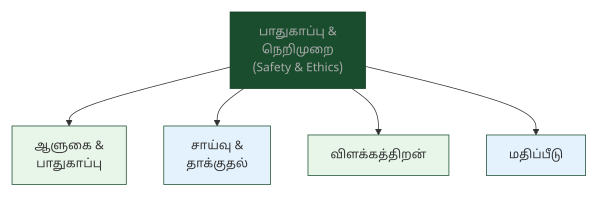
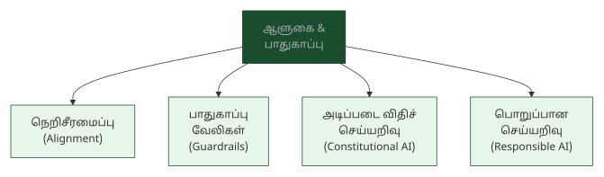
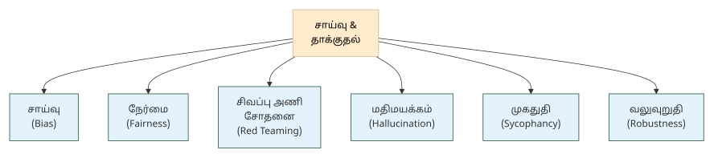
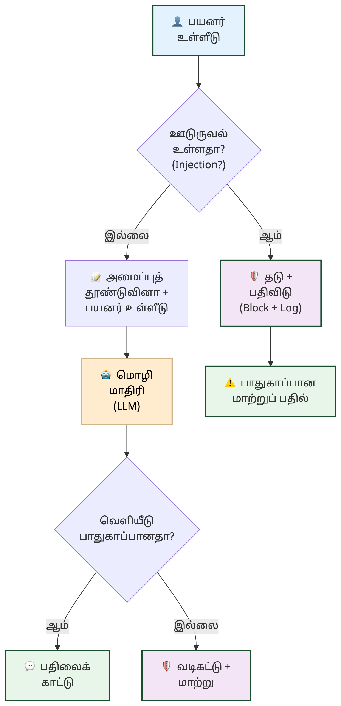
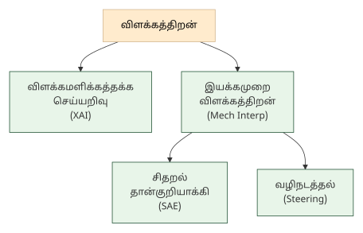
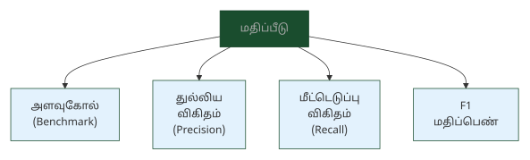
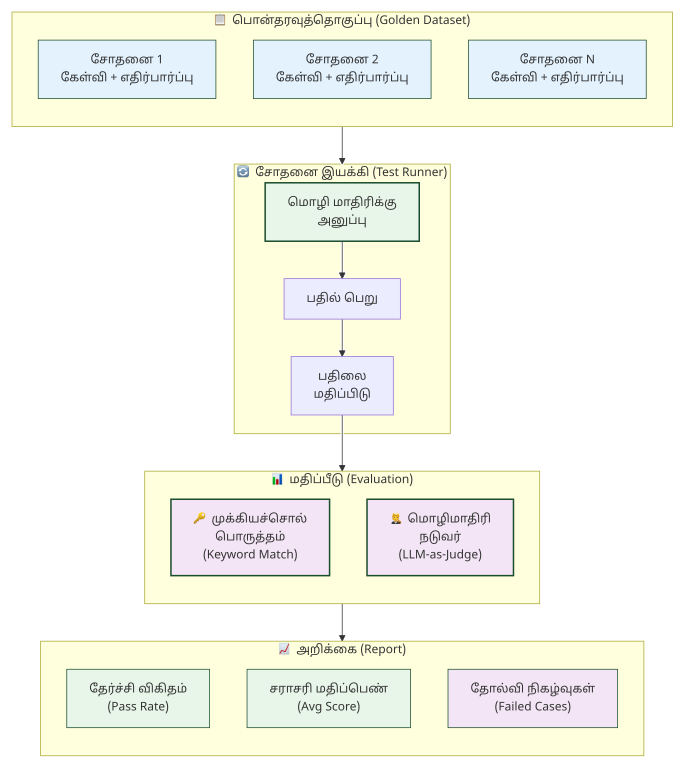

# 10. பாதுகாப்பு, நெறிமுறை & மதிப்பீடு — Safety, Ethics & Evaluation

> **🎯 கற்றல் நோக்கங்கள்**
> - செய்யறிவுப் பாதுகாப்பு (AI Safety), நெறிசீரமைப்பு (Alignment), பொறுப்பான செய்யறிவு (Responsible AI) ஆகிய பாதுகாப்புக் கலைச்சொற்களை அறிதல்
> - மதிமயக்கம் (Hallucination), முகதுதி (Sycophancy), வலுவுறுதி (Robustness) போன்ற நம்பகத்தன்மை சார்ந்த கலைச்சொற்களைப் புரிந்துகொள்ளுதல்
> - விளக்கத்திறன் (Interpretability), இயக்கமுறை விளக்கத்திறன் (Mechanistic Interpretability), அளவுகோல் (Benchmark) ஆகிய மதிப்பீட்டுக் கலைச்சொற்களை வேறுபடுத்தி அறிதல்

## AI நம்பிக்கைக்குரியதா?

<!-- IMAGE: A shield protecting Tamil text and AI circuits — red team arrows testing defenses, alignment scales balancing human values, evaluation metrics dashboard, deep green (#1a4d2e) accent, flat vector style with Tamil cultural motifs -->

<!-- END IMAGE -->

"AI கவிதை எழுதுகிறது, படம் வரைகிறது, நிரல் எழுதுகிறது. ஆனால் அது உண்மையைச் சொல்கிறதா?" என்ற கேள்வி இன்று மிக இன்றியமையாதது. ஒரு AI மாதிரி திருக்குறளை மேற்கோள் காட்டுகிறது, ஆனால் அந்தக் குறள் உண்மையில் இல்லாத ஒன்றாக இருக்கலாம். இது மதிமயக்கம் (Hallucination) எனப்படுகிறது.

AI அமைப்புகள் சக்திவாய்ந்தவை, ஆனால் அவை சாய்வு (Bias) கொண்டிருக்கலாம், தாக்குதல்களுக்கு (Adversarial Attacks) உள்ளாகலாம், பயனரின் கருத்துகளுக்கு அளவுக்கு மீறி ஒத்துப்போகலாம் (Sycophancy). நெறிசீரமைப்பு (Alignment) மூலம் AI-யை மனித மதிப்புகளுடன் சீரமைப்பது, பாதுகாப்பு வேலிகள் (Guardrails) மூலம் கட்டுப்படுத்துவது, அளவுகோல்கள் (Benchmarks) மூலம் மதிப்பிடுவது ஆகியவை இன்றைய AI ஆராய்ச்சியின் முதன்மை அம்சங்கள்.

இந்த அத்தியாயத்தில் பாதுகாப்பு, நெறிமுறை, நம்பகத்தன்மை, விளக்கத்திறன், மதிப்பீடு ஆகியவற்றுக்கான 44 கலைச்சொற்கள் தொகுக்கப்பட்டுள்ளன.

### பாதுகாப்பு & ஆளுகை — Safety & Governance

AI அமைப்புகள் மனிதர்களுக்குத் தீங்கு விளைவிக்காமல் செயல்படுவதை உறுதிசெய்வது பாதுகாப்பு ஆராய்ச்சியின் முதன்மை நோக்கம். சட்டம், கொள்கை, நெறிமுறை ஆகியவற்றின் வழியாக AI-யை ஒழுங்குபடுத்துவது ஆளுகையின் பணி. இந்தப் பிரிவு அந்த அடிப்படைக் கலைச்சொற்களை விளக்குகிறது.

**AI Safety — செய்யறிவுப் பாதுகாப்பு**
AI அமைப்புகள் மனிதர்களுக்குத் தீங்கு விளைவிக்காமல், எதிர்பாராத ஆபத்துகளை உருவாக்காமல் பாதுகாப்பாகச் செயல்படுவதை உறுதிசெய்யும் ஆராய்ச்சித் துறை.

**AI Governance — செய்யறிவு ஆளுகை**
செய்யறிவு (AI) + ஆளுகை (governance). AI வடிவமைப்பு, பயன்பாடு மற்றும் பொறுப்புணர்வைச் சட்டம், கொள்கை மற்றும் நெறிமுறைகள் வழிநடத்தும் கட்டமைப்பு (உ-ம்: EU AI Act, NIST AI RMF). [அத்தியாயம் 1 காண்க](01-ai-foundations.md).

**AI Sandbox — செய்யறிவுப் பரிசோதனைக்களம்** (செய்யறிவு ஆய்விடம்)
AI மாதிரிகளைப் பாதுகாப்பான, தனிமைப்படுத்தப்பட்ட சூழலில் சோதனை செய்யவும் மேம்படுத்தவும் பயன்படும் கட்டமைப்பு.

**Alignment — நெறிசீரமைப்பு** (மதிப்புச் சீரமைப்பு)
AI மாதிரியின் செயல்பாடுகள் மனித மதிப்புகள், உண்மைகள் மற்றும் பாதுகாப்பு விதிகளுக்கு உட்பட்டு இருப்பதை உறுதிசெய்யும் செயல்முறை.

**Ethics in AI — செய்யறிவு நெறிமுறை**
AI அமைப்புகளின் வடிவமைப்பு, பயன்பாடு மற்றும் தாக்கம் தொடர்பான நெறிமுறை, நேர்மை, பொறுப்புணர்வு மற்றும் சமூகச் சிக்கல்களை ஆராயும் துறை.

**Responsible AI — பொறுப்பான செய்யறிவு**
பொறுப்பு (responsibility) + செய்யறிவு (AI). நேர்மை, வெளிப்படைத்தன்மை, பொறுப்புணர்வு, தனியுரிமைப் பாதுகாப்பு ஆகிய கொள்கைகளின் அடிப்படையில் AI அமைப்புகளை வடிவமைத்துப் பயன்படுத்துவதை உறுதிசெய்யும் அணுகுமுறை; AI ஆளுகையின் (AI Governance) நடைமுறைச் செயலாக்கம். [அத்தியாயம் 1 காண்க](01-ai-foundations.md).

**Constitutional AI — அடிப்படை விதிச் செய்யறிவு** (நெறிமுறை அடிப்படைச் செய்யறிவு)
AI மாதிரிக்கு ஒரு "அடிப்படை விதி" அல்லது நெறிமுறை வழிகாட்டுதலை அளித்து, அதன் வெளியீடுகள் அந்த விதிகளுக்கு ஏற்ப இருக்கப் பயிற்றுவிக்கும் முறை (Anthropic நிறுவனத்தின் கட்டமைப்பு).

**Constitutional Classifier — அடிப்படை விதி வகைப்படுத்தி**
Constitutional AI அமைப்பில், ஒரு உள்ளீடு அல்லது வெளியீடு அமைப்பின் அடிப்படை விதிகளை மீறுகிறதா என்று வகைப்படுத்தும் துணை மாதிரி.

**Guardrails — பாதுகாப்பு வேலிகள்** (நெறிமுறை வேலிகள்)
AI மாதிரி தவறான, ஆபத்தான அல்லது இழிவான பதில்களைத் தராமல் தடுக்க அதன் உள்ளீட்டிலும் வெளியீட்டிலும் வைக்கப்படும் கட்டுப்பாட்டு அடுக்குகள்.

**Human-in-the-Loop (HITL) — மனிதர்-சுழற்சி வடிவமைப்பு** (மனிதத் தலையீட்டு வடிவமைப்பு)
மனிதர் (human) + சுழற்சி (loop) + வடிவமைப்பு (design). AI அமைப்பின் முடிவெடுக்கும் சுழற்சியில் மனிதர் ஒருவரை முக்கியமான கட்டங்களில் ஈடுபடுத்தும் வடிவமைப்பு மாதிரி; உயர்ந்த பாதிப்புள்ள முடிவுகளில் (மருத்துவம், நிதி) இது இன்றியமையாதது.

> [!NOTE]
> **அறிவீர்களா?** நெறிசீரமைப்பு (Alignment) AI ஆராய்ச்சியின் மிகக் கடினமான சிக்கல்களில் ஒன்று. AI மாதிரி மனிதர்களின் உண்மையான நோக்கங்களைப் புரிந்துகொண்டு, அவற்றுக்கு ஏற்ப செயல்படுவதை உறுதிசெய்வது எளிதல்ல. அடிப்படை விதிச் செய்யறிவு (Constitutional AI) இதற்கான ஒரு அணுகுமுறை: AI-க்கு ஒரு நெறிமுறை வழிகாட்டுதலை அளித்து, அது தானாகவே தன் வெளியீடுகளைச் சுய-மதிப்பீடு செய்து திருத்திக்கொள்ளும்.

### சாய்வு, தாக்குதல் & நம்பகத்தன்மை — Bias, Attacks & Reliability

AI மாதிரிகள் பயிற்சித் தரவின் சாய்வுகளைப் பிரதிபலிக்கலாம், தாக்குதல்களுக்கு உள்ளாகலாம், தவறான தகவல்களை நம்பிக்கையாகக் கூறலாம். இந்தப் பிரிவு அந்தச் சிக்கல்களையும் அவற்றைத் தடுக்கும் நுட்பங்களையும் விவரிக்கும் கலைச்சொற்களைத் தொகுக்கிறது.

**Bias — சாய்வு** (சார்பு)
சாய்வு (bias/slant). பால், இனம் போன்றவற்றின் அடிப்படையில் AI வெளியீட்டில் ஏற்படும் ஒருதலைச் சார்பு; பயிற்சித் தரவுக் குறைபாட்டால் உருவாவது; சாய்வுத் தடுப்பு (Bias Mitigation) மூலம் குறைக்கப்படுகிறது.

**Bias Mitigation — சாய்வுத் தடுப்பு** (சாய்வுக் குறைப்பு)
சாய்வு (bias) + தடுப்பு (mitigation). AI மாதிரியின் பயிற்சித் தரவு, நெறிமுறை அல்லது வெளியீட்டில் உள்ள ஒருதலைச் சார்பைக் கண்டறிந்து குறைக்கும் நுட்பங்கள் மற்றும் செயல்முறைகள்.

**Fairness — நேர்மை** (நீதிமை)
நேர்மை (fairness/justice). AI முடிவுகள் குறிப்பிட்ட குழுக்களுக்குச் சாதகமாகவோ பாதகமாகவோ இல்லாமல், ஒருதலைச் சார்பின்றி நியாயமாக இருப்பதை உறுதிசெய்தல்; பொறுப்பான செய்யறிவு (Responsible AI) கொள்கையின் அடிப்படைக் கூறு.

**Red Teaming — சிவப்பு அணி சோதனை**
AI மாதிரியின் பாதுகாப்பு, பிழைகள் மற்றும் சாய்வுகளைக் கண்டறியத் திட்டமிட்ட தாக்குதல் அல்லது அறைகூவல் கேள்விகள் மூலம் சோதனை செய்யும் முறை.

**Jailbreak — விதிவிலக்கு ஊடுருவல்** (பாதுகாப்பு மீறல் தூண்டல்)
விதிவிலக்கு (exception) + ஊடுருவல் (intrusion). AI மாதிரியின் உள்ளமைக்கப்பட்ட பாதுகாப்புக் கட்டுப்பாடுகளையும் அடிப்படை விதிகளையும் தந்திரமாக மீறச் செய்து, தடைசெய்யப்பட்ட பதில்களைப் பெறும் தாக்குதல் முறை.

**Adversarial Attack — எதிரிடைத் தாக்குதல்**
எதிரிடை (adversarial) + தாக்குதல் (attack). AI மாதிரியை ஏமாற்ற உள்ளீட்டில் மனிதக் கண்ணுக்குத் தெரியாத நுட்பமான மாற்றங்கள் செய்யும் தாக்குதல் முறை (உ-ம்: படத்தில் சிறு புள்ளிகள் சேர்த்து வகைப்பாட்டைத் தவறாக்குவது).

**Hallucination — மதிமயக்கம்** (பொய் உருவாக்கம்) [^1]
மதி (intellect) + மயக்கம் (delusion). AI தவறான தகவலை உண்மையைப் போல நம்பிக்கையாக உருவாக்கும் நிலை.

**Hallucination Mitigation — மதிமயக்கத் தடுப்பு**
மதிமயக்கம் (hallucination) + தடுப்பு (mitigation). AI மாதிரிகள் தவறான தகவல்களை உண்மையைப் போலச் சொல்வதைத் தடுக்க அல்லது குறைக்கப் பயன்படுத்தப்படும் நுட்பங்கள் (உ-ம்: RAG).

**Hallucination Rate — மதிமயக்க வீதம்**
ஒரு AI மாதிரி கொடுக்கும் மொத்தப் பதில்களில் எத்தனை விழுக்காடு மதிமயக்கப் பதில்கள் என அளவிடும் பிழை அளவீடு; அளவுகோலிலும் மதிப்பீட்டிலும் முதன்மை அளவீடு.

**Sycophancy — முகதுதி** (துதிச் சார்பு)
முகம் (face) + துதி (flattery). AI மாதிரி பயனரின் கருத்துகளுடன் அளவுக்கு மீறி ஒத்துப்போய், உண்மையான தகவலையோ எதிர்க் கருத்தையோ வழங்காமல் இருக்கும் தவறான நடத்தை.

**Refusal — மறுப்பு**
AI மாதிரி ஒரு கோரிக்கையைப் பாதுகாப்பு, நெறிமுறை, அல்லது திறன் காரணங்களால் நிறைவேற்ற முடியாது என்று வெளிப்படையாக மறுக்கும் வெளியீடு.

**Robustness — வலுவுறுதி** (உறுதித்தன்மை)
வலு (strength) + உறுதி (firmness). எதிர்பாராத உள்ளீடுகள், இரைச்சல், அல்லது தாக்குதல்கள் (Adversarial Attacks) ஏற்படும்போதும் AI மாதிரி நிலையாக, துல்லியமாகச் செயல்படும் திறன்.

**DeepFake — ஆழ்போலி** (ஆழ்பொய்) [^1]
ஆழ் (deep) + போலி (fake). ஆழ்கற்றல் நுட்பத்தைப் பயன்படுத்தி உருவாக்கப்படும் போலி காணொளி, படம் அல்லது ஒலி; உண்மையிலிருந்து வேறுபடுத்திக் காண்பது கடினம்.

> [!TIP]
> **மதிமயக்கம் (Hallucination) vs முகதுதி (Sycophancy):** மதிமயக்கம் என்பது AI தவறான தகவலை உண்மையைப் போலக் கூறுவது. முகதுதி என்பது AI பயனரின் கருத்துக்கு எதிர்க்கருத்து சொல்லாமல் அளவுக்கு மீறி ஒத்துப்போவது. இரண்டும் AI நம்பகத்தன்மையைக் குறைக்கும் சிக்கல்கள்.

### விளக்கத்திறன் & இயக்கமுறை — Explainability & Mechanistic Interpretability

AI மாதிரிகள் "கருப்புப் பெட்டி" (Black Box) போல செயல்படுகின்றன: உள்ளீடு கொடுத்தால் வெளியீடு வரும், ஆனால் உள்ளே என்ன நடக்கிறது என்பது தெரியாது. விளக்கத்திறன் (Interpretability) மற்றும் இயக்கமுறை விளக்கத்திறன் (Mechanistic Interpretability) ஆகியவை இந்தக் கருப்புப் பெட்டியைத் திறந்து உள்ளே என்ன நடக்கிறது என்பதைப் புரிந்துகொள்ள முயற்சிக்கும் ஆய்வுத் துறைகள்.

**Explainability — விளக்கத் தகவு**
விளக்கம் (explanation) + தகவு (capability). AI மாதிரியின் முடிவுகளை மனிதர்கள் புரிந்துகொள்ளக்கூடிய அளவில் விளக்கும் பண்பு; LIME, SHAP போன்ற கருவிகள் பயன்படுகின்றன (XAI காண்க).

**Explainable AI (XAI) — விளக்கமளிக்கத்தக்க செய்யறிவு**
AI மாதிரிகள் தங்கள் முடிவுகளை எவ்வாறு எடுத்தன என்பதை மனிதர்களுக்குப் புரியும் வகையில் விளக்கக்கூடிய திறன்; கருப்புப் பெட்டி (Black Box) சிக்கலுக்கான தீர்வு.

**Interpretability — விளக்கத்திறன்**
விளக்கம் (interpretation) + திறன் (capability). மாதிரி எப்படி முடிவெடுக்கிறது என்பதைப் புரிந்துகொள்ளும் அளவு; விளக்கமளிக்கத்தக்க செய்யறிவு (XAI) மற்றும் இயக்கமுறை விளக்கத்திறன் (Mechanistic Interpretability) ஆகியவற்றுடன் தொடர்புடையது.

**Mechanistic Interpretability — இயக்கமுறை விளக்கத்திறன்**
இயக்கம் (mechanism) + முறை (method) + விளக்கம் (interpretation) + திறன் (capability). AI மாதிரியின் உள் சுற்றமைப்புகள், பண்புகள் மற்றும் சிறு உறுப்புகளை ஆராய்ந்து, அது எவ்வாறு செயல்படுகிறது என்பதை ஆழமாகப் புரிந்துகொள்ளும் ஆய்வுத் துறை.

**Activation Patching — தூண்டல் ஒட்டாக்கம்**
இயக்கமுறை விளக்கத்திறன் (Mechanistic Interpretability) ஆய்வில், நரவலையின் குறிப்பிட்ட ஓர் அடுக்கின் தூண்டல்களை மற்றொன்றில் பதிலீடு செய்து, அந்தச் சுற்றமைப்பின் பங்களிப்பைக் கண்டறியும் நுட்பம்.

**Circuit (Mech Interp) — சுற்றமைப்பு** (இயக்கச் சுற்று)
இயக்கமுறை விளக்கத்திறன் (Mechanistic Interpretability) ஆய்வில், ஒரு குறிப்பிட்ட செயலை நிறைவேற்ற நரவலையில் ஒன்றிணைந்து செயல்படும் நரம்புகள் மற்றும் இணைப்புகளின் தொகுதி.

**Feature (Mech Interp) — பண்பு**
பண்பு (feature/attribute). இயக்கமுறை விளக்கத்திறன் ஆய்வில், ஒரு நரவலையில் ஒரு குறிப்பிட்ட கருத்தை அல்லது வடிவத்தைக் குறிக்கும் தனிப்பட்ட திசையுருவாக்கம்; சிதறல் தான்குறியாக்கி (SAE) மூலம் கண்டறியப்படுகிறது.

**Sparse Autoencoder (SAE) — சிதறல் தான்குறியாக்கி**
சிதறல் (sparse) + தான் (self) + குறியாக்கி (encoder). இயக்கமுறை விளக்கத்திறன் ஆய்வில், ஒரு நரவலையின் தூண்டல்களைப் புரிந்துகொள்ளக்கூடிய தனிப்பட்ட பண்புகளாகச் சிதைத்துப் பிரிக்கும் கட்டமைப்பு (Anthropic-ன் முதன்மை ஆராய்ச்சிக் கருவி).

**Steering — வழிநடத்தல்** (திசை திருப்பல்)
இயக்கமுறை விளக்கத்திறன் நுட்பங்களைப் பயன்படுத்தி, AI மாதிரியின் வெளியீட்டை ஒரு குறிப்பிட்ட பண்பு (உ-ம்: பாதுகாப்பு, நேர்மை) நோக்கிக் கட்டுப்படுத்தி வழிநடத்தும் முறை.

> [!NOTE]
> **அறிவீர்களா?** இயக்கமுறை விளக்கத்திறன் (Mechanistic Interpretability) AI பாதுகாப்பின் எதிர்காலம் என்று கருதப்படுகிறது. Anthropic நிறுவனம் சிதறல் தான்குறியாக்கி (SAE) பயன்படுத்தி Claude மாதிரியின் உள்ளே "நேர்மை" என்ற பண்பைக் கண்டறிந்தது. அந்தப் பண்பை வலுப்படுத்தி (Steering) AI-யின் வெளியீட்டை நேர்மையான திசையில் வழிநடத்த முடிந்தது. இது AI-யின் உள்ளே என்ன நடக்கிறது என்பதைப் புரிந்துகொள்வதன் சக்தியைக் காட்டுகிறது.

### மதிப்பீடு & அளவீடுகள் — Evaluation & Metrics

AI மாதிரிகளின் செயல்திறனை அளவிடுவது அவற்றை ஒப்பிட்டுப் புரிந்துகொள்ள அவசியம். அளவுகோல்கள் (Benchmarks) தரப்படுத்தப்பட்ட சோதனைகளை வழங்குகின்றன, முன்னிலைப் பட்டியல்கள் (Leaderboards) மாதிரிகளை வரிசைப்படுத்துகின்றன, துல்லிய விகிதம் (Precision) மற்றும் மீட்டெடுப்பு விகிதம் (Recall) போன்ற அளவீடுகள் செயல்திறனை எண்களால் குறிக்கின்றன.

**Evaluation — மதிப்பீடு**
மதிப்பு (value) + ஈடு (assessment). AI மாதிரியின் செயல்திறன், துல்லியம் மற்றும் பாதுகாப்பை அளவிடப் பயன்படுத்தப்படும் முறைகள் மற்றும் கருவிகள்; F1, துல்லிய விகிதம் (Precision), மீட்டெடுப்பு விகிதம் (Recall) போன்ற அளவீடுகள் பயன்படுகின்றன.

**Benchmark — அளவுகோல்** (தரப்படுத்தல்)
அளவு (measure) + கோல் (standard). வெவ்வேறு AI மாதிரிகளின் செயல்திறனை ஒப்பிட்டு மதிப்பிடப் பயன்படுத்தப்படும் தரப்படுத்தப்பட்ட சோதனைகள் மற்றும் தரவுக்கணங்கள் (உ-ம்: MMLU, HumanEval, GPQA).

**Model Comparison — மாதிரி ஒப்பீடு** (மாதிரி ஒப்புநோக்கல்)
மாதிரி (model) + ஒப்பீடு (comparison). வெவ்வேறு AI மாதிரிகளின் செயல்திறன், செலவு, வேகம், துல்லியம் ஆகியவற்றை அளவுகோல்கள் (Benchmarks) மூலம் ஒப்பிட்டுத் தகுந்த மாதிரியைத் தேர்ந்தெடுக்கும் செயல்முறை.

**Leaderboard — முன்னிலைப் பட்டியல்** (தரவரிசைப் பட்டியல்)
முன்னிலை (leading) + பட்டியல் (list). வெவ்வேறு AI மாதிரிகளின் செயல்திறன் அளவீடுகளை மதிப்பெண் அடிப்படையில் வரிசைப்படுத்திக் காட்டும் தரவரிசைப் பட்டியல்.

**Precision — துல்லிய விகிதம்**
துல்லியம் (precision) + விகிதம் (ratio). மாதிரி சரியாகக் கண்டறிந்தவற்றில் எத்தனை உண்மையில் சரியானவை என்பதைக் காட்டும் அளவீடு.

**Recall — மீட்டெடுப்பு விகிதம்**
மீட்டெடுப்பு (recall) + விகிதம் (ratio). தரவில் உள்ள உண்மையானவற்றில் எத்தனை மாதிரியால் கண்டறியப்பட்டன என்பதைக் காட்டும் அளவீடு.

**Perplexity — குழப்ப அளவு** (திகைப்பளவு)
குழப்பம் (perplexity) + அளவு (measure). ஒரு மொழி மாதிரி புதிய உரையைக் கணிக்கும்போது எவ்வளவு குழம்புகிறது என்பதை அளவிடும் குறியீடு; அளவு குறைந்தால் மாதிரியின் துல்லியம் மிகுதி.

**Scalar — ஒற்றை மதிப்பு** (தன்மதிப்பு)
ஒற்றை (single) + மதிப்பு (value). ஒரே ஒரு எண்ணைக் கொண்ட மதிப்பு; திசையன், பன்பரிமாண அணி ஆகியவற்றுக்கு எதிர்மறை.

**Tensor — பன்பரிமாண அணி** (பல்திசை அணி)
பன் (multi) + பரிமாணம் (dimension) + அணி (matrix/array). பல பரிமாணங்களைக் கொண்ட எண்களின் அமைப்பு; ஒற்றை மதிப்பு (Scalar), திசையன் (Vector), அணி (Matrix) ஆகியவற்றின் பொதுவான வடிவம். ஆழ்கற்றலின் அடிப்படைத் தரவு வடிவம்.

**Testing — சோதனை** (சரிபார்ப்பு)
சோதனை (testing/verification). ஒரு மாதிரி அல்லது மென்பொருள் எதிர்பார்த்தபடி செயல்படுகிறதா என்பதை உறுதிசெய்யும் செயல்முறை; அலகுச் சோதனை (Unit), ஒருங்கிணைப்புச் சோதனை (Integration), மதிப்பீடு (Eval) என பல வகைகள் உள்ளன.

> [!TIP]
> **துல்லிய விகிதம் (Precision) vs மீட்டெடுப்பு விகிதம் (Recall):** துல்லிய விகிதம் "AI சொன்னவற்றில் எத்தனை சரி?" என்ற கேள்விக்கு விடையளிக்கும். மீட்டெடுப்பு விகிதம் "உண்மையில் உள்ளவற்றில் எத்தனையை AI கண்டறிந்தது?" என்ற கேள்விக்கு விடையளிக்கும். F1 மதிப்பெண் இரண்டையும் சமநிலையில் இணைக்கும்.

**Logical Schema — ஏரண வரைவு** (ஏரண மாதிரி)
ஏரணம் (logic) + வரைவு (schema). தரவுகள் மற்றும் விதிகளுக்கு இடையே உள்ள தொடர்புகளை முறையான ஏரண அமைப்பாக வடிவமைக்கும் வரைபடம்.

**Fine-Grained — நுண்தர**
நுண் (fine) + தர (grade). மிகச் சிறிய விவர நிலை; வகைப்பாட்டில் பல உட்பிரிவுகளுடன் விரிவாகப் பகுப்பாய்வு செய்தல் (உ-ம்: பறவை வகைப்பாடு — காக்கா, பட்டாணி, வைரவர் கொக்கு எனப் பிரித்தல்).

### 📰 AI வரலாற்றில் ஒரு துளி

**OpenAI மீது எலான் மஸ்க் வழக்கு!**

பாதுகாப்பான, திறந்த மூல (Open-source) AI-யை மனிதகுலத்தின் நன்மைக்காக உருவாக்க வேண்டும் என்ற நோக்கத்துடன் 2015-ல் OpenAI நிறுவனம் இலாப நோக்கற்ற அமைப்பாகத் தொடங்கப்பட்டது. இதன் இணை நிறுவனர்களில் ஒருவரான எலான் மஸ்க், "OpenAI தனது மூல நோக்கத்தை விட்டுவிட்டு, மைக்ரோசாஃப்ட் நிறுவனத்தின் இலாபத்துக்காக மட்டுமே செயல்படுகிறது" என்று கூறி அந்நிறுவனத்தின் மீதே வழக்குத் தொடர்ந்தார்!

"ஒரு தொழில்நுட்பம் பாதுகாப்பானதா அல்லது இலாபகரமானதா?" என்ற நெறிமுறைச் சிக்கலுக்கு (Ethics in AI) இது ஒரு சிறந்த உதாரணம். தொழில்நுட்பம் வளர வளர, அறநெறிக் கேள்விகளும் பெருகி வருகின்றன.

## 📋 அத்தியாயச் சுருக்கம்

> **💡 முதன்மைக் கருத்துகள்**
> - இந்த அத்தியாயத்தில் பாதுகாப்பு & ஆளுகை முதல் மதிப்பீடு & அளவீடுகள் வரையிலான 44 கலைச்சொற்கள் தொகுக்கப்பட்டுள்ளன.
> - நெறிசீரமைப்பு (Alignment) AI-யை மனித மதிப்புகளுடன் சீரமைக்கும்; பாதுகாப்பு வேலிகள் (Guardrails) உள்ளீடு/வெளியீட்டைக் கட்டுப்படுத்தும்
> - மதிமயக்கம் (Hallucination), முகதுதி (Sycophancy) ஆகியவை AI நம்பகத்தன்மைக்கான முதன்மைச் சிக்கல்கள்

**அடிக்கடி குழப்பமடையும் சொற்கள்:**
- விளக்கத் தகவு (Explainability) vs விளக்கத்திறன் (Interpretability): விளக்கத் தகவு வெளிப்புற விளக்கம், விளக்கத்திறன் உள் புரிதல்
- சாய்வு (Bias) vs நேர்மை (Fairness): சாய்வு சிக்கலைக் குறிக்கும், நேர்மை அதற்கான தீர்வை இலக்காகக் கொள்ளும்
- சிவப்பு அணி சோதனை (Red Teaming) vs எதிரிடைத் தாக்குதல் (Adversarial Attack): சிவப்பு அணி சோதனை திட்டமிட்ட பாதுகாப்புச் சோதனை, எதிரிடைத் தாக்குதல் உள்ளீட்டில் நுட்பமான மாற்றம் செய்யும் தாக்குதல்

> [!TIP]
> **குறுக்கு இணைப்பு:** தூண்டுவினா ஊடுருவல் (Prompt Injection) [அத்தியாயம் 8-ல் விளக்கப்பட்டுள்ளது](08-prompting-interaction.md). நரவலை (Neural Network) கட்டமைப்புகள் [அத்தியாயம் 3-ல் உள்ளன](03-neural-networks.md). RLHF மற்றும் பயிற்சி நுட்பங்கள் [அத்தியாயம் 4-ல் காணலாம்](04-training-optimization.md).

## 💭 உங்கள் சிந்தனைக்கு

1. ஒரு தமிழ் மருத்துவ AI செயலி நோயாளிகளுக்கு ஆலோசனை வழங்குகிறது. இது மதிமயக்கம் (Hallucination) செய்து தவறான மருந்தைப் பரிந்துரைத்தால் உயிருக்கு ஆபத்து. இந்தச் செயலியில் பாதுகாப்பு வேலிகள் (Guardrails), சிவப்பு அணி சோதனை (Red Teaming), மதிமயக்கத் தடுப்பு (Hallucination Mitigation) ஆகியவற்றை எவ்வாறு அமைப்பீர்கள்?

2. ஒரு தமிழ் வங்கி AI-யைக் கடன் ஒப்புதலுக்குப் பயன்படுத்துகிறது. AI மாதிரியில் சாய்வு (Bias) இருந்தால் குறிப்பிட்ட சமூகங்களுக்குக் கடன் மறுக்கப்படலாம். நேர்மை (Fairness) உறுதிசெய்ய விளக்கமளிக்கத்தக்க செய்யறிவு (XAI) எவ்வாறு உதவும்? செய்யறிவு ஆளுகை (AI Governance) இதில் என்ன பங்கு வகிக்கும்?

3. இரண்டு தமிழ் மொழிபெயர்ப்பு AI மாதிரிகளை ஒப்பிட வேண்டும் என்றால், அளவுகோல் (Benchmark) எவ்வாறு அமைப்பீர்கள்? துல்லிய விகிதம் (Precision), மீட்டெடுப்பு விகிதம் (Recall), குழப்ப அளவு (Perplexity) ஆகியவற்றில் எந்த அளவீடு தமிழ் மொழிபெயர்ப்புக்கு இன்றியமையானது?

## 🧠 அறிவுச் சோதனை

1. **பொருத்துக:** கீழ்க்கண்ட ஆங்கிலச் சொற்களுக்கு சரியான தமிழ்ச் சொல்லைப் பொருத்துக:

    | ஆங்கிலம் | தமிழ் |
    |:---------|:------|
    | Alignment | அ) மதிமயக்கம் |
    | Hallucination | ஆ) அளவுகோல் |
    | Benchmark | இ) நெறிசீரமைப்பு |

2. **கோடிட்ட இடத்தை நிரப்புக:** "________ என்பது AI மாதிரியின் உள் சுற்றமைப்புகள், பண்புகள் மற்றும் சிறு உறுப்புகளை ஆராய்ந்து, அது எவ்வாறு செயல்படுகிறது என்பதை ஆழமாகப் புரிந்துகொள்ளும் ஆய்வுத் துறை." (Mechanistic Interpretability)

3. **சரியா / தவறா:** "முகதுதி (Sycophancy) என்பது AI தவறான தகவலை உண்மையைப் போலக் கூறுவது."

4. **பல தேர்வு:** கீழ்க்கண்டவற்றில் "பாதுகாப்பு வேலிகள்" (Guardrails) என்பதன் சரியான விளக்கம் எது?

    - அ) AI மாதிரியின் செயல்திறனை அளவிடும் கருவிகள்
    - ஆ) AI மாதிரி தவறான அல்லது ஆபத்தான பதில்களைத் தராமல் தடுக்கும் கட்டுப்பாட்டு அடுக்குகள்
    - இ) AI மாதிரியின் பயிற்சித் தரவைச் சுத்தம் செய்யும் முறை

5. **சரியா / தவறா:** "துல்லிய விகிதம் (Precision) என்பது தரவில் உள்ள உண்மையானவற்றில் எத்தனை மாதிரியால் கண்டறியப்பட்டன என்பதைக் காட்டும்."

<strong>விடைகளைக் காண சொடுக்குக</strong>

1. Alignment → இ) நெறிசீரமைப்பு, Hallucination → அ) மதிமயக்கம், Benchmark → ஆ) அளவுகோல்
2. இயக்கமுறை விளக்கத்திறன் (Mechanistic Interpretability)
3. **தவறு.** முகதுதி (Sycophancy) என்பது AI பயனரின் கருத்துகளுடன் அளவுக்கு மீறி ஒத்துப்போவது. தவறான தகவலை உண்மையைப் போலக் கூறுவது மதிமயக்கம் (Hallucination).
4. **ஆ)** AI மாதிரி தவறான அல்லது ஆபத்தான பதில்களைத் தராமல் தடுக்கும் கட்டுப்பாட்டு அடுக்குகள்.
5. **தவறு.** அது மீட்டெடுப்பு விகிதம் (Recall). துல்லிய விகிதம் (Precision) என்பது மாதிரி சரியாகக் கண்டறிந்தவற்றில் எத்தனை உண்மையில் சரியானவை என்பதைக் காட்டும்.

