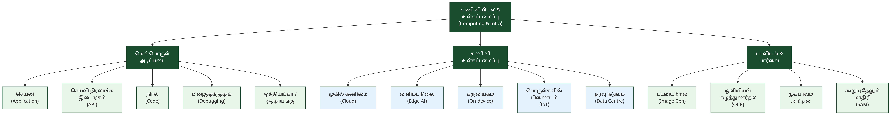
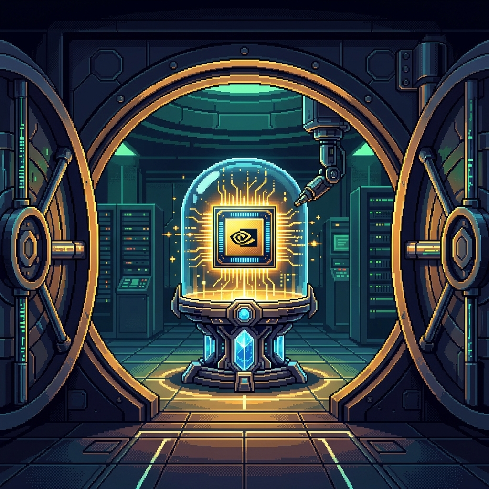

# பிற்சேர்க்கை அ: கணினியியல் & உள்கட்டமைப்பு — Appendix A: Computing & Infrastructure

<!-- IMAGE: Computing infrastructure layers with Tamil cultural motifs, deep green (#1a4d2e) accent, flat vector style -->

<!-- END IMAGE -->

> **🎯 கற்றல் நோக்கங்கள்**
>
> - செயலி (Application), செயலி நிரலாக்க இடைமுகம் (API), நிரலாக்க மொழி (Programming Language) ஆகிய மென்பொருள் அடிப்படைக் கலைச்சொற்களை அறிதல்
> - முகில் கணிமை (Cloud Computing), விளிம்புநிலைச் செய்யறிவு (Edge AI), தரவு நடுவம் (Data Centre) ஆகிய உள்கட்டமைப்புக் கலைச்சொற்களைப் புரிந்துகொள்ளுதல்
> - படவியற்றல் (Image Generation), ஒளியியல் எழுத்துணர்தல் (OCR), கூறு ஏதேனும் மாதிரி (SAM) போன்ற படவியல் & பார்வை கலைச்சொற்களை வேறுபடுத்தி அறிதல்

## AI-க்குப் பின்னால் உள்ள இயந்திரம்

AI மாதிரிகள் கவிதை எழுதுகின்றன, படம் வரைகின்றன, நிரல் உருவாக்குகின்றன. ஆனால் இவை அனைத்தும் இயங்குவதற்கு ஒரு வலுவான அடிப்படைக் கட்டமைப்பு தேவை. நிரலாக்க மொழிகள் (Programming Languages) கட்டளைகளை எழுத உதவுகின்றன, செயலி நிரலாக்க இடைமுகங்கள் (APIs) மென்பொருள்களை இணைக்கின்றன, முகில் கணிமை (Cloud Computing) மற்றும் தரவு நடுவங்கள் (Data Centres) கணக்கீட்டு வளங்களை வழங்குகின்றன.

விளிம்புநிலைச் செய்யறிவு (Edge AI) மற்றும் கருவியகச் செய்யறிவு (On-device AI) ஆகியவை AI-யை முகில் சேவையகங்களிலிருந்து பயனரின் கையிலேயே கொண்டுவருகின்றன. ஒளியியல் எழுத்துணர்தல் (OCR) மற்றும் படவியற்றல் (Image Generation) போன்ற நுட்பங்கள் AI-யின் நடைமுறைப் பயன்பாடுகளைக் காட்டுகின்றன.

இந்தப் பிற்சேர்க்கையில் AI-யின் அடிப்படைக் கணினியியல் மற்றும் உள்கட்டமைப்புக் கலைச்சொற்கள் 28 தொகுக்கப்பட்டுள்ளன.

---

### மென்பொருள் அடிப்படை — Software Fundamentals

நிரலாக்கம், பிழைத்திருத்தம், ஆவணமாக்கம் போன்றவை AI மட்டுமல்ல, எல்லா மென்பொருள் உருவாக்கத்துக்கும் அடிப்படை. இந்தப் பிரிவு அந்த அடிப்படைக் கலைச்சொற்களைத் தொகுக்கிறது.

**Application — செயலி** (பயன்பாடு)
ஒரு குறிப்பிட்ட பயனர் தேவையை நிறைவேற்றப் பயன்படும் முழுமையான மென்பொருள் கட்டமைப்பு.

**App — குறுஞ்செயலி** (செயலி) [^1]
குறு (small) + செயலி (application). குறிப்பிட்ட ஒரு சிறு பணிக்காக வடிவமைக்கப்பட்ட மென்பொருள்.

**API — செயலி நிரலாக்க இடைமுகம்**
ஒரு செயலி மற்றொரு செயலியுடன் தொடர்பு கொள்ளப் பயன்படும் கட்டமைப்பு (Application Programming Interface).

**Code — நிரல்** (குறிமுறை)
கணினிக்குக் கட்டளைகளை வழங்கப் பயன்படுத்தப்படும் நிரலாக்க மொழித் தொடர்கள்.

**Programming Language — நிரலாக்க மொழி** (கணினி மொழி)
நிரலாக்கம் (programming) + மொழி (language). கணினிக்குக் கட்டளைகளை வழங்கப் பயன்படுத்தப்படும் முறையான மொழி.

**Debugging — பிழைத்திருத்தம்**
பிழை (bug/error) + திருத்தம் (correction). மென்பொருள் நிரலில் உள்ள தவறுகளைக் கண்டறிந்து சரிசெய்தல்.

**Edit — தொகு** (திருத்து) [^1]
ஏற்கனவே உள்ள உரை, நிரல் அல்லது தரவை மாற்றி அமைக்கும் செயல்.

**Compress — சுருக்கம்** (தரவுச் சுருக்கம்) [^1]
தரவின் அளவைக் குறைத்து, சேமிப்பக இடத்தையோ அலைவரிசையையோ மிச்சப்படுத்தும் செயல்முறை.

**Documentation — ஆவணமாக்கம்** (விளக்கக் குறிப்புகள்)
மென்பொருள் அல்லது மாதிரியின் வடிவமைப்பு, பயன்பாடு மற்றும் குறிமுறைகளை விளக்கும் விரிவான எழுத்துப்பூர்வப் பதிவு.

**Environment Variable — சுற்றுப்புற மாறி** (சூழல் மாறி) [^1]
சுற்றுப்புறம் (environment) + மாறி (variable). ஒரு மென்பொருள் அல்லது கணினி இயங்கும் சூழல் சார்ந்த அமைப்பு மதிப்புகளைச் சேமித்து வைக்கும் மாறும் தரவு.

**Metadata — மேந்தரவு** (தரவுப் பின்னணி) [^1]
மேல் (over/meta) + தரவு (data). தரவைப் பற்றிய தரவு; ஒரு கோப்பு அல்லது தகவலின் உருவாக்கம், அளவு, வகை போன்ற அடிப்படை விவரங்களைச் சுருக்கமாகக் குறிப்பது.

**Asynchronous — ஒத்தியங்கா** (ஒத்திசையா / தன்னேர்)
ஒத்து (matching/together) + இயங்கா (not operating). ஒரே நேரத்தில் நடக்காமல், ஒரு செயல் முடிவதற்குள் மற்றொன்று தொடங்கும் முறை.

**Synchronous — ஒத்தியங்கு** (ஒத்திசை / ஒன்னேர்)
ஒத்து (matching/together) + இயங்கு (operate). செயல்பாடுகள் ஒரே நேரத்தில் அல்லது ஒரு குறிப்பிட்ட வரிசையில் ஒன்றன்பின் ஒன்றாகத் தடங்கலின்றிச் செயல்படும் முறை.

**Finite State Machine (FSM) — வரையறு நிலை இயந்திரம்** (நிலை இயந்திரம்)
குறிப்பிட்ட தூண்டுதல்களுக்கு ஏற்ப ஒரு நிலையிலிருந்து மற்றொரு நிலைக்கு மாறும் கணித மாதிரி; உரையாடல் சுழற்சிகளை மாதிரியாக்கம் செய்யப் பயன்படுகிறது.

**Analyze — பகுப்பாய்வு**
ஒரு தரவையோ அல்லது சிக்கலையோ அதன் அடிப்படைக் கூறுகளாகப் பிரித்து ஆழமாக ஆராயும் செயல்.

> [!NOTE]
> **அறிவீர்களா?** செயலி நிரலாக்க இடைமுகம் (API) இன்றைய AI பயன்பாடுகளின் முதுகெலும்பு. OpenAI, Google, Anthropic போன்ற நிறுவனங்கள் தங்கள் AI மாதிரிகளை API வழியாகவே வெளிப்படுத்துகின்றன. ஒரு தமிழ்ச் செயலி உருவாக்குநர் API மூலம் மொழிபெயர்ப்பு, உரை உருவாக்கம், படவியற்றல் போன்ற AI திறன்களைத் தன் செயலியில் இணைக்க முடியும்.

---

### கணினி உள்கட்டமைப்பு — Computing Infrastructure

AI மாதிரிகளைப் பயிற்றுவிக்கவும் இயக்கவும் பெரிய அளவிலான கணக்கீட்டு வளங்கள் தேவை. முகில் கணிமை (Cloud Computing) இணையம் வழியாக இந்த வளங்களை வழங்குகிறது. விளிம்புநிலைச் செய்யறிவு (Edge AI) மற்றும் கருவியகச் செய்யறிவு (On-device AI) ஆகியவை AI-யை பயனரின் சாதனத்திலேயே இயக்குகின்றன.

**Cloud Computing — முகில் கணிமை** (மேகக் கணிமை) [^1]
முகில் (cloud) + கணிமை (computing). இணையத்தின் வழியே சேவையகங்கள், தரவுத்தளங்கள் மற்றும் மென்பொருள்களைப் பயன்படுத்தும் தொழில்நுட்பம்.

**Edge AI — விளிம்புநிலைச் செய்யறிவு** (கருவிநிலைச் செய்யறிவு)
விளிம்பு (edge) + நிலை (level) + செய்யறிவு. முகில் சேவையகங்களில் அல்லாமல், பயனரின் சாதனத்திலேயே (கைபேசி, IoT கருவி) நேரடியாக இயங்கும் AI மாதிரி.

**On-device AI — கருவியகச் செய்யறிவு** (சாதனவழிச் செய்யறிவு)
கருவியகம் (within-device) + செய்யறிவு. இணையத் தொடர்பின்றி, கருவியின் (கைபேசி போன்றவை) சொந்த வன்பொருளைப் பயன்படுத்தியே தரவுகளைச் செயலாக்கும் AI அமைப்பு.

**Internet of Things (IoT) — பொருள்களின் பிணையம்** (இணை பொருள்கள்)
இணையத்துடன் இணைக்கப்பட்ட அன்றாடப் பொருள்கள் (உணர்வேற்பிகள், கருவிகள்) ஒன்றோடொன்று தரவைப் பகிரும் வலையமைப்பு.

**Data Centre — தரவு நடுவம்** (தரவு மையம்) [^1]
தரவு (data) + நடுவம் (center). கணினி அமைப்புகளையும், தொடர்புடைய தரவுச் சேமிப்பகங்களையும் ஒருங்கே மையப்படுத்தி நிர்வகிக்கும் கட்டமைப்பு.

**Server — வழங்கி** (சேவையகம்) [^1]
தரவுகளைச் சேமித்து வைத்து, வலையமைப்பில் உள்ள பிற கணினிகளுக்கு (Clients) சேவைகளை அல்லது தகவல்களை வழங்கும் மையக் கணினி.

**Blockchain — கட்டச்சங்கிலி**
கட்டம் (block) + சங்கிலி (chain). தரவுகளை மாற்ற முடியாதபடி சங்கிலித் தொடராகத் தொகுத்துச் சேமிக்கும் பரவலாக்கப்பட்ட தரவுத்தளத் தொழில்நுட்பம்.

**Social Media — சமூக ஊடகம்**
சமூகம் (society) + ஊடகம் (media). இணையத்தின் வழியே மக்கள் தகவல்களையும் கருத்துகளையும் பகிர்ந்துகொள்ளவும் தொடர்புகொள்ளவும் உதவும் தளங்கள்.

> [!TIP]
> **முகில் (Cloud) vs விளிம்புநிலை (Edge) vs கருவியகம் (On-device):** முகில் கணிமையில் தரவு இணையம் வழியாகச் சேவையகத்துக்குச் சென்று செயலாக்கப்படும். விளிம்புநிலைச் செய்யறிவு பயனருக்கு அருகிலுள்ள கருவியில் இயங்கும். கருவியகச் செய்யறிவு முழுமையாகக் கைபேசி போன்ற சாதனத்திலேயே இயங்கும், இணையத் தொடர்பு தேவையில்லை.

---

### படவியல் & பார்வை — Image & Vision

கணினியியல் பார்வை (Computer Vision) AI-யின் முதன்மைப் பயன்பாட்டுத் துறைகளில் ஒன்று. படவியற்றல் (Image Generation) புதிய படங்களை உருவாக்குகிறது, ஒளியியல் எழுத்துணர்தல் (OCR) ஆவணங்களை எண்ணிமப்படுத்துகிறது, முகபாவம் அறிதல் (Facial Expression Recognition) உணர்வுகளை அடையாளம் காண்கிறது.

**Image Generation — படவியற்றல்** (பட உருவாக்கம்)
படம் (image) + இயற்றல் (generation). உரைக் கட்டளைகள் அல்லது பிற உள்ளீடுகளின் அடிப்படையில் செய்யறிவைப் பயன்படுத்திப் புதிய படங்களை உருவாக்கும் செயல்முறை.

**OCR (Optical Character Recognition) — ஒளியியல் எழுத்துணர்தல்** (ஒளிவழி எழுத்துணர்தல்)
ஒளியியல் (optical) + எழுத்து (character) + உணர்தல் (recognition). அச்சிடப்பட்ட அல்லது கையால் எழுதப்பட்ட ஆவணங்களைப் படம்பிடித்து, அதிலுள்ள எழுத்துகளைக் கணினி திருத்தக்கூடிய உரையாக மாற்றும் நுட்பம்.

**Facial Action Coding System (FACS) — முகச்செயல் குறியீட்டு முறைமை**
முகம் (face) + செயல் (action) + குறியீடு (coding) + முறைமை (system). ஏக்மன்-ஃபிரீசன் (1978) உருவாக்கிய முறைமை; முகத் தசை இயக்கங்களை எண்களாகக் குறியீடாக்கி, உணர்வுகளை அளவீட்டு வடிவத்தில் கண்டறியும் கருவி.

**Facial Expression Recognition — முகபாவம் அறிதல்** (முக உணர்வு அறிதல்)
முகம் (face) + பாவம் (expression) + அறிதல் (recognition). முகப் படம் அல்லது காணொளியிலிருந்து உணர்வை வகைப்படுத்த உதவும் கணினியியல் பார்வை (Computer Vision) நுட்பம்.

**Segment Anything Model (SAM) — கூறு ஏதேனும் மாதிரி** (ஏதும்கூறு மாதிரி) [^1]
கூறு (segment) + ஏதேனும் (anything) + மாதிரி (model). படத்திலுள்ள எந்தவொரு பொருளையும் முன்கூட்டியே அறியாமலேயே துல்லியமாகப் பிரித்து (Segment) அடையாளம் காணும் கணினியியல் பார்வை மாதிரி.

> [!NOTE]
> **அறிவீர்களா?** OCR தொழில்நுட்பம் தமிழுக்கு மிக இன்றியமையாதது. பழைய தமிழ் நூல்கள், ஓலைச்சுவடிகள், அச்சிடப்பட்ட ஆவணங்கள் ஆகியவற்றை எண்ணிமப்படுத்த OCR இன்றியமையாதது. தமிழ் எழுத்து வடிவங்களின் சிக்கலான வளைவுகள் காரணமாக தமிழ் OCR ஆராய்ச்சி தொடர்ந்து முன்னேறி வருகிறது.

---

### 📰 AI வரலாற்றில் ஒரு துளி (A Drop in AI History)

{ style="width: 250px; float: right; margin-left: 20px; border-radius: 8px;" }

**உலகின் மிகவும் மதிப்புமிக்க பொருள்: H100 சிப்!**

ஒரு காலத்தில் தங்கம், பெட்ரோல் ஆகியவை உலகின் மிக மதிப்புமிக்க பொருள்களாக இருந்தன. ஆனால் இன்று, என்விடியா (NVIDIA) நிறுவனத்தின் H100 என்ற GPU சிப்பைப் பெறுவதற்குத்தான் உலகின் மாபெரும் தொழில்நுட்ப நிறுவனங்களுக்கு இடையே கடும் போட்டி நிலவுகிறது.

ஒரு சிப்பின் விலை சுமார் 30,000 டாலர்கள் (சுமார் 25 லட்சம் ரூபாய்). மெட்டா (Meta) நிறுவனம் மட்டும் பல பில்லியன் டாலர்களைச் செலவழித்து 3,50,000 H100 சிப்களை வாங்கியுள்ளது! தரவு மையங்கள் (Data Centres) இன்றைய காலத்தின் எண்ணெய் சுத்திகரிப்பு நிலையங்கள்போல மாறிவிட்டன.

---

## 📋 அத்தியாயச் சுருக்கம்

> **💡 முதன்மைக் கருத்துகள்**
>
> - இந்தப் பிற்சேர்க்கையில் 28 கலைச்சொற்கள்: மென்பொருள் அடிப்படை, கணினி உள்கட்டமைப்பு, படவியல் & பார்வை
> - செயலி நிரலாக்க இடைமுகம் (API) AI சேவைகளை இணைக்கும் முதன்மைக் கட்டமைப்பு
> - முகில் கணிமை (Cloud), விளிம்புநிலை (Edge AI), கருவியகம் (On-device AI) ஆகியவை AI இயங்கும் மூன்று நிலைகள்
> - ஒளியியல் எழுத்துணர்தல் (OCR), படவியற்றல் (Image Generation), கூறு ஏதேனும் மாதிரி (SAM) ஆகியவை கணினியியல் பார்வையின் முதன்மைப் பயன்பாடுகள்

**அடிக்கடி குழப்பமடையும் சொற்கள்:**
- செயலி (Application) vs குறுஞ்செயலி (App): செயலி முழுமையான மென்பொருள், குறுஞ்செயலி சிறு பணிக்கான மென்பொருள்
- விளிம்புநிலைச் செய்யறிவு (Edge AI) vs கருவியகச் செய்யறிவு (On-device AI): இரண்டும் நெருக்கமான கருத்துகள், ஆனால் கருவியகம் முழுமையாகச் சாதனத்திலேயே இயங்கும்
- ஒத்தியங்கா (Asynchronous) vs ஒத்தியங்கு (Synchronous): ஒத்தியங்கா செயல்கள் ஒன்றுக்கொன்று காத்திருக்காது, ஒத்தியங்கு வரிசையாக நடக்கும்

> [!TIP]
> **குறுக்கு இணைப்பு:** நரவலை (Neural Network) கட்டமைப்புகள் அத்தியாயம் 3-ல் உள்ளன. தரவு மற்றும் பயிற்சி நுட்பங்கள் அத்தியாயம் 4-ல் காணலாம். கணினியியல் பார்வை (Computer Vision) கருத்துகள் அத்தியாயம் 2-ல் அறிமுகப்படுத்தப்பட்டுள்ளன.

---

## 💭 உங்கள் சிந்தனைக்கு

1. ஒரு தமிழ்நாட்டு விவசாயி தன் வயலில் IoT உணர்வேற்பிகளைப் பொருத்தி, விளிம்புநிலைச் செய்யறிவு (Edge AI) மூலம் பயிர் நோய்களைக் கண்டறிய விரும்புகிறார். முகில் கணிமை (Cloud Computing) பயன்படுத்தாமல் கருவியகச் செய்யறிவு (On-device AI) தேர்வு செய்வதன் நன்மைகள் என்ன? அறைகூவல்கள் என்ன?

2. ஒரு தமிழ் நூலகம் தன் பழைய அச்சிடப்பட்ட புத்தகங்களை எண்ணிமப்படுத்த OCR பயன்படுத்துகிறது. தமிழ் எழுத்து வடிவங்களின் சிக்கலான வளைவுகள், பழைய அச்சு எழுத்துருக்கள் ஆகியவற்றால் என்ன சிக்கல்கள் எழலாம்? இவற்றைத் தீர்க்க என்ன நுட்பங்கள் உதவும்?

3. ஒரு தமிழ்ச் செயலி உருவாக்குநர் API வழியாக AI மொழிபெயர்ப்பு சேவையை இணைக்க விரும்புகிறார். ஒத்தியங்கா (Asynchronous) அழைப்பு vs ஒத்தியங்கு (Synchronous) அழைப்பு இரண்டிலும் எது சிறந்தது? ஏன்?

---

## 🧠 அறிவுச் சோதனை — Knowledge Check

1. **பொருத்துக:** கீழ்க்கண்ட ஆங்கிலச் சொற்களுக்கு சரியான தமிழ்ச் சொல்லைப் பொருத்துக:

   | ஆங்கிலம் | தமிழ் |
   |:---------|:------|
   | Cloud Computing | அ) பிழைத்திருத்தம் |
   | Debugging | ஆ) செயலி நிரலாக்க இடைமுகம் |
   | API | இ) முகில் கணிமை |

2. **கோடிட்ட இடத்தை நிரப்புக:** "________ என்பது இணையத் தொடர்பின்றி, கருவியின் சொந்த வன்பொருளைப் பயன்படுத்தியே தரவுகளைச் செயலாக்கும் AI அமைப்பு." (On-device AI)

3. **சரியா / தவறா:** "ஒத்தியங்கா (Asynchronous) என்பது செயல்பாடுகள் ஒரு குறிப்பிட்ட வரிசையில் ஒன்றன்பின் ஒன்றாகத் தடங்கலின்றிச் செயல்படும் முறை."

4. **பல தேர்வு:** கீழ்க்கண்டவற்றில் OCR என்பதன் சரியான விரிவாக்கம் எது?
   - அ) Optical Character Recognition
   - ஆ) Online Content Retrieval
   - இ) Object Classification Runtime

5. **சரியா / தவறா:** "விளிம்புநிலைச் செய்யறிவு (Edge AI) முகில் சேவையகங்களில் இயங்கும் AI மாதிரி."

<strong>விடைகளைக் காண சொடுக்குக</strong>

1. Cloud Computing → இ) முகில் கணிமை, Debugging → அ) பிழைத்திருத்தம், API → ஆ) செயலி நிரலாக்க இடைமுகம்
2. கருவியகச் செய்யறிவு (On-device AI)
3. **தவறு.** அது ஒத்தியங்கு (Synchronous). ஒத்தியங்கா (Asynchronous) என்பது ஒரே நேரத்தில் நடக்காமல், ஒரு செயல் முடிவதற்குள் மற்றொன்று தொடங்கும் முறை.
4. **அ)** Optical Character Recognition
5. **தவறு.** விளிம்புநிலைச் செய்யறிவு (Edge AI) முகில் சேவையகங்களில் அல்லாமல், பயனரின் சாதனத்திலேயே நேரடியாக இயங்கும்.

